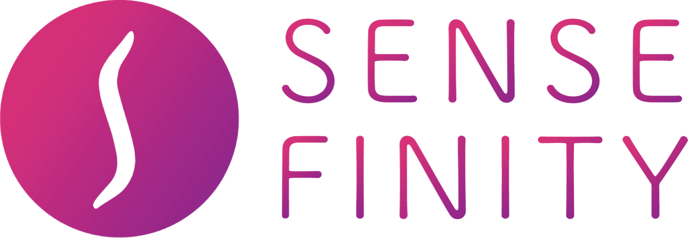
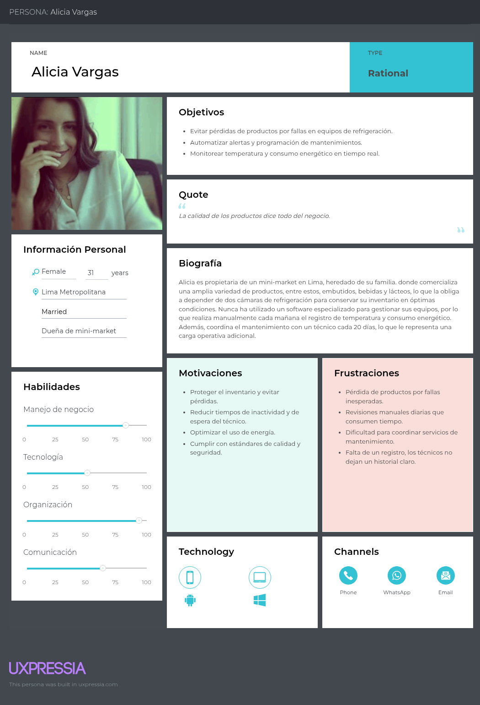
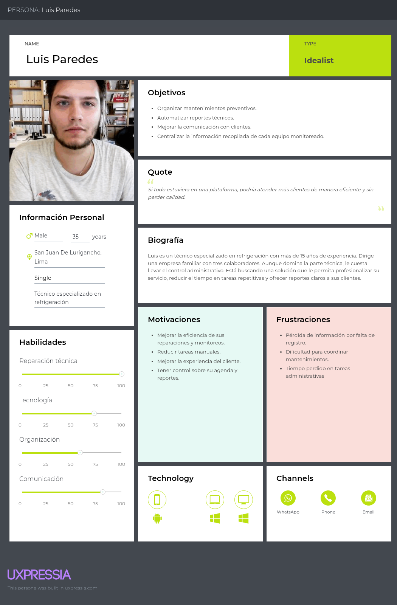
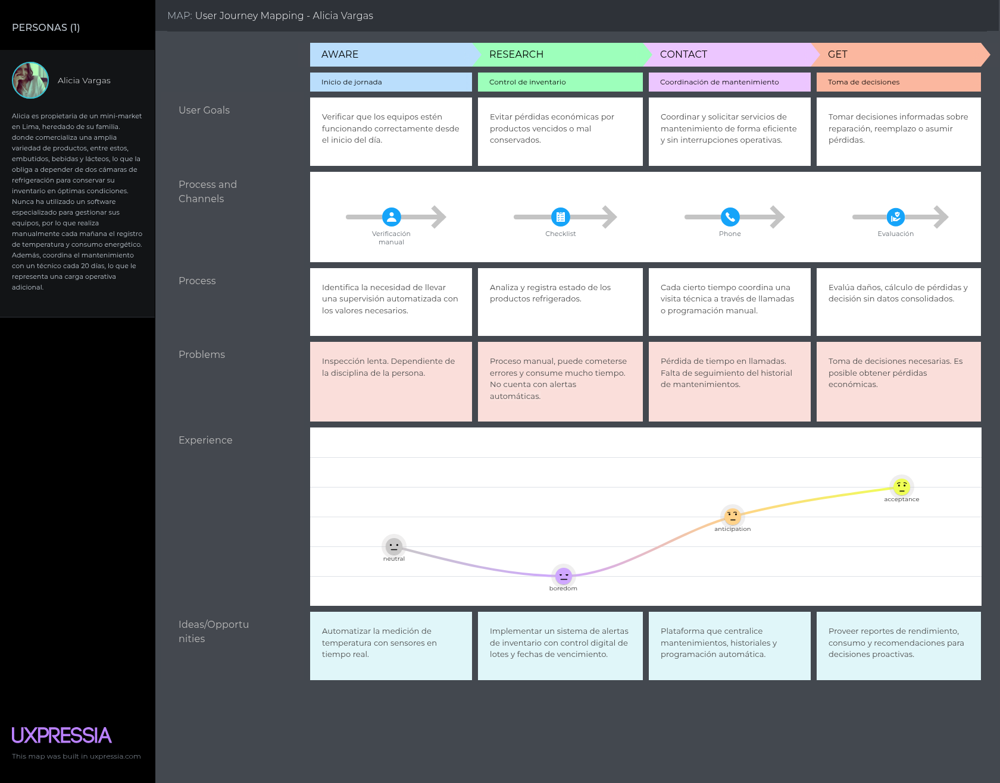
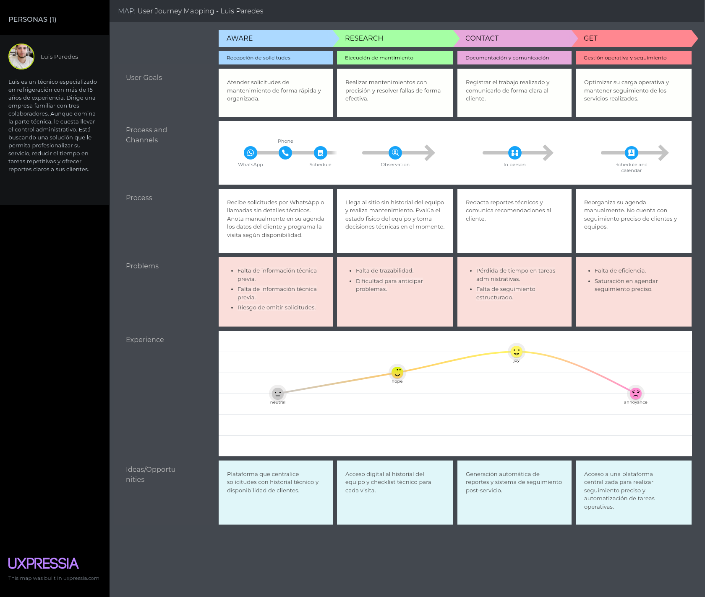
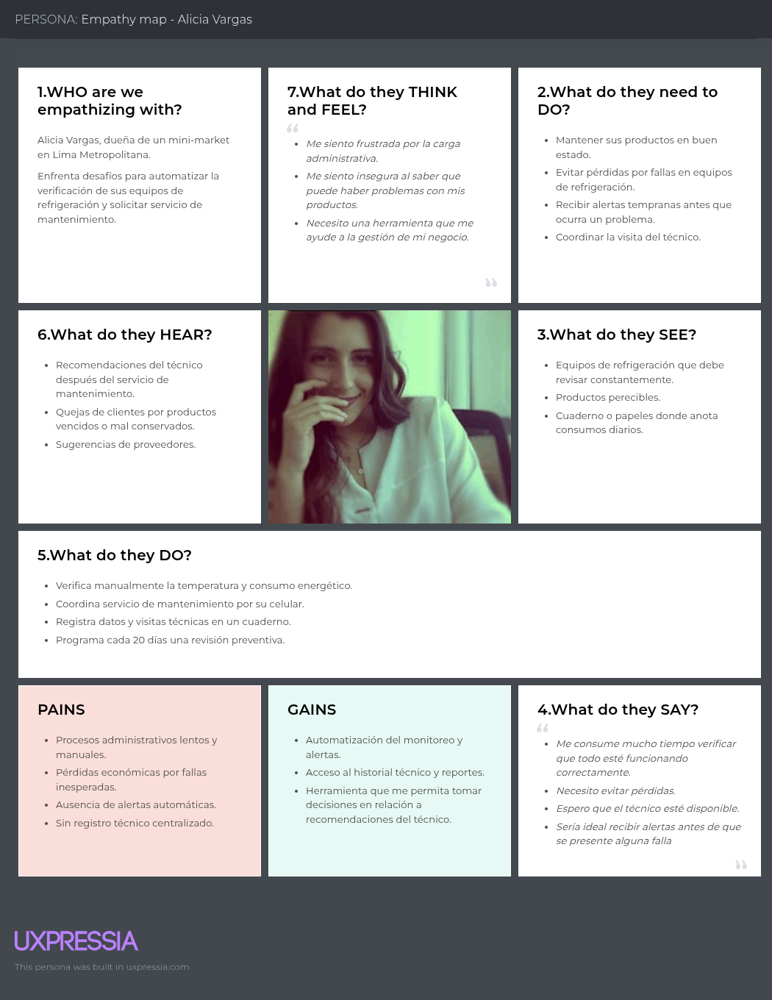
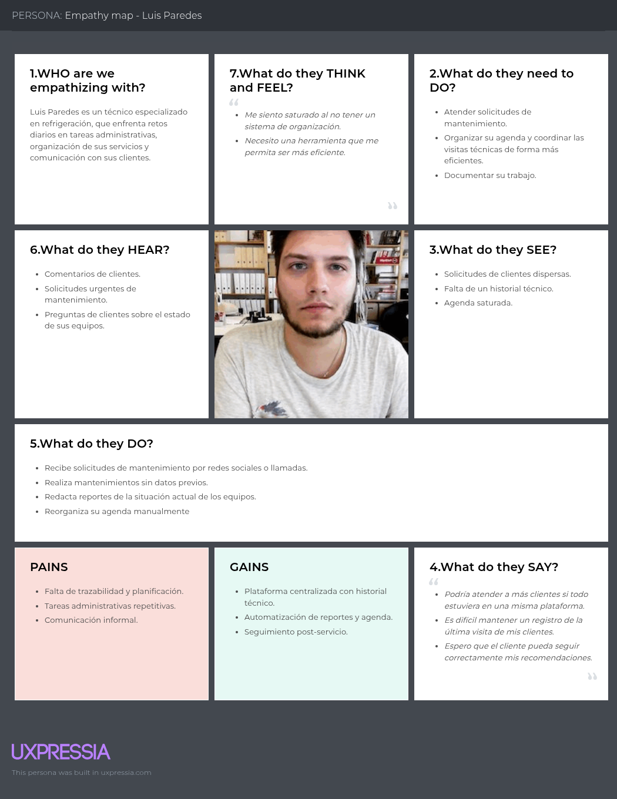

<h2 align="center">
  
</h2>

<h1 align="center">Universidad Peruana de Ciencias Aplicadas</h1>

<h3 align="center">
   Carrera: Ingeniería de Software
       
    Curso: SI729 - Aplicaciones Web 
       
    Sección: 7452
       
    Profesor: Hugo Allan Mori Paiva
       
    Ciclo: 2025-20 
       
    Informe de Trabajo Final
       
    Startup: 
       
    Producto: 
</h3>

 
| 
Alumno
 | 
Código
 |
|:-------------------------------------:|:-------------------------------------:|
|   Galindo Montero, Alejandro Manuel   |              u202321264               |
|     Guillen Galindo, Julio Adolfo     |              u20241a352               |
|   La Madrid Lozano, Ivan Jeanpierre   |              u202113432               |
|       Nanfuñay Liza, Pedro Jesus      |              u202215462               |
|     Ramirez Cabrera, Kenyi Efrain     |              u202220138               |

 Septiembre 2025 

## Registro de Versiones del Informe

| Versión |   Fecha    |        Autor         |                   Descripción de modificación                   |
|---------|------------|----------------------|-----------------------------------------------------------------|
| 0.1     | 13/09/2025 | Kenyi Ramírez        | Elaboración de la estructura inicial del reporte                |

## Project Report Collaboration Insights *(POR MODIFICAR POR CADA ENTREGA)
- **URL de la organización del proyecto:**  

- **URL del repositorio del informe del proyecto:**  

- **URL del repositorio del landing page del proyecto:**  

## Contenido

- [Student Outcome](#student-outcome)

- [Capítulo I: Introducción](#capítulo-i-introducción)
    - [1.1. Startup Profile](#11-startup-profile)
        - [1.1.1. Descripción de la Startup](#111-descripción-de-la-startup)
        - [1.1.2. Perfiles de integrantes del equipo](#112-perfiles-de-integrantes-del-equipo)
    - [1.2. Solution Profile](#12-solution-profile)
        - [1.2.1 Antecedentes y problemática](#121-antecedentes-y-problemática)
        - [1.2.2 Lean UX Process](#122-lean-ux-process)
            - [1.2.2.1. Lean UX Problem Statements](#1221-lean-ux-problem-statements)
            - [1.2.2.2. Lean UX Assumptions](#1222-lean-ux-assumptions)
            - [1.2.2.3. Lean UX Hypothesis Statements](#1223-lean-ux-hypothesis-statements)
            - [1.2.2.4. Lean UX Canvas](#1224-lean-ux-canvas)
    - [1.3. Segmentos Objetivos](#13-segmentos-objetivos)

- [Capítulo II: Requirements Elicitation & Analysis](#capítulo-ii-requirements-elicitation--analysis)
    - [2.1. Competidores](#21-competidores)
        - [2.1.1. Análisis competitivo](#211-análisis-competitivo)
        - [2.1.2. Estrategias y tácticas frente a competidores](#212-estrategias-y-tácticas-frente-a-competidores)
    - [2.2. Entrevistas](#22-entrevistas)
        - [2.2.1. Diseño de entrevistas](#221-diseño-de-entrevistas)
        - [2.2.2. Registro de entrevistas](#222-registro-de-entrevistas)
        - [2.2.3. Análisis de entrevistas](#223-análisis-de-entrevistas)
    - [2.3. Needfinding](#23-needfinding)
        - [2.3.1. User Personas](#231-user-personas)
        - [2.3.2. User Task Matrix](#232-user-task-matrix)
        - [2.3.3. User Journey Mapping](#233-user-journey-mapping)
        - [2.3.4. Empathy Mapping](#234-empathy-mapping)
    - [2.4. Big Picture EventStorming](#24-big-picture-eventstorming)
    - [2.5. Ubiquitous Language](#25-ubiquitous-language)

- [Capítulo III: Requirements Specification](#capítulo-iii-requirements-specification)
    - [3.1. To-Be Scenario Mapping](#31-to-be-scenario-mapping)
    - [3.2. User Stories](#32-user-stories)
    - [3.3. Impact Mapping](#33-impact-mapping)
    - [3.4. Product Backlog](#34-product-backlog)
      
- [Capítulo IV: Product Design](#capítulo-iv-product-design)
    - [4.1. Style Guidelines](#41-style-guidelines)
        - [4.1.1. General Style Guidelines](#411-general-style-guidelines)
        - [4.1.2. Web Style Guidelines](#412-web-style-guidelines)
    - [4.2. Information Architecture](#42-information-architecture)
        - [4.2.1. Organization Systems](#421-organization-systems)
        - [4.2.2. Labeling Systems](#422-labeling-systems)
        - [4.2.3. SEO Tags and Meta Tags](#423-seo-tags-and-meta-tags)
        - [4.2.4. Searching Systems](#424-searching-systems)
        - [4.2.5. Navigation Systems](#425-navigation-systems)
    - [4.3. Landing Page UI Design](#43-landing-page-ui-design)
        - [4.3.1. Landing Page Wireframe](#431-landing-page-wireframe)
        - [4.3.2. Landing Page Mock-up](#432-landing-page-mock-up)
    - [4.4. Web Applications UX/UI Design](#44-web-applications-uxui-design)
        - [4.4.1. Web Applications Wireframes](#441-web-applications-wireframes)
        - [4.4.2. Web Applications Wireflow Diagrams](#442-web-applications-wireflow-diagrams)
        - [4.4.3. Web Applications Mock-ups](#443-web-applications-mock-ups)
        - [4.4.4. Web Applications User Flow Diagrams](#444-web-applications-user-flow-diagrams)
    - [4.5. Web Applications Prototyping](#45-web-applications-prototyping)
    - [4.6. Domain-Driven Software Architecture](#46-domain-driven-software-architecture)
        - [4.6.1. Design-Level EventStorming](#461-design-level-eventstorming)
        - [4.6.2. Software Architecture Context Diagram](#462-software-architecture-context-diagram)
        - [4.6.3. Software Architecture Container Diagrams](#463-software-architecture-container-diagrams)
        - [4.6.4. Software Architecture Components Diagrams](#464-software-architecture-components-diagrams)
    - [4.7. Software Object-Oriented Design](#47-software-object-oriented-design)
        - [4.7.1. Class Diagrams](#471-class-diagrams)
    - [4.8. Database Design](#48-database-design)
        - [4.8.1. Database Diagrams](#481-database-diagrams)

- [Capítulo V: Product Implementation, Validation & Deployment](#capítulo-v-product-implementation-validation--deployment)
    - [5.1. Software Configuration Management](#51-software-configuration-management)
        - [5.1.1. Software Development Environment Configuration](#511-software-development-environment-configuration)
        - [5.1.2. Source Code Management](#512-source-code-management)
        - [5.1.3. Source Code Style Guide & Conventions](#513-source-code-style-guide--conventions)
        - [5.1.4. Software Deployment Configuration](#514-software-deployment-configuration)
    - [5.2. Landing Page, Services & Applications Implementation](#52-landing-page-services--applications-implementation)
        - [5.2.1. Sprint 1](#521-sprint-1)
            - [5.2.1.1. Sprint Planning 1](#5211-sprint-planning-1)
            - [5.2.1.2. Aspect Leaders and Collaborators](#5212-aspect-leaders-and-collaborators)
            - [5.2.1.3. Sprint Backlog 1](#5213-sprint-backlog-1)
            - [5.2.1.4. Development Evidence for Sprint Review](#5214-development-evidence-for-sprint-review)
            - [5.2.1.5. Execution Evidence for Sprint Review](#5215-execution-evidence-for-sprint-review)
            - [5.2.1.6. Services Documentation Evidence for Sprint Review](#5216-services-documentation-evidence-for-sprint-review)
            - [5.2.1.7. Software Deployment Evidence for Sprint Review](#5217-software-deployment-evidence-for-sprint-review)
            - [5.2.1.8. Team Collaboration Insights during Sprint](#5218-team-collaboration-insights-during-sprint)

- [Conclusiones](#conclusiones)
- [Bibliografía](#bibliografía)
- [Anexos](#anexos)

## Student Outcome
El curso contribuye al cumplimiento del Student Outcome ABET:

**ABET – EAC - Student Outcome 5**

**Criterio**: *La capacidad de funcionar efectivamente en un equipo cuyos miembros juntos proporcionan liderazgo, crean un entorno de colaboración e inclusivo, establecen objetivos, planifican tareas y cumplen objetivos.*

En el siguiente cuadro se describe las acciones realizadas y enunciados de conclusiones por parte del grupo, que permiten sustentar el haber alcanzado el logro del ABET – EAC - Student Outcome 5.

| Criterio específico | Acciones realizadas | Conclusiones |
|---------------------|--------------------|--------------|
| Trabaja en equipo para proporcionar liderazgo en forma conjunta                                 | <ul><li><b>Galindo Montero, Alejandro Manuel</b> <b>TB1</b>:</li> <li><b>Guillen Galindo, Julio Adolfo</b> <b>TB1</b>:</li> <li><b>La Madrid Lozano, Ivan Jeanpierre</b> <b>TB1</b>:</li> <li><b>Nanfuñay Liza, Pedro Jesus</b> <b>TB1</b>:</li> <li><b>Ramirez Cabrera, Kenyi Efrain</b> <b>TB1</b>: <b></li></ul>        | <ul><li><b>TB1</b>: </li></ul> |
| Crea un entorno colaborativo e inclusivo, establece metas, planifica tareas y cumple objetivos. | <ul><li><b>Galindo Montero, Alejandro Manuel</b> <b>TB1</b>:</li> <li><b>Guillen Galindo, Julio Adolfo</b> <b>TB1</b>:</li> <li><b>La Madrid Lozano, Ivan Jeanpierre</b> <b>TB1</b>:</li> <li><b>Nanfuñay Liza, Pedro Jesus</b> <b>TB1</b>:</li> <li><b>Ramirez Cabrera, Kenyi Efrain</b> <b>TB1</b>: <b></li></ul>        | <ul><li><b>TB1</b>: </li></ul> |

# Capítulo I: Introducción 

## 1.1 Startup Profile

### 1.1.1 Descripción de la Startup

es una aplicación web diseñada para optimizar la gestión y el mantenimiento de equipos de refrigeración en negocios que dependen de la cadena de frío. Nuestro alcance es atender a una amplia gama de clientes, incluyendo supermercados, minimarkets, laboratorios, restaurantes y empresas de los sectores alimentario y farmacéutico. Nuestra plataforma conecta de manera fluida a estos negocios con técnicos especializados y proveedores de equipos, facilitando un enfoque integral, proactivo y automatizado para la gestión de sus sistemas de refrigeración.
Las funcionalidades clave de la plataforma incluyen el monitoreo en tiempo real de temperatura, consumo energético y tiempo de uso. Además, ofrece alertas automáticas ante fallos, informes técnicos detallados, historiales de rendimiento y programación inteligente de mantenimientos. Estas herramientas permiten a empresas, técnicos y proveedores mejorar la eficiencia operativa, prevenir costosas pérdidas por fallos inesperados y mantener un registro completo del estado y uso de sus equipos.

**Misión:** Queremos ofrecer una solución tecnológica inteligente que ayude a las empresas a proteger su inventario y a optimizar la gestión de sus equipos de refrigeración. Al mismo tiempo, proporcionamos herramientas especializadas para mejorar la eficiencia operativa de los técnicos y proveedores del sector.

**Visión:** Ser la empresa líder en la gestión y el mantenimiento de equipos de refrigeración en el mercado peruano, comenzando por consolidar nuestra posición en Lima.

### 1.1.2 Perfiles de integrantes del equipo

| **Integrante**            | **Galindo Montero Alejandro Manuel**                                                |
|---------------------------|-------------------------------------------------------------------------------------|
| **Código del Estudiante** |                                                                                     |
| **Carrera**               |                                                                                     |
| **Descripción**           |                                                                                     |
| **Foto**                  |                                         |

---

| **Integrante**            | **Guillen Galindo Julio Adolfo**                                                    |
|---------------------------|-------------------------------------------------------------------------------------|
| **Código del Estudiante** | u20241a352                                                                          |
| **Carrera**               | Ingeniería de Software                                                              |
| **Descripción**           | Actualmente curso la carrera de Ingeniería de Software en la UPC. Me considero una persona discreta, pero responsable y enfocada en cumplir los proyectos dentro de los plazos establecidos. Poseo conocimientos en C++ y Python; disfruto trabajar en equipo cuando existe colaboración y apoyo mutuo. Además, me motiva aplicar lo aprendido para afrontar los desafíos que puedan surgir en los próximos ciclos. |
| **Foto**                  |  |

---

| **Integrante**            | **La Madrid Lozano, Ivan Jeanpierre**                                               |
|---------------------------|-------------------------------------------------------------------------------------|
| **Código del Estudiante** |                                                                                     |
| **Carrera**               |                                                                                     |
| **Descripción**           |                                                                                     |
| **Foto**                  |                                         |

---

| **Integrante**            | **Nanfuñay Liza, Pedro Jesus**                                                      |
|---------------------------|-------------------------------------------------------------------------------------|
| **Código del Estudiante** |                                                                                     |
| **Carrera**               |                                                                                     |
| **Descripción**           |                                                                                     |
| **Foto**                  |                                         |

---

| **Integrante**            | **Kenyi Efrain Ramirez Cabrera**                                                    |
|---------------------------|-------------------------------------------------------------------------------------|
| **Código del Estudiante** | u202220138                                                                          |
| **Carrera**               | Ingeniería de Software                                                              |
| **Descripción**           | Soy Kenyi Ramirez, estudio la carrera de Ingeniería de Software en la Universidad Peruana de Ciencias Aplicadas. Soy una persona comprometida y trabajadora. Poseo un nivel intermedio en los lenguajes C++, Python, Java y HTML, los cuales aplico para garantizar resultados efectivos en mis tareas. |
| **Foto**                  |  |

## 1.2. Solution Profile

### 1.2.1. Antecedentes y problemática

### 1.2.2. Lean UX Process

#### 1.2.2.1. Lean UX Problem Statements

#### 1.2.2.2. Lean UX Assumptions

#### 1.2.2.3. Lean UX Hypothesis Statements

#### 1.2.2.4. Lean UX Canvas

## 1.3. Segmentos Objetivos

# Capítulo II: Requirements Elicitation & Analysis

## 2.1. Competidores

**Competidor 1: ServiceTitan**
ServiceTitan es una plataforma de gestión de servicios basada en la nube que ofrece soluciones de software para empresas de servicios, incluidos técnicos de HVAC, fontaneros y electricistas. Proporciona funcionalidades de programación, gestión de trabajos, facturación y más. Esta plataforma es conocida por su facilidad de uso y por ayudar a las empresas a optimizar sus operaciones de servicio técnico en tiempo real.

---

**Competidor 2: Sensefinity**
Sensefinity es una plataforma tecnológica especializada en soluciones de IoT para la cadena de frío, que permite monitorear en tiempo real condiciones como temperatura, humedad y vibraciones en productos sensibles durante su transporte y almacenamiento. Además, ofrece alertas automáticas y reportes en la nube que ayudan a las empresas a reaccionar rápidamente ante cualquier falla. Esta plataforma es reconocida por facilitar la trazabilidad completa de los productos y por apoyar a sectores como supermercados, farmacéuticas y logística en la reducción de pérdidas y el cumplimiento de estándares de calidad.

---

**Competidor 3: TempGenius**
TempGenius es un software de monitoreo de temperatura y humedad en tiempo real para diversas industrias, incluida la de la refrigeración comercial. Permite a los usuarios realizar un seguimiento de sus equipos de refrigeración mediante sensores conectados a la nube, generar reportes y recibir alertas automáticas por variaciones en los niveles de temperatura. Su principal enfoque es mejorar la visibilidad y control de las operaciones de refrigeración para evitar pérdidas económicas.

### 2.1.1. Análisis competitivo

<table> 
  <tr>
    <th colspan="7"> Competitive Analysis Landscape </th>
  </tr>
  <tr>
    <td colspan="2" rowspan="2">¿Por qué llevar acabo este análisis? </td>
    <td colspan="5"> Con el objetivo de evaluar y comparar funcionalidades, tecnología, precios y estrategias de marketing de los principales competidores para identificar nuestras fortalezas y debilidades, detectar oportunidades negocio y identificar puntos que nos hagan diferenciar de la competencia. </td>
  </tr>
  <tr>
  </tr>
  <tr>
    <td colspan="2"> </td>
    <td> IceTrack   </img> </td>
    <td> ServiceTitan   </img> </td>
    <td> Sensefinity   </img> </td>
    <td> TempGenius   </img> </td>
  </tr>
  <tr>
    <td rowspan="2">Perfil</td>
    <td>Overview</td>
    <td> IceTrack es una plataforma integral de monitoreo y gestión para sistemas de refrigeración, que conecta negocios con técnicos especializados. Ofrece monitoreo en tiempo real, alertas automáticas, mantenimiento preventivo, y trazabilidad de cada equipo. </td>
    <td> ServiceTitan es una plataforma de gestión de servicios basada en la nube que ofrece soluciones de software para empresas de servicios, incluidos técnicos de HVAC, fontaneros y electricistas. </td>
    <td> Sensefinity es una solución IoT que combina sensores físicos con plataforma en la nube para monitoreo y trazabilidad de la cadena de frío. </td>
    <td> TempGenius es un software de monitoreo de temperatura y humedad en tiempo real para diversas industrias, incluida la refrigeración comercial. Permite a los usuarios gestionar y recibir alertas automáticas sobre sus equipos. </td>
  </tr>
  <tr>
    <td>Ventaja competitiva ¿Qué valor ofrece a los clientes?</td>
    <td> Ofrece una solución automatizada y centralizada para negocios que necesitan monitorear y gestionar sus equipos de refrigeración. Permite a los técnicos optimizar sus visitas y el mantenimiento preventivo, mejorando la eficiencia operativa. </td>
    <td> Ofrece una plataforma todo-en-uno para la gestión de servicios con características como la programación de citas, facturación y seguimiento en tiempo real de proyectos. </td>
    <td> Ofrece soluciones con foco en logística y permite monitorear productos en tiempo real durante su transporte y almacenamiento. </td>
    <td> Ofrece monitoreo preciso en tiempo real de la temperatura y humedad, con alertas automáticas, y un enfoque especial en la fiabilidad y precisión de los datos. </td>
  </tr>
  <tr>
    <td rowspan="2">Perfil de Marketing</td>
    <td> Mercado Objetivo </td>
    <td> Negocios que dependen de sistemas de refrigeración, como supermercados, minimarkets, laboratorios, restaurantes, entre otros. También incluye técnicos de refrigeración y proveedores de equipos. </td>
    <td> Empresas de servicios como HVAC, fontaneros, electricistas, y otros proveedores de servicios técnicos. </td>
    <td> Supermercados, farmacéuticas, operadores logísticos y empresas de exportación internacional. </td>
    <td> Usuarios de diversas industrias, especialmente en áreas que requieren monitoreo continuo de temperatura y humedad, como el sector alimentario y farmacéutico. </td>
  </tr>
  <tr>
    <td> Estrategias de Marketing </td>
    <td> Marketing digital, colaboraciones estratégicas con empresas del sector alimentario y farmacéutico, demostraciones gratuitas y promociones en redes sociales. </td>
    <td> Marketing digital, colaboraciones con empresas de servicios y promoción en plataformas de negocio. </td>
    <td> Marketing en ferias globales de logística y alianzas estratégicas con empresas de exportación. </td>
    <td> Marketing en redes sociales, promociones para nuevos usuarios y colaboraciones con industrias reguladas como la farmacéutica y alimentaria. </td>
  </tr>
  <tr>
    <td rowspan="3">Perfil de Producto</td>
    <td> Productos & Servicios </td>
    <td> Gestión de equipos de refrigeración en tiempo real, alertas automáticas, mantenimiento preventivo, reportes técnicos automáticos y trazabilidad de cada equipo. </td>
    <td> Plataforma de gestión de servicios que incluye programación de citas, gestión de personal, facturación, y seguimiento de proyectos en tiempo real. </td>
    <td> Plataforma de monitoreo y gestión de sistemas de refrigeración en la nube, con alertas preventivas e informes automáticos. Además ofrece sensores para monitorear temperatura, humedad, etc. </td>
    <td> Plataforma de monitoreo de temperatura y humedad en tiempo real, con alertas automáticas, reportes detallados y gestión de datos históricos. </td>
  </tr>
  <tr>
    <td> Precios & Costos </td>
    <td> Modelo basado en comisiones bajas por cada reserva o cita pagada para negocios, con una versión gratuita para usuarios. </td>
    <td> Suscripción mensual o anual, con tarifas adicionales por características avanzadas o soporte personalizado. </td>
    <td> Basado en subscripciones por conectividad y por servicios utilizados. Posible coste de instalación de hardware. </td>
    <td> Varía según la cantidad de equipos monitoreados y las características seleccionadas, con modelos de suscripción mensual o anual. </td>
  </tr>
  <tr> 
    <td>Canales de distribución (Web y/o Móvil)</td>
    <td> Plataforma en línea y aplicación móvil disponible para dispositivos iOS y Android. </td>
    <td> Plataforma en línea y aplicación móvil disponible para dispositivos iOS y Android. </td>
    <td> Plataforma en línea y aplicación móvil. </td>
    <td> Aplicación móvil disponible en tiendas de aplicaciones y plataforma en línea. </td>
  </tr>
  <tr>
    <td rowspan="4"> Análisis SWOT </td>
    <td> Fortalezas </td>
    <td> Monitoreo en tiempo real, alertas automáticas y mantenimiento preventivo para evitar fallas críticas. Función de trazabilidad completa de los equipos. </td>
    <td> Amplia funcionalidad para gestión de servicios y seguimiento en tiempo real de proyectos. </td>
    <td> Especialización en IoT y trazabilidad de la cadena de frío. Permite cumplir con normativas logísticas. Hardware propio optimizado para monitoreo en tiempo real.</td>
    <td> Precisión en el monitoreo de temperatura y humedad, con alertas automáticas y un enfoque flexible en diferentes industrias. </td>
  </tr>
  <tr>
    <td> Debilidades </td>
    <td> Dependencia de la adopción inicial por parte de los usuarios, lo que podría afectar la expansión. </td>
    <td> Puede ser más complejo de usar para pequeñas empresas sin experiencia en gestión de software. </td>
    <td> Fuerte dependencia de hardware, tiene menos presencia en el Perú. </td>
    <td> Puede resultar costoso para pequeñas empresas debido a las suscripciones y los costos adicionales por dispositivos. </td>
  </tr>
  <tr>
    <td> Oportunidades </td>
    <td> Expansión en el sector de la gestión de refrigeración, con foco en la eficiencia operativa y la reducción de costos. </td>
    <td> Expansión a nuevos mercados, introducción de nuevos servicios, mejorar la experiencia del usuario. </td>
    <td> Alianza con operadores logísticos. Aumento de regulaciones en farmaceúticas y alimentos. </td>
    <td> Expansión a nuevos mercados, introducción de nuevas características y servicios, colaboraciones estratégicas con marcas de belleza. </td>
  </tr>
  <tr>
    <td> Amenazas </td>
    <td> Competencia de aplicaciones ya establecidas en la gestión de refrigeración y mantenimiento. </td>
    <td> Competencia de otras plataformas de gestión de servicios que ofrecen características similares. </td>
    <td> Competencia con soluciones más económicas. Restricciones de conectividad por IoT en ciertas regiones. </td>
    <td> Competencia de otras plataformas de monitoreo de temperatura y humedad, con características similares y precios más bajos. </td>
  </tr>
</table>

### 2.1.2. Estrategias y tácticas frente a competidores

Hemos identificado diversas estrategias y tácticas para diferenciarnos y competir efectivamente con otros actores del mercado de la gestión y monitoreo de sistemas de refrigeración. A continuación se detallan las principales:

1. **Estrategias de Diferenciación:**

**Solución Integral para Refrigeración comercial:** A diferencia de los competidores, IceTrack se especializa exclusivamente en la gestión de sistemas de refrigeración, ofreciendo monitoreo en tiempo real, alertas automáticas, mantenimiento preventivo y trazabilidad completa. Esto permite a los negocios reducir las incidencias por fallas inesperadas y gestionar sus equipos de refrigeración de manera proactiva.

**Trazabilidad Completa de Equipos:** Ofrecemos una plataforma que proporciona un historial técnico detallado de cada equipo, algo que competidores como ServiceTitan no ofrecen de forma especializada para el sector de refrigeración. Esto garantiza un mayor control sobre los activos y la calidad del servicio.

**Interfaz Intuitiva y Fácil de Usar:** La plataforma prioriza una interfaz intuitiva y accesible para técnicos y negocios sin experiencia tecnológica.

2. **Tácticas de Marketing:**

**Marketing Digital y Demostraciones Gratuitas:** Lanzaremos campañas en redes sociales dirigidas a supermercados, laboratorios y restaurante, destacando nuestra capacidad para reducir fallas y ahorrar costos en operaciones. Esta táctica se diferencia de TempGenius, que aún no ha adoptado un enfoque digital tan agresivo.

**Fidelización de Usuarios a Largo Plazo:** Implementaremos programas de fidelización y un sistema de recompensas para los técnicos y negocios que continúen usando nuestra plataforma y colaboren con nosotros para mejorar el servicio. De esta forma, buscamos aumentar la lealtad, algo que muchos competidores no han logrado gestionar adecuadamente.

3. **Estrategias de Precios:**

**Modelo Freemium:** Ofrecemos una versión gratuita para atraer a pequeños negocios y usuarios que no están seguros de pagar por un servicio premium de inmediato. Este modelo es más flexible que el de ServiceTitan, que depende de suscripciones pagadas desde el principio.

**Comisiones Bajas por Reserva:** Para los negocios, aplicamos comisiones reducidas por cada cita reservada a través de nuestra plataforma, lo que facilita la adopción y reduce el riesgo financiero para los negocios. Esto nos diferencia de competidores con estructuras de costos más rígidas.

4. **Expansión y Adaptabilidad:**

**Enfoque Regional Inicial y Expansión Nacional:** A diferencia de competidores como TempGenius, que tiene un enfoque global, IceTrack comenzará en Lima con planes de expansión a otras ciudades del Perú. Esto nos permite adaptarnos mejor a las necesidades locales antes de expandirnos a nivel internacional.

**Colaboraciones con Proveedores Locales:** Formaremos alianzas estratégicas con proveedores de equipos de refrigeración y servicios técnicos en Perú, lo que nos diferenciará de la competencia al contar con un sistema robusto y adaptado específicamente para el mercado peruano.

## 2.2. Entrevistas

### 2.2.1. Diseño de entrevistas

En esta sección, se han planteado diversas preguntas dirigidas a nuestros segmentos objetivos con el objetivo de obtener información relevante, como opiniones o descripciones. Estos datos serán fundamentales para el desarrollo de nuestra solución.

**Preguntas para el Segmento Objetivo 1 - Negocios con equipos de refrigeración:**

1. ¿Cuál es su edad y en qué ciudad vive?

2. ¿A qué se dedica principalmente su negocio?

3. ¿Qué productos o insumos necesita mantener en frío?

4. ¿Cuántos equipos de refrigeración tiene actualmente en funcionamiento?

5. ¿Ha experimentado pérdidas debido a fallas en los equipos? ¿Cómo impactaron en su negocio?

6. Actualmente, ¿cómo supervisa el estado de sus equipos (temperatura, consumo eléctrico, posibles fallas)?

7. ¿Con qué frecuencia realiza mantenimiento y quién se encarga?

8. ¿Utiliza actualmente alguna herramienta digital para la gestión o monitoreo de estos equipos?

9. ¿Qué tan valioso le resultaría recibir alertas automáticas en caso de fallas o variaciones de temperatura?

10. ¿Le interesaría contar con un historial técnico y reportes automáticos de cada equipo?

11. ¿Estaría dispuesto a pagar una suscripción si esta solución le ayuda a evitar pérdidas y mejorar la eficiencia?

12. En su opinión, ¿qué funcionalidades son indispensables para que usted use una herramienta de este tipo?

13. ¿En que dispositivos le gustaría acceder a la herramienta?

14. ¿Qué situaciones lo llevarían a dejar de usar una aplicación de este tipo?

**Preguntas para el Segmento Objetivo 2 - Técnicos y empresas de mantenimiento:**

1. ¿Cuál es su edad y en qué ciudad vive?

2. ¿A qué se dedica específicamente y hace cuánto tiempo?

3. ¿Cuántos clientes o negocios atiende regularmente?

4. ¿Cómo organiza actualmente sus visitas técnicas y mantenimientos?

5. ¿Lleva un historial técnico de los equipos que repara? ¿Cómo lo gestiona?

6. ¿Cuáles son las principales dificultades que enfrenta al coordinar servicios técnicos con clientes?

7. ¿Cómo planifica o coordina sus rutas de visitas? ¿Utiliza alguna herramienta digital o lo hace manualmente?

8. ¿Qué tan valioso sería para usted contar con una aplicación donde pueda ver todos los equipos que atiende o provee a sus clientes?

9. ¿Le interesaría recibir alertas en tiempo real sobre fallas en los equipos de sus clientes?

10. ¿Qué tanto valora la posibilidad de generar reportes automáticos y mantener trazabilidad de cada intervención?

11. ¿Estaría dispuesto a utilizar una plataforma que le ayude a organizarse mejor y escalar su servicio?

12. ¿Ha probado anteriormente alguna plataforma similar? Si es afirmativo ¿Por qué la dejó de usar?

13. ¿qué beneficios cree que podría aportar la implementación de una solución digital a su trabajo o empresa?

14. ¿Qué características considera indispensables para que una plataforma de este tipo sea realmente útil para usted?

### 2.2.2. Registro de entrevistas
## Segmento objetivo #1: Negocios con equipos de refrigeración

### Entrevista 1:

- **Nombres y apellidos:** Sonia Rocio
- **Edad:** 59
- **Distrito:** Lima

- **Inicio:** 0:00
- **Duración:** 3:48 min
- **URL:** [https://bit.ly/4j6lCpZ](https://upcedupe-my.sharepoint.com/:v:/g/personal/u20241a352_upc_edu_pe/ETKJctLbRiVHtT6Ar-dPgXoBGK4k22YajjNwWnianXrDiw?nav=eyJyZWZlcnJhbEluZm8iOnsicmVmZXJyYWxBcHAiOiJPbmVEcml2ZUZvckJ1c2luZXNzIiwicmVmZXJyYWxBcHBQbGF0Zm9ybSI6IldlYiIsInJlZmVycmFsTW9kZSI6InZpZXciLCJyZWZlcnJhbFZpZXciOiJNeUZpbGVzTGlua0NvcHkifX0&e=44iERI)
- **Resumen:** Sonia es una emprendedora que dirige un minimarket en Lima. Su negocio depende en gran medida del buen estado de sus equipos de refrigeración, ya que conserva productos perecibles como embutidos, lácteos y bebidas. Durante la entrevista comentó que ha sufrido pérdidas económicas por fallas imprevistas en sus congeladoras y señaló que no cuenta con herramientas digitales que le permitan anticipar estos problemas. Actualmente controla la temperatura de forma manual y realiza mantenimientos cada cierto tiempo, una rutina que considera necesaria pero vulnerable a errores humanos. Mostró gran interés en disponer de una solución tecnológica que le avise automáticamente de posibles fallas, le genere un historial técnico completo y le entregue reportes de cada servicio. Sonia afirmó que estaría dispuesta a pagar por este servicio si le garantiza una reducción significativa de sus pérdidas operativas. Para ella, una herramienta como IceTrack sería una opción innovadora que le permitiría profesionalizar la gestión de su negocio, asi esta entrevista evidencia la urgencia de digitalizar los procesos de mantenimiento en los pequeños empresarios.

---

#### Entrevista 2:

- **Nombres y apellidos:** Mauricio Mego
- **Edad:** 21
- **Distrito:** Lima

- **Inicio:** 0:00
- **Duración:** 3:44 min
- **URL:** [https://upcedupe-my.sharepoint.com/:v:/g/personal/u20241a352_upc_edu_pe/EceJ9blY8XxCtV5UevVH-7sBMvCyM6BVY5_L9s-novpIcA?nav=eyJyZWZlcnJhbEluZm8iOnsicmVmZXJyYWxBcHAiOiJPbmVEcml2ZUZvckJ1c2luZXNzIiwicmVmZXJyYWxBcHBQbGF0Zm9ybSI6IldlYiIsInJlZmVycmFsTW9kZSI6InZpZXciLCJyZWZlcnJhbFZpZXciOiJNeUZpbGVzTGlua0NvcHkifX0&e=Wwa7i3](https://upcedupe-my.sharepoint.com/:v:/g/personal/u20241a352_upc_edu_pe/EceJ9blY8XxCtV5UevVH-7sBMvCyM6BVY5_L9s-novpIcA?nav=eyJyZWZlcnJhbEluZm8iOnsicmVmZXJyYWxBcHAiOiJPbmVEcml2ZUZvckJ1c2luZXNzIiwicmVmZXJyYWxBcHBQbGF0Zm9ybSI6IldlYiIsInJlZmVycmFsTW9kZSI6InZpZXciLCJyZWZlcnJhbFZpZXciOiJNeUZpbGVzTGlua0NvcHkifX0&e=Wwa7i3)
- **Resumen:** Mauricio administra un negocio que almacena carnes, pescados y alimentos que requieren refrigeración. Necesita que sus equipos de refrigeración estén en buen estado para así poder generar ganancias. En la entrevista, él comentó que una vez sufrió una perdida considerable ya que sus equipos de refrigeración fallaron por falta de mantenimiento. También nos comenta que cada semana tiene que estar verificando que sus equipos estén en buen estado y tiene que llamar a un tercero para que arregle los errores, si es que hay. Menciona que sería de suma importancia recibir alertas automáticas ya que no estaría tan preocupado por revisar sus equipos, le daría confianza a la aplicación. En conclusión, Mauricio estaría dispuesto a adquirir una aplicación como IceTrack, ya que satisface las necesidades que tiene y le ayudaría a poder mantener sus equipos de refrigeración sin preocupaciones.

---

## Segmento Objetivo 2 - Técnicos y empresas de mantenimiento:

#### **Entrevista 1:**

- **Nombres y apellidos:** Diego Ivan Cabrera Buitrón
- **Edad:** 26
- **Distrito:** Los Olivos
- **Inicio:** 0:15 min
- **Duración:** 5:01 min
- **Url:** [https://upcedupe-my.sharepoint.com/:v:/g/personal/u202215462_upc_edu_pe/EVNBPAe0oLJJt9Z25_ztjjwB-BcIJIUhWsD3XCvjQJsKDQ?e=YNt2wV&nav=eyJyZWZlcnJhbEluZm8iOnsicmVmZXJyYWxBcHAiOiJTdHJlYW1XZWJBcHAiLCJyZWZlcnJhbFZpZXciOiJTaGFyZURpYWxvZy1MaW5rIiwicmVmZXJyYWxBcHBQbGF0Zm9ybSI6IldlYiIsInJlZmVycmFsTW9kZSI6InZpZXcifX0%3D](https://upcedupe-my.sharepoint.com/:v:/g/personal/u202215462_upc_edu_pe/EVNBPAe0oLJJt9Z25_ztjjwB-BcIJIUhWsD3XCvjQJsKDQ?e=YNt2wV&nav=eyJyZWZlcnJhbEluZm8iOnsicmVmZXJyYWxBcHAiOiJTdHJlYW1XZWJBcHAiLCJyZWZlcnJhbFZpZXciOiJTaGFyZURpYWxvZy1MaW5rIiwicmVmZXJyYWxBcHBQbGF0Zm9ybSI6IldlYiIsInJlZmVycmFsTW9kZSI6InZpZXcifX0%3D)

- **Resumen:** Diego Cabrera es un técnico especializado en refrigeración con 2 años de experiencia en este rubro. Durante la entrevista, comentó que regularmente atiende negocios como supermercados, farmacias, etc. Generalmente, coordinar citas técnicas mediante llamadas y aplicaciones como Whatsapp. Para el registro e historial de sus visitas utiliza Excel y cuadernos para redactar el historial e informes técnicos. Actualmente, considera que una de las mayores dificultades que enfrenta es la complicada coordinación de visitas técnicas ya que lo clientes usualmente olvidan revisar sus equipos que derivan a fallas graves. Así mismo, menciona que no tener un historial técnico afecta negativamente en su rendimiento. Él considera valioso un historial técnico para tener un panorama más completo de la situación de los equipos. También destacó la posibilidad de generar reportes automáticos, recibir alertas sobre fallas y mejorar su planificación en una plataforma centralizada. En su opinión, considera que implementar una plataforma de este tipo sería ideal para mejorar su eficiencia, ahorrar tiempo y una mejor comunicación con sus clientes.

---

#### **Entrevista 2:**

- **Nombres y apellidos:** Jackeline Bravo
- **Edad:** 36
- **Distrito:** Comas
- **Duración:** 5:35 min
- **Resumen:** Jackeline, profesional con 13 años de trayectoria en el sector de mantenimiento y servicios de refrigeración, se desempeña en el área administrativa. Su labor actual incluye la gestión de reportes técnicos a través de hojas de cálculo de Excel y la planificación de rutas operativas mediante métodos manuales y aplicaciones móviles. La entrevistada considera que una plataforma como OsitoPolar representaría un avance significativo, ya que facilitaría la centralización de datos sobre los equipos atendidos y ofrecería una visualización en tiempo real de su estado. Subraya la conveniencia de una función de ingreso de datos en campo, lo cual optimizaría el flujo de información y minimizaría errores. Además, resalta la utilidad de las alertas automáticas para una respuesta proactiva. En conclusión, el testimonio de Jackeline valida la necesidad de que la industria adopte soluciones tecnológicas para optimizar sus procesos y elevar el estándar de sus servicios, reafirmando la importancia de la profesionalización digital.
- **Url:**

### 2.2.3. Análisis de entrevistas

## 2.3. Needfinding

### 2.3.1. User Personas

En esta sección se presentan las fichas de User Personas construidas a partir de los datos recolectados del análisis de entrevistas a nuestros segmentos objetivos. Estas fichas permiten representar de forma clara y estratégica los perfiles de cada segmento objetivo, considerando sus metas, habilidades, motivaciones y dificultades. De esta manera se integra la perspectiva del usuario y tendencias del sector para identificar oportunidades en el mercado y ofrecer una solución alineada a lo que el usuario necesita.

**Segmento Objetivo 1: Negocios con equipos de refrigeración**

 

**Segmento Objetivo 2: Técnicos y empresas de mantenimiento**

### 2.3.2. User Task Matrix

En esta sección se presenta el User Task Matrix, construido a partir de los User Persona que representan a los dos segmentos clave identificados:

Segmento 1: Negocios con equipos de refrigeración (representado por Alicia Vargas).

Segmento 2: Técnicos y empresas de mantenimiento (representado por Luis Paredes).

Las tareas fueron identificadas a partir del análisis cualitativo de entrevistas, y cada una fue evaluada según su frecuencia y nivel de importancia para los respectivos perfiles.

<table>
  <tr>
    <th rowspan="2">Tarea / Task</th>
    <th colspan="2">Alicia Vargas</th>
    <th colspan="2">Luis Paredes</th>
  </tr>
  <tr>
    <th>Frecuencia</th>
    <th>Importancia</th>
    <th>Frecuencia</th>
    <th>Importancia</th>
  </tr>
  <tr>
    <td>Verificar temperatura de equipos</td>
    <td>Alta</td>
    <td>Alta</td>
    <td>Alta</td>
    <td>Alta</td>
  </tr>
  <tr>
    <td>Registrar consumo energético</td>
    <td>Media</td>
    <td>Media</td>
    <td>Alta</td>
    <td>Media</td>
  </tr>
  <tr>
    <td>Coordinar servicios de mantenimiento</td>
    <td>Media</td>
    <td>Alta</td>
    <td>Alta</td>
    <td>Alta</td>
  </tr>
  <tr>
    <td>Contactar técnicos o proveedores</td>
    <td>Media</td>
    <td>Media</td>
    <td>Alta</td>
    <td>Alta</td>
  </tr>
  <tr>
    <td>Realizar mantenimiento preventivo o solicitarlo</td>
    <td>Media</td>
    <td>Alta</td>
    <td>Alta</td>
    <td>Alta</td>
  </tr>
  <tr>
    <td>Revisar estado físico de los equipos</td>
    <td>Media</td>
    <td>Alta</td>
    <td>Alta</td>
    <td>Alta</td>
  </tr>
  <tr>
    <td>Generar reportes técnicos</td>
    <td>Baja</td>
    <td>Baja</td>
    <td>Media</td>
    <td>Alta</td>
  </tr>
  <tr>
    <td>Organizar agenda de mantenimientos</td>
    <td>Baja</td>
    <td>Media</td>
    <td>Alta</td>
    <td>Alta</td>
  </tr>
  <tr>
    <td>Supervisar cumplimiento de normas sanitarias</td>
    <td>Media</td>
    <td>Alta</td>
    <td>Baja</td>
    <td>Media</td>
  </tr>
  <tr>
    <td>Controlar inventario de productos refrigerados</td>
    <td>Alta</td>
    <td>Alta</td>
    <td>-</td>
    <td>-</td>
  </tr>
  <tr>
    <td>Comunicar incidencias a clientes o equipo</td>
    <td>-</td>
    <td>-</td>
    <td>Alta</td>
    <td>Alta</td>
  </tr>
</table>

 

**Análisis:**

A través del User Task Matrix, podemos identificar las frecuencias e importancias entre los diferentes segmentos que presentamos y usar esta información como guía.

Las tareas clave con mayor frecuencia e importancia en ambos segmentos son verificar temperaturas de equipos, coordinar servicios de mantenimiento, revisar estado físico de los equipos y realizar mantenimiento preventivo o solicitarlo, lo que evidencia una necesidad común de control y prevención en la gestión de refrigeración. Sin embargo, Alicia Vargas prioriza el control del inventario y la operación del negocio, mientras que Luis Paredes se enfoca en aspectos técnicos, reportes y comunicación de incidencias. Ambos grupos coinciden en la necesidad de contar con una solución que les permita monitorear el estado de los equipos, prevenir fallas y mejorar la eficiencia operativa.

### 2.3.3. User Journey Mapping

En esta sección se presentan los User Journey Maps de los dos segmentos objetivo: Alicia Vargas, propietaria de un mini-market, y Luis Paredes, técnico especializado en refrigeración. Cada mapa refleja el recorrido actual que estos usuarios realizan para cumplir sus objetivos sin contar aún con una solución tecnológica integrada, mostrando los puntos críticos, emociones, tareas clave y oportunidades de mejora. Estos recorridos nos permiten entender los desafíos que enfrentan los usuarios día a día.

 

**Segmento Objetivo 1: Negocios con equipos de refrigeración**

 

**Segmento Objetivo 2: Técnicos y empresas de mantenimiento**

### 2.3.4. Empathy Mapping

En esta sección se presentan los Empathy Maps. Estos nos ayudarán a comprender las experiencias, emociones y pensamientos que expresan los usuarios de cada segmento objetivo.

 

**Segmento Objetivo 1: Negocios con equipos de refrigeración**

 

**Segmento Objetivo 2: Técnicos y empresas de mantenimiento**

## 2.4. Big Picture Event Storming

En esta sección se presenta el trabajo realizado durante la sesión de Big Picture Event Storming, enfocada en comprender el dominio general del negocio. Para ello se utilizaron post-its en LucidChart para mapear los eventos significativos que ocurren en el flujo operativo actual, desde la detección de fallas en los equipos de refrigeración hasta el seguimiento posterior al servicio técnico. Ello nos permitió identificar procesos clave, actores involucrados, relaciones entre eventos, y oportunidades de mejora para el desarrollo de nuestra solución.

## 2.5. Ubiquitous Language

1. **User Profile (Perfil de Usuario):** Perfil del usuario dentro de la plataforma.

2. **Smart Dashboard (Panel Inteligente):** Interfaz central donde los usuarios monitorean el estado de sus equipos, reciben alertas y gestionan sus servicios.

3. **Performance Report (Reporte de Rendimiento):** Informe técnico con historial de uso, consumo energético, temperatura y fallas de cada equipo.

4. **Maintenance Schedule (Agenda de Mantenimientos):** Calendario inteligente para programar mantenimientos preventivos o correctivos.

5. **Failure Alert (Alerta de Falla):** Notificación automática ante anomalías críticas como sobrecalentamiento o cortes de energía.

6. **Equipment Inventory (Inventario de Equipos):** Registro de todos los equipos de congelación con sus datos técnicos y ubicación.

7. **Service Provider (Proveedor de Servicio):** Técnico o empresa que brinda mantenimiento, instalación o reparación de equipos de refrigeración.

8. **Technical History (Historial Técnico):** Registro detallado de todas las intervenciones realizadas a un equipo.

9. **Work Order (Orden de Trabajo):** Documento digital con las tareas asignadas a un técnico para una visita de servicio.

10. **Service Coordination (Coordinación de Servicio):** Proceso de conexión entre clientes y proveedores según disponibilidad, ubicación y necesidad.

11. **Automatic Report Generation (Generación Automática de Reportes):** Función que crea informes técnicos sin intervención manual.

12. **Real-Time Monitoring (Monitoreo en Tiempo Real):** Supervisión constante del estado operativo del equipo (temperatura, consumo, uso).

13. **Service Zone (Zona de Servicio):** Área donde un proveedor puede atender equipos con rapidez y eficiencia.

14. **Client Portfolio (Cartera de Clientes):** Lista de negocios atendidos por un proveedor, con sus datos y equipos registrados.

15. **Cold Equipment (Equipo de Congelación):** Unidad de refrigeración usada para conservar productos, como congeladoras, cámaras o vitrinas.

16. **Energy Consumption (Consumo Energético):** Registro del uso eléctrico de los equipos para detectar anomalías y optimizar recursos.

17. **Preventive Maintenance (Mantenimiento Preventivo):** Servicio planificado para evitar fallas y extender la vida útil del equipo.

18. **Corrective Maintenance (Mantenimiento Correctivo):** Servicio realizado para solucionar una falla existente en un equipo.

19. **Notification (Notificación):** Mensajes enviados automáticamente para informar sobre mantenimientos, fallas o cambios importantes.

# Capítulo III: Requirements Specification

## 3.1. To-Be Scenario Mapping

## 3.2. User Stories

## 3.3. Impact Mapping

## 3.4. Product Backlog

# Capítulo IV: Product Design

## 4.1. Style Guidelines

### 4.1.1. General Style Guidelines

### 4.1.2. Web Style Guidelines

## 4.2. Information Architecture

### 4.2.1. Organization Systems

### 4.2.2. Labeling Systems

### 4.2.3. SEO Tags and Meta Tags

### 4.2.4. Searching Systems

### 4.2.5. Navigation Systems

## 4.3. Landing Page UI Design

### 4.3.1. Landing Page Wireframe

### 4.3.2. Landing Page Mock-up

## 4.4. Web Applications UX/UI Design

### 4.4.1. Web Applications Wireframes

### 4.4.2. Web Applications Wireflow Diagrams

### 4.4.3. Web Applications Mock-ups

### 4.4.4. Web Applications User Flow Diagrams

## 4.5. Web Applications Prototyping

## 4.6. Domain-Driven Software Architecture

### 4.6.1. Design-Level EventStorming

### 4.6.2. Software Architecture Context Diagram

### 4.6.3. Software Architecture Container Diagrams

### 4.6.4. Software Architecture Components Diagrams

## 4.7. Software Object-Oriented Design

### 4.7.1. Class Diagrams

## 4.8. Database Design

### 4.8.1. Database Diagrams

# Capítulo V: Product Implementation, Validation & Deployment

## 5.1. Software Configuration Management

### 5.1.1. Software Development Environment Configuration

### 5.1.2. Source Code Management

### 5.1.3. Source Code Style Guide & Conventions

### 5.1.4. Software Deployment Configuration

## 5.2. Landing Page, Services & Applications Implementation

### 5.2.X. Sprint n

#### 5.2.X.1. Sprint Planning n

#### 5.2.X.2. Aspect Leaders and Collaborators

#### 5.2.X.3. Sprint Backlog n

#### 5.2.X.4. Development Evidence for Sprint Review

#### 5.2.X.5. Execution Evidence for Sprint Review

#### 5.2.X.6. Services Documentation Evidence for Sprint Review

#### 5.2.X.7. Software Deployment Evidence for Sprint Review

#### 5.2.X.8. Team Collaboration Insights during Sprint
