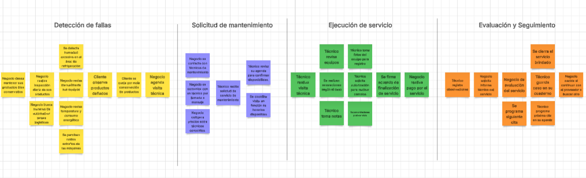
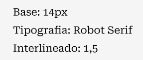
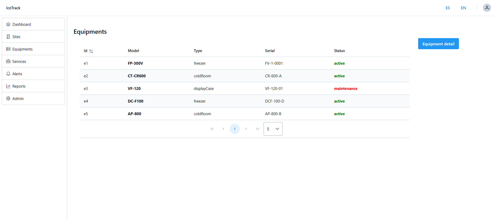
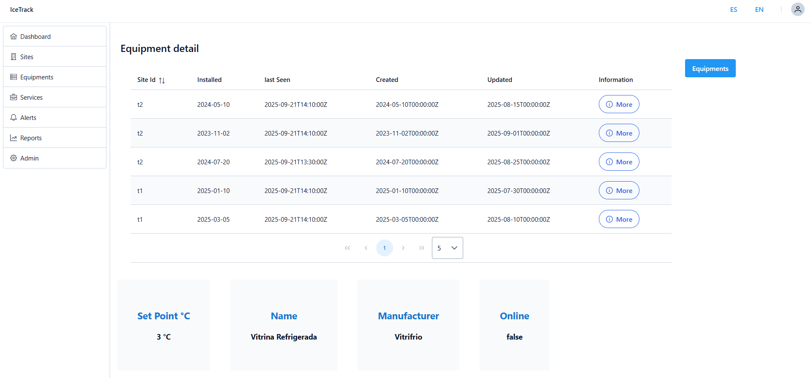

 <h1>Universidad Peruana de Ciencias Aplicadas</h1>
 
  <h2>Carrera: Ingeniería de Software</h2>
  <h2>Ciclo: 2025-20</h2>
 
  <h2>Curso: 1ASI0730 Aplicaciones Web</h2>
  <h2>Sección: 7452</h2>
  <h2>Profesor: Hugo Allan Mori Paiva</h2>
 
 <h1>Informe TB1</h1>
  <h2>Startup: Frostshield </h2>
  <h2>Producto: IceTrack </h2>
 
  <h2>Integrantes</h2>
 

 
| 
Alumno
 | 
Código
 |
|:-------------------------------------:|:-------------------------------------:|
|   Galindo Montero, Alejandro Manuel   |              u202321264               |
|     Guillen Galindo, Julio Adolfo     |              u20241a352               |
|   La Madrid Lozano, Ivan Jeanpierre   |              u202113432               |
|       Nanfuñay Liza, Pedro Jesus      |              u202215462               |
|     Ramirez Cabrera, Kenyi Efrain     |              u202220138               |

 
   <h3>Setiembre 2025</h3>

## Registro de Versiones del Informe

 
| Versión | Fecha      | Autor               | Descripción de modificación                                      |
|---------|------------|----------------------|-----------------------------------------------------------------|
| 0.1     | 13/09/2025 | Kenyi Ramírez        | Elaboración de la estructura inicial del reporte                |
| 0.2     | 13/09/2025 | Alejandro Galindo    | Desarrollo del Capitulo I                                       |
| TB1 | 13/09/2025 | FrostShield | Se redactaron los capítulos:   - Capítulo I: Introducción   - Capítulo II: Requirements Elicitation & Analysis   - Capítulo III: Requirements Specification   - Capítulo IV: Product Design   - Capítulo V: Product Implementation, Validation & Deployment (Sprint 1) |
| TP1 | 13/09/2025 | FrostShield | Se modificaron los capítulos:   - Capítulo II: Requirements Elicitation & Analysis   - Capítulo III: Requirements Specification   - Capítulo IV: Product Design     Se redactaron los capítulos:  - Capítulo V: Product Implementation, Validation & Deployment (Sprint 2) |

## Project Report Collaboration Insights

- **URL de la organización del proyecto:**  [https://github.com/1ASI0730-2520-7452-G1-FrostShield](https://github.com/1ASI0730-2520-7452-G1-FrostShield)

- **URL del repositorio del informe del proyecto:**  [https://github.com/1ASI0730-2520-7452-G1-FrostShield/Report](https://github.com/1ASI0730-2520-7452-G1-FrostShield/Report)

- **URL del repositorio del landing page del proyecto:**  [https://github.com/1ASI0730-2520-7452-G1-FrostShield/IceTrack---Landing-Page](https://github.com/1ASI0730-2520-7452-G1-FrostShield/IceTrack---Landing-Page)

**TB1:** Las tareas asignadas a la TB1 han sido finalizadas y se encuentran correctamente documentadas en el repositorio de GitHub.

Durante la fase de preparación del informe, se llevaron a cabo las siguientes actividades:

- Se redactaron y crearon los contenidos asignados a cada miembro utilizando formato Markdown, y se realizaron "Conventional Commits" para documentar el avance en el repositorio.

- Se generaron los recursos necesarios y se añadieron las imágenes al repositorio en la carpeta "assets" correspondiente a cada rama del informe.

- Se organizaron reuniones para coordinar el progreso de los componentes del informe y del Sprint 1, que estuvo enfocado en el desarrollo de la Landing Page.

## Contenido

- [Student Outcome](#student-outcome)

- [Capítulo I: Introducción](#c1)
    - [1.1. Startup Profile](#11-startup-profile)
        - [1.1.1. Descripción de la Startup](#111-descripción-de-la-startup)
        - [1.1.2. Perfiles de integrantes del equipo](#112-perfiles-de-integrantes-del-equipo)
    - [1.2. Solution Profile](#12-solution-profile)
        - [1.2.1 Antecedentes y problemática](#121-antecedentes-y-problematica)
        - [1.2.2 Lean UX Process](#122-lean-ux-process)
            - [1.2.2.1. Lean UX Problem Statements](#1221-lean-ux-problem-statements)
            - [1.2.2.2. Lean UX Assumptions](#1222-lean-ux-assumption)
            - [1.2.2.3. Lean UX Hypothesis Statements](#1223-lean-ux-hypothesis-statements)
            - [1.2.2.4. Lean UX Canvas](#1224-lean-ux-canvas)
    - [1.3. Segmentos objetivo](#13-segmentos-objetivos)

- [Capítulo II: Requirements Elicitation & Analysis](#c2)
    - [2.1. Competidores](#21-competidores)
        - [2.1.1. Análisis competitivo](#211-análisis-competitivo)
        - [2.1.2. Estrategias y tácticas frente a competidores](#212-estrategias-y-tácticas-frente-a-competidores)
    - [2.2. Entrevistas](#22-entrevistas)
        - [2.2.1. Diseño de entrevistas](#221-diseño-de-entrevistas)
        - [2.2.2. Registro de entrevistas](#222-registro-de-entrevistas)
        - [2.2.3. Análisis de entrevistas](#223-análisis-de-entrevistas)
    - [2.3. Needfinding](#23-needfinding)
        - [2.3.1. User Personas](#231-user-personas)
        - [2.3.2. User Task Matrix](#232-user-task-matrix)
        - [2.3.3. User Journey Mapping](#233-user-journey-mapping)
        - [2.3.4. Empathy Mapping](#234-empathy-mapping)
    - [2.4. Big Picture EventStorming](#24-big-picture-eventstorming)
    - [2.5. Ubiquitous Language](#25-ubiquitous-language)

- [Capítulo III: Requirements Specification](#c3)
    - [3.1. To-Be Scenario Mapping](#31-to-be-scenario-mapping)
    - [3.2. User Stories](#32-user-stories)
    - [3.3. Impact Mapping](#33-impact-mapping)
    - [3.4. Product Backlog](#34-product-backlog)

- [Capítulo IV: Product Design](#c4)
    - [4.1. Style Guidelines](#41-style-guidelines)
        - [4.1.1. General Style Guidelines](#411-general-style-guidelines)
        - [4.1.2. Web Style Guidelines](#412-web-style-guidelines)
    - [4.2. Information Architecture](#42-information-architecture)
        - [4.2.1. Organization Systems](#421-organization-systems)
        - [4.2.2. Labeling Systems](#422-labeling-systems)
        - [4.2.3. SEO Tags and Meta Tags](#423-seo-tags-and-meta-tags)
        - [4.2.4. Searching Systems](#424-searching-systems)
        - [4.2.5. Navigation Systems](#425-navigation-systems)
    - [4.3. Landing Page UI Design](#43-landing-page-ui-design)
        - [4.3.1. Landing Page Wireframe](#431-landing-page-wireframe)
        - [4.3.2. Landing Page Mock-up](#432-landing-page-mock-up)
    - [4.4. Web Applications UX/UI Design](#44-web-applications-uxui-design)
        - [4.4.1. Web Applications Wireframes](#441-web-applications-wireframes)
        - [4.4.2. Web Applications Wireflow Diagrams](#442-web-applications-wireflow-diagrams)
        - [4.4.3. Web Applications Mock-ups](#443-web-applications-mock-ups)
        - [4.4.4. Web Applications User Flow Diagrams](#444-web-applications-user-flow-diagrams)
    - [4.5. Web Applications Prototyping](#45-web-applications-prototyping)
    - [4.6. Domain-Driven Software Architecture](#46-domain-driven-software-architecture)
        - [4.6.1. Design-Level EventStorming](#461-design-level-eventstorming)
        - [4.6.2. Software Architecture Context Diagram](#462-software-architecture-context-diagram)
        - [4.6.3. Software Architecture Container Diagrams](#463-software-architecture-container-diagrams)
        - [4.6.4. Software Architecture Components Diagrams](#464-software-architecture-components-diagrams)
    - [4.7. Software Object-Oriented Design](#47-software-object-oriented-design)
        - [4.7.1. Class Diagrams](#471-class-diagrams)
    - [4.8. Database Design](#48-database-design)
        - [4.8.1. Database Diagrams](#481-database-diagrams)

- [Capítulo V: Product Implementation, Validation & Deployment](#c5)
    - [5.1. Software Configuration Management](#51-software-configuration-management)
        - [5.1.1. Software Development Environment Configuration](#511-software-development-environment-configuration)
        - [5.1.2. Source Code Management](#512-source-code-management)
        - [5.1.3. Source Code Style Guide & Conventions](#513-source-code-style-guide--conventions)
        - [5.1.4. Software Deployment Configuration](#514-software-deployment-configuration)
    - [5.2. Landing Page, Services & Applications Implementation](#52-landing-page-services--applications-implementation)
        - [5.2.1. Sprint 1](#521-sprint-1)
            - [5.2.1.1. Sprint Planning 1](#5211-sprint-planning-1)
            - [5.2.1.2. Aspect Leaders and Collaborators](#5212-aspect-leaders-and-collaborators)
            - [5.2.1.3. Sprint Backlog 1](#5213-sprint-backlog-1)
            - [5.2.1.4. Development Evidence for Sprint Review](#5214-development-evidence-for-sprint-review)
            - [5.2.1.5. Execution Evidence for Sprint Review](#5215-execution-evidence-for-sprint-review)
            - [5.2.1.6. Services Documentation Evidence for Sprint Review](#5216-services-documentation-evidence-for-sprint-review)
            - [5.2.1.7. Software Deployment Evidence for Sprint Review](#5217-software-deployment-evidence-for-sprint-review)
            - [5.2.1.8. Team Collaboration Insights during Sprint](#5218-team-collaboration-insights-during-sprint)
        - [5.2.2. Sprint 2](#522-sprint-2)
            - [5.2.2.1. Sprint Planning 2](#5221-sprint-planning-2)
            - [5.2.2.2. Aspect Leaders and Collaborators](#5222-aspect-leaders-and-collaborators)
            - [5.2.2.3. Sprint Backlog 2](#5223-sprint-backlog-2)
            - [5.2.2.4. Development Evidence for Sprint Review](#5224-development-evidence-for-sprint-review)
            - [5.2.2.5. Execution Evidence for Sprint Review](#5225-execution-evidence-for-sprint-review)
            - [5.2.2.6. Services Documentation Evidence for Sprint Review](#5226-services-documentation-evidence-for-sprint-review)
            - [5.2.2.7. Software Deployment Evidence for Sprint Review](#5227-software-deployment-evidence-for-sprint-review)
            - [5.2.2.8. Team Collaboration Insights during Sprint](#5228-team-collaboration-insights-during-sprint)

- [Conclusiones](#conclusiones)
- [Bibliografía](#bibliografía)
- [Anexos](#anexos)

## Student Outcome
El curso contribuye al cumplimiento del Student Outcome ABET:

**ABET – EAC - Student Outcome 5**

**Criterio**: *La capacidad de funcionar efectivamente en un equipo cuyos miembros
juntos proporcionan liderazgo, crean un entorno de colaboración e inclusivo,
establecen objetivos, planifican tareas y cumplen objetivos.*

En el siguiente cuadro se describe las acciones realizadas y enunciados de
conclusiones por parte del grupo, que permiten sustentar el haber alcanzado el logro
del ABET – EAC - Student Outcome 5.

| Criterio específico                                                                             | Acciones realizadas                                                      | Conclusiones                   |
|-------------------------------------------------------------------------------------------------|--------------------------------------------------------------------------|--------------------------------|
| Trabaja en equipo para proporcionar liderazgo en forma conjunta                                 | <ul><li><b>Galindo Montero, Alejandro Manuel</b> <b>TB1</b>: Durante el proyecto participé de manera activa en la coordinación del equipo y la organización de tareas y la búsqueda conjunta de soluciones para cumplir con los objetivos establecidos.  <b>TP1</b>: Durante el desarrollo de esta entrega, apoyé a mis compañeros en la realización de diversas tareas y en la resolución de dudas. Asimismo, corregí secciones de la TB1 como User Stories y Product Backlog, y colaboré en el desarrollo del Sprint 2 y del capítulo 5, promoviendo el liderazgo compartido dentro del grupo. </li><li><b>Guillen Galindo, Julio Adolfo</b> <b>TB1</b>: Durante el desarrollo del trabajo, he colaborado de forma continua en la parte del capitulo IV, mostrando soluciones apropiados a las especificaciones necesarias de cada parte.  <b>TP1</b>: Participé en la elaboración y mejora de los wireframes, optimizando la experiencia del usuario y facilitando la comunicación entre los miembros del equipo de diseño y desarrollo. </li><li><b>La Madrid Lozano, Ivan Jeanpierre</b> <b>TB1</b>: He colaborado en equipo en lso principales canales de comunicación como whatsapp y discord. También estuve presente en las distintas reuniones y trabajado colaborativamente.  <b>TP1</b>: Organicé las tareas pendientes del equipo para definir su correcta distribución entre los integrantes, contribuyendo a mantener la eficiencia y el cumplimiento de los plazos establecidos. </li><li><b>Nanfuñay Liza, Pedro Jesus</b>  <b>TB1</b>: Durante el desarrollo del presente proyecto, participé activamente en las reuniones y toma de decisiones del equipo. Así mismo, contribuí a la coordinación de tareas y propuesta de soluciones, demostrando capacidad de liderazgo de forma colaborativa y responsabilidad con el desarrollo del proyecto y del equipo.  <b>TP1</b>: Realicé la identificación de fallas y observaciones dentro del proyecto, asegurando la mejora continua del trabajo en equipo. <li><b>Ramirez Cabrera, Kenyi Efrain</b> <b>TB1</b>: A lo largo del desarrollo, colaboré en la organización de las tareas y en la generación de propuestas para resolver problemas, mostrando liderazgo colaborativo y compromiso tanto con el progreso del proyecto como con el crecimiento del equipo.  <b>TP1</b>: Participé activamente en las reuniones de coordinación, colaborando en la toma de decisiones junto con mis compañeros y reforzando la comunicación y el liderazgo compartido del grupo. </ul>        | <ul><li><b>TB1</b>: Como equipo logramos identificar y desarrollar ideas de negocio; realizamos entrevistas y construimos modelos de los capitulos, con el fin de obtener una visión más precisa sobre cómo funcionará el software.   </li><li><b>TP1</b>: El liderazgo fue ejercido de manera colaborativa entre los miembros del equipo, promoviendo la organización, la comunicación constante y el cumplimiento de los objetivos planteados.</li></ul> |
| Crea un entorno colaborativo e inclusivo, establece metas, planifica tareas y cumple objetivos. | <ul><li><b>Galindo Montero, Alejandro Manuel</b> <b>TB1</b>: Empleeé una organización para estructurar y gestionar las tareas de forma colaborativa, priorizando actividades según los plazos planificados, para maximizar la eficiencia del equipo y el cumplimiento de metas.  <b>TP1</b>: Diseñé el formato de organización en Trello y, junto con mi equipo, definí los bounded contexts de la aplicación web. Además, destaqué observaciones y puntos de mejora para optimizar la planificación del proyecto. </li><li><b>Guillen Galindo, Julio Adolfo</b> <b>TB1</b>: Organize mi timepo apra realizar lapropuesta de trabajo, ademas de organizar entrevistas que eran un requerimiento en los objetivos a realizar.  <b>TP1</b>: Desarrollé prototipos visuales y mockups interactivos que facilitaron la comunicación entre el equipo de diseño y el desarrollo frontend, contribuyendo a la alineación de los objetivos visuales del producto. </li><li><b>La Madrid Lozano, Ivan Jeanpierre</b>  <b>TB1</b>: Fui responsable del diseño de los wireframes de la Landing Page y de la organización de las ramas y la estructura del repositorio en GitHub.  <b>TB1</b>: Fui participé en las decisiones del equipo asu como su planificación y desarrollo. Mediante aplicaicones como Trello se desplego y evidenció las distintas tareas del equipo. </li><li><b>Nanfuñay Liza, Pedro Jesus</b> <b>TB1</b>: Trabajé activamente en el desarrollo del proyecto mediante una organización en Github, plataforma que permite realizar avances en un entorno colaborativo para cumplir con los objetivos establecidos mediante tareas asignadas en plazos previamente planificados.  <b>TP1</b>: Elaboré los wireflows y userflows del proyecto, aplicando principios de diseño UX para mejorar la usabilidad y experiencia del usuario. </li><li><b>Ramirez Cabrera, Kenyi Efrain</b> <b>TB1</b>: Participé de forma activa en el desarrollo del proyecto usando una organización en GitHub, a través de ella se gestionaron los avances, se asignaron tareas y se cumplieron los objetivos dentro de los plazos previamente establecidos.  <b>TP1</b>: Actualicé el Database Diagram, el Class Diagram y los Lean UX Assumptions, contribuyendo a la documentación técnica y coherencia del sistema</li></ul>        | <ul><li><b>TB1</b>: Fomentamos un ambiente de trabajo colaborativo e inclusivo, fijamos metas claras, organizamos las tareas y alcanzamos los objetivos propuestos.   </li><li><b>TP1</b>: Se fortaleció un entorno colaborativo e inclusivo mediante una planificación conjunta y una comunicación efectiva. Cada integrante participó activamente en la consecución de los entregables, consolidando el compromiso del equipo y el cumplimiento de los objetivos. </li></ul> |

# Capitulo 1: Introducción

## 1.1 Startup Profile

### 1.1.1 Descripción de la Startup

Nuestra startup ofrece una aplicación web diseñada para optimizar la gestión y el mantenimiento de equipos de refrigeración en negocios que dependen de la cadena de frío. Nuestro alcance es atender a una amplia gama de clientes, incluyendo supermercados, minimarkets, laboratorios, restaurantes y empresas de los sectores alimentario y farmacéutico. Nuestra plataforma conecta de manera fluida a estos negocios con técnicos especializados y proveedores de equipos, facilitando un enfoque integral, proactivo y automatizado para la gestión de sus sistemas de refrigeración.
Las funcionalidades clave de la plataforma incluyen el monitoreo en tiempo real de temperatura, consumo energético y tiempo de uso. Además, ofrece alertas automáticas ante fallos, informes técnicos detallados, historiales de rendimiento y programación inteligente de mantenimientos. Estas herramientas permiten a empresas, técnicos y proveedores mejorar la eficiencia operativa, prevenir costosas pérdidas por fallos inesperados y mantener un registro completo del estado y uso de sus equipos.

Misión: Queremos ofrecer una solución tecnológica inteligente que ayude a las empresas a proteger su inventario y a optimizar la gestión de sus equipos de refrigeración. Al mismo tiempo, proporcionamos herramientas especializadas para mejorar la eficiencia operativa de los técnicos y proveedores del sector.
Visión: Ser la empresa líder en la gestión y el mantenimiento de equipos de refrigeración en el mercado peruano, comenzando por consolidar nuestra posición en Lima.

### 1.1.2 Perfiles de integrantes del equipo

| **Integrante**            | **Galindo Montero Alejandro Manuel**          |
|---------------------------|-----------------------------------------------|
| **Código del Estudiante** |  u202321264                                   |
| **Carrera**               |  Ingeniería de Software                       |
| **Descripción**           |   Mi nombre es Alejandro Manuel Galindo Montero, tengo 20 años y curso la carrera de Ingeniería de Software. Me considero una persona creativa y responsable. En mis tiempos libres me gusta aprender cosas nuevas. En este proyecto apoyaré con todos los conocimientos que he adquirido en los últimos años.   |
| **Foto**                  |   |

---

| **Integrante**            | **Guillen Galindo Julio Adolfo**                                                    |
|---------------------------|-------------------------------------------------------------------------------------|
| **Código del Estudiante** | u20241a352                                                                          |
| **Carrera**               | Ingeniería de Software                                                              |
| **Descripción**           | Actualmente curso la carrera de Ingeniería de Software en la UPC. Me considero una persona discreta, pero responsable y enfocada en cumplir los proyectos dentro de los plazos establecidos. Poseo conocimientos en C++ y Python; disfruto trabajar en equipo cuando existe colaboración y apoyo mutuo. Además, me motiva aplicar lo aprendido para afrontar los desafíos que puedan surgir en los próximos ciclos. |
| **Foto**                  |  |

---

| **Integrante**            | **La Madrid Lozano, Ivan Jeanpierre**                                               |
|---------------------------|-------------------------------------------------------------------------------------|
| **Código del Estudiante** |u202113432|
| **Carrera**               |Ingeniería de Software|
| **Descripción**           |Soy un estudiante de la ingeniería de software. Actualente me gusta el desarrollo de solucines innovadores meidante la tecnología. Me encanta proponer soluciones para problemas que requieran innovación y tecnología. Ne considero alguien proactivo y colaborativo. Con entusiasmo espero aportar valor al equipo y a distintos proyectos.|
| **Foto**                  | |

---

| **Integrante**  | **Nanfuñay Liza, Pedro Jesús** |
|-----------------|--------------------------------|
| **Código del Estudiante** | u202215462 |
| **Carrera** | Ingeniería de Software |
| **Descripción** | Mi nombre es Pedro Jesús Nanfuñay Liza, tengo 20 años y soy estudiante de la carrera de Ingeniería de Software. Me considero una persona creativa, responsable, perseverante y siempre dispuesto a trabajar en equipo. Tengo conocimientos en varios lenguajes de programación como C++, Java y Python; en el desarrollo web con frameworks Angular y Primevue, y en base de datos relacionales y no relacionales como SQL y MongoDB. Espero aportar de manera positiva al equipo y cumplir con los objetivos establecidos. |
| **Foto** |  |

---

| **Integrante**            | **Kenyi Efrain Ramirez Cabrera**                                                    |
|---------------------------|-------------------------------------------------------------------------------------|
| **Código del Estudiante** | u202220138                                                                          |
| **Carrera**               | Ingeniería de Software                                                              |
| **Descripción**           | Soy Kenyi Ramirez, estudio la carrera de Ingeniería de Software en la Universidad Peruana de Ciencias Aplicadas. Soy una persona comprometida y trabajadora. Poseo un nivel intermedio en los lenguajes C++, Python, Java y HTML, los cuales aplico para garantizar resultados efectivos en mis tareas. |
| **Foto**                  |  |

## 1.2 Solution Profile

### 1.2.1 Antecedentes y Problematica

| **5W & 2H**                                     | **Descripcion**                                                                                                                                            |
|-------------------------------------------------|------------------------------------------------------------------------------------------------------------------------------------------------------------|
| **What: ¿Cuál es el problema?**                 | Los negocios que dependen de la refrigeración se enfrentan a una vulnerabilidad operativa significativa. La falta de control en sus equipos de congelación lleva a fallas inesperadas, alto consumo energético y falta de un mantenimiento proactivo. Como resultado, sufren grandes pérdidas económicas, tanto por productos dañados como por la interrupción de su servicio. |
| **When: ¿Cuándo sucede este problema?**         | Este problema es una amenaza constante, especialmente durante la operación continua de los negocios. Se vuelve más crítico cuando no hay técnicos disponibles para una revisión inmediata o cuando se ha descuidado el seguimiento regular del estado de los equipos. |
| **Where: ¿Dónde se produce este suceso?**       | El problema está presente en todo el país, afectando a negocios en diversas ciudades. Sin embargo, su impacto es particularmente notable en Lima, donde la cadena de frío es vital para sectores como la alimentación y la medicina. Las empresas de servicios que atienden a estos clientes también se ven afectadas al no tener una forma centralizada de gestionar sus operaciones. |
| **Who: ¿Quiénes están involucrados?**           | Este problema afecta a una amplia gama de actores. Por un lado, están los dueños y administradores de negocios que sufren las consecuencias directas de las fallas. Por otro, los técnicos y empresas de servicio que se ven obligados a responder a emergencias sin las herramientas adecuadas. |
| **Why: ¿Cuál es la causa del problema?**        | La causa principal es la falta de herramientas tecnológicas accesibles que permitan integrar el monitoreo en tiempo real, las alertas y la programación de servicios. En la mayoría de los casos, la gestión del mantenimiento aún es manual, lo que impide una respuesta preventiva y eficiente ante cualquier anomalía. |
| **How: ¿Qué llevó a la persona a llegar a esta situación?** | La situación actual es el resultado de la gestión reactiva y la falta de digitalización. Los negocios han dependido de una estrategia de "apagar incendios", esperando a que ocurra un problema crítico para actuar. Esta mentalidad ha generado un ciclo de costos elevados, tiempos de respuesta lentos y un desgaste operativo que se podría haber evitado con una planificación adecuada. |
| **How Much: ¿Cuánto es el impacto financiero?** | El impacto económico de una falla es considerable y varía. Las pérdidas por el deterioro de productos pueden ser de cientos a miles de soles. A esto se suman los costos de las reparaciones de emergencia y el daño a largo plazo en la reputación y la confianza del cliente, lo que hace que el costo total sea mucho mayor. |

### 1.2.2 Lean UX Process

#### 1.2.2.1 Lean UX Problem Statements

En el sector de la refrigeración, las empresas se enfrentan a un desafío recurrente: la falta de una gestión inteligente para sus equipos. Los negocios que dependen de la cadena de frío, desde supermercados hasta laboratorios farmacéuticos, operan con un alto riesgo de pérdidas económicas y desperdicio de energía, ya que su mantenimiento es reactivo, no proactivo.
Existe un vacío en el mercado que las soluciones actuales no han logrado llenar. No hay una plataforma que unifique la gestión y ofrezca una visibilidad completa del estado de los equipos. Esta ausencia de alertas preventivas y datos históricos dificulta la respuesta ante fallas y degrada la calidad del servicio técnico.
FrostShield ha sido creada para superar estos obstáculos. IceTrack establece una conexión digital entre los negocios y sus equipos, permitiendo un monitoreo constante de la temperatura y el consumo energético. Esto no solo previene fallas, sino que también optimiza el rendimiento y prolonga la vida útil de los equipos. Además, proporcionamos a los técnicos una herramienta centralizada para organizar sus tareas, acceder al historial de cada equipo y responder de manera más eficiente.
Inicialmente, nos enfocamos en los negocios de Lima que buscan una solución confiable para sus sistemas de refrigeración, así como en los proveedores de servicio que desean modernizar sus operaciones. 
Sabremos que hemos tenido éxito cuando se reduzcan las fallas críticas, mejore la eficiencia energética y aumente en la satisfacción y lealtad de nuestros clientes, demostrando así el valor de la tecnología en el sector.

#### 1.2.2.2 Lean UX Assumption

# Business Outcomes

-	**Reducir las pérdidas de inventario:** La plataforma de FrostShield previene fallas térmicas, minimizando el descarte de productos y aumentando la rentabilidad de los negocios.
- **Aumentar la eficiencia operativa:** Los técnicos pueden gestionar sus tareas de forma más inteligente y atender a más clientes en menos tiempo, lo que se traduce en una mayor productividad.
- **Mejorar la fidelización de clientes:** Un servicio proactivo y transparente fortalece la confianza con los clientes, lo que lleva a una mayor retención y a relaciones comerciales a largo plazo.
- **Optimizar los costos de mantenimiento:** La plataforma permite pasar de un modelo de mantenimiento reactivo, costoso e impredecible, a uno predictivo, que reduce los gastos en reparaciones de emergencia.
- **Posicionar el liderazgo en el mercado:** Al ofrecer una solución tecnológica innovadora, el proyecto permite a los proveedores de servicio diferenciarse de su competencia y captar nuevos clientes de manera más efectiva.
- **Generar ingresos recurrentes:** El modelo de negocio, basado en suscripciones y servicios de valor añadido, asegura un flujo de ingresos constante y escalable para la empresa.
- **Disminuir el consumo energético:** El monitoreo en tiempo real del consumo de energía permite identificar y corregir ineficiencias, lo que se traduce en ahorros significativos para los negocios.
- **Facilitar la toma de decisiones:** Los dueños de negocios tienen acceso a datos precisos y en tiempo real sobre el rendimiento de sus equipos, lo que les permite tomar decisiones más informadas para optimizar su operación.

# User Outcomes

## ¿Quién será nuestro usuario?

Nuestros usuarios clave son de tres tipos:
- Negocios que dependen de la cadena de frío, como restaurantes, supermercados y laboratorios, para quienes una falla es una amenaza directa a su rentabilidad.
- Técnicos especializados en refrigeración que necesitan herramientas para gestionar su trabajo de manera más eficiente.
- Proveedores de equipos que buscan diferenciarse ofreciendo un servicio postventa de vanguardia.

## ¿Dónde encaja nuestro producto en su vida?

La plataforma se integra como una herramienta esencial para la gestión diaria de nuestros usuarios. 
- Para los negocios, es una capa de seguridad que les garantiza la continuidad operativa y previene pérdidas. 
- Para los técnicos, se convierte en su asistente personal para organizar clientes y visitas. 
- Sirve como un registro centralizado y accesible que facilita auditorías y la toma de decisiones.

## ¿Qué problemas tiene nuestro producto y cómo se pueden resolver?

- Un desafío crítico es la precisión de los datos. Si las lecturas no son confiables, la plataforma pierde su valor. 
- Para resolverlo, implementaremos sensores certificados y algoritmos de validación de datos que corrijan lecturas erróneas. 
- Otro problema es la resistencia inicial de usuarios no tecnológicos. 
- Esto se abordará con una interfaz simple y un proceso de “onboarding” intuitivo, además de tutoriales en video para facilitar la adopción.

## ¿Cómo y Cuándo es usado nuestro producto?

- La plataforma es multiplataforma (web y móvil), lo que la hace accesible tanto desde una oficina como en el campo. 
- Negocios la consultan para monitorear el estado de sus equipos
- Los técnicos la utilizan para gestionar sus tareas.
- También funciona de manera automática en segundo plano, enviando alertas inmediatas al detectar una anomalía, lo que permite una respuesta rápida incluso fuera del horario laboral.

## ¿Qué características son importantes para la app?

Las características clave incluyen: 
- Monitoreo en tiempo real, alertas automatizadas y un historial técnico detallado. 
- La plataforma también integra un calendario de mantenimiento y un módulo exclusivo para técnicos. 
- Integración de IA para recomendaciones predictivas. 
- Sistema de gestión de roles para múltiples usuarios y ubicaciones son esenciales.

## ¿Cómo debe verse nuestro producto y cómo comportarse?

- El diseño de la plataforma debe transmitir confianza y claridad. 
- La interfaz será minimalista y centrada en la acción, mostrando la información más relevante de un vistazo. 
- La experiencia de usuario debe ser fluida, con una navegación intuitiva y notificaciones inmediatas que no saturen al usuario, sino que lo mantengan siempre informado y en control.

## ¿Qué valor busca el cliente?

- El cliente busca simplificar la gestión de sus equipos y pasar de ser un gestor reactivo a uno proactivo. 
- Los negocios desean seguridad operativa, saber que sus equipos están protegidos de fallas inesperadas y pérdidas. 
- También buscan optimizar sus costos a través de la eficiencia energética y una mejor trazabilidad del rendimiento de sus sistemas.

## ¿Qué beneficios adicionales obtendrá el cliente?

- Obtendrán visibilidad total y remota de sus activos.
- Soporte técnico más ágil gracias a la información centralizada
- Reducción significativa de los costos operativos.
- La plataforma proporcionará reportes personalizados que no podrían generar de forma manual.

## ¿Cómo atraeremos usuarios?

- Se implementará una estrategia de marketing de nicho que se dirija a la audiencia correcta a través de LinkedIn y correos.
- Exploraremos alianzas estratégicas con proveedores de equipos para ofrecer la plataforma como un valor añadido en sus ventas. 
- Prueba gratuita de 14 días para que los usuarios experimenten el valor del producto de primera mano, sin compromiso.

## ¿Cómo generaremos ingresos?

- Suscripción mensual, escalonada según el número de equipos y el nivel de funcionalidad. 
- Modelo freemium para captar a usuarios más pequeños
- Publicidad dirigida para marcas que deseen llegar a nuestra base de usuarios.

## ¿Cuál es nuestra competencia y cómo la superamos?

- Nuestra competencia son soluciones genéricas de gestión de mantenimiento y nuestra ventaja es la especialización. 
- La plataforma está diseñada exclusivamente para la refrigeración, lo que nos permite ofrecer funciones avanzadas como la detección de anomalías en tiempo real y la automatización de acciones, que ninguna otra herramienta genérica puede igualar.

## ¿Cuál es nuestro mayor riesgo?

- Resistencia al cambio del personal tradicional.
- Lentitud en la adopción inicial.
- Desconfianza en la precisión de los datos.

## ¿Cómo lo resolveremos?

- Implementaremos algoritmos de validación robustos para asegurar la precisión de los datos.
- Ofreceremos capacitación continua y soporte dedicado para facilitar la adopción.
- comenzaremos con una estrategia de integración progresiva, enfocándonos en los equipos más comunes y trabajando con sensores certificados para generar una base de confianza sólida.

#### 1.2.2.3 Lean UX Hypothesis Statements

**Hipótesis 1: Adopción del Producto**

Creemos que los negocios de alimentos y bebidas adoptarán nuestra plataforma para gestionar sus equipos de refrigeración, utilizándola regularmente para el monitoreo y la gestión de tareas.
Sabremos que hemos tenido éxito cuando la mayoría de nuestros usuarios activos semanales utilicen tanto la función de monitoreo en tiempo real como la de gestión de servicios durante los primeros meses de suscripción.

---

**Hipótesis 2: Mitigación de Pérdidas**

Creemos que, al proporcionar monitoreo en tiempo real y alertas tempranas, reduciremos significativamente las pérdidas de inventario de nuestros clientes relacionadas con fallos en la refrigeración.
Sabremos que hemos tenido éxito cuando una gran parte de nuestros clientes que reporten pérdidas de inventario confirmen que la alerta de nuestra plataforma les permitió actuar a tiempo para mitigar el daño, reflejándose en una notable reducción de pérdidas en sus registros.

---

**Hipótesis 3: Eficiencia del Servicio**

Creemos que nuestra plataforma optimizará la cadena de servicio, reduciendo sustancialmente el tiempo promedio de respuesta y resolución de un problema de refrigeración.
Sabremos que hemos tenido éxito cuando los técnicos de servicio registren que el tiempo desde la solicitud hasta la finalización de un servicio se ha acortado notablemente en comparación con sus procesos manuales, y esta mejora se refleje en los informes generados por nuestra plataforma.

---

**Hipótesis 4: Satisfacción del Cliente**

Creemos que la centralización de la gestión y la transparencia del proceso de servicio mejorarán la satisfacción de los clientes con el mantenimiento de sus equipos.
Sabremos que hemos tenido éxito cuando obtengamos una alta puntuación promedio en las encuestas de satisfacción del cliente relacionadas con la coordinación de servicios, y recibamos testimonios que resalten la facilidad y la claridad del proceso.

---

**Hipótesis 5: Retención y Valor a Largo Plazo**

Creemos que la propuesta de valor de nuestra plataforma, centrada en la automatización y el ahorro, incentivará la retención a largo plazo de los clientes.
Sabremos que hemos tenido éxito cuando la gran mayoría de nuestros clientes continúen utilizando la plataforma después de los primeros meses, y veamos que renuevan sus suscripciones de forma recurrente.

#### 1.2.2.4 Lean UX Canvas

<figure style="page-break-inside: avoid; text-align: center;">
  
  <figcaption style="font-size: 0.9em; color: #555;">
    <strong>Figura 1:</strong> Lean UX Canvas.
  </figcaption>
</figure>

## 1.3 Segmentos objetivos

**Segmento Objetivo 1: Negocios con equipos de refrigeración**

**Aspectos demográficos:**
- **Tipo de negocio:** Pequeñas, medianas y grandes empresas.
- **Rubro:** Alimentario, farmacéutico, restauración y comercio minorista.
- **Nivel de necesidad:** Alta dependencia de sistemas de refrigeración.

**Aspectos geográficos:**
- **Nacionalidad:** Peruana.
- **Zona geográfica:** Urbana.
- **Departamento:** Lima.

**Aspectos psicográficos:**
- **Motivación:** Evitar pérdidas económicas por fallas en la refrigeración y reducir costos operativos.
- **Valores:** La eficiencia, la calidad del inventario y el control de las operaciones.
- **Intereses:** La adopción de tecnología para optimizar la gestión y asegurar la tranquilidad en la operación diaria.

---

**Segmento Objetivo 2: Técnicos y empresas de mantenimiento**

**Aspectos demográficos:**
- **Tipo de negocio:** Profesionales independientes y compañías de servicio técnico.
- **Rubro:** Mantenimiento y reparación de equipos de refrigeración.
- **Nivel de necesidad:** Alta demanda de organización y eficiencia en sus procesos.

**Aspectos geográficos:**
- **Nacionalidad:** Peruana.
- **Zona geográfica:** Urbana.
- **Departamento:** Lima.

**Aspectos psicográficos:**
- **Motivación:** Incrementar la productividad, reducir el tiempo en tareas administrativas y mejorar la calidad de su servicio.
- **Valores:** La profesionalidad, la eficiencia y la tecnología como herramienta para facilitar su trabajo.
- **Intereses:** Contar con una plataforma que centralice la información, automatice la generación de reportes y mejore la comunicación con sus clientes.

# Capítulo II: Requirements Elicitation & Analysis

## 2.1. Competidores

**Competidor 1: ServiceTitan**
ServiceTitan es una plataforma de gestión de servicios basada en la nube que ofrece soluciones de software para empresas de servicios, incluidos técnicos de HVAC, fontaneros y electricistas. Proporciona funcionalidades de programación, gestión de trabajos, facturación y más. Esta plataforma es conocida por su facilidad de uso y por ayudar a las empresas a optimizar sus operaciones de servicio técnico en tiempo real.

---

**Competidor 2: Sensefinity**
Sensefinity es una plataforma tecnológica especializada en soluciones de IoT para la cadena de frío, que permite monitorear en tiempo real condiciones como temperatura, humedad y vibraciones en productos sensibles durante su transporte y almacenamiento. Además, ofrece alertas automáticas y reportes en la nube que ayudan a las empresas a reaccionar rápidamente ante cualquier falla. Esta plataforma es reconocida por facilitar la trazabilidad completa de los productos y por apoyar a sectores como supermercados, farmacéuticas y logística en la reducción de pérdidas y el cumplimiento de estándares de calidad.

---

**Competidor 3: TempGenius**
TempGenius es un software de monitoreo de temperatura y humedad en tiempo real para diversas industrias, incluida la de la refrigeración comercial. Permite a los usuarios realizar un seguimiento de sus equipos de refrigeración mediante sensores conectados a la nube, generar reportes y recibir alertas automáticas por variaciones en los niveles de temperatura. Su principal enfoque es mejorar la visibilidad y control de las operaciones de refrigeración para evitar pérdidas económicas.

### 2.1.1. Análisis competitivo

<table> 
  <tr>
    <th colspan="7"> Competitive Analysis Landscape </th>
  </tr>
  <tr>
    <td colspan="2" rowspan="2">¿Por qué llevar acabo este análisis? </td>
    <td colspan="5"> Con el objetivo de evaluar y comparar funcionalidades, tecnología, precios y estrategias de marketing de los principales competidores para identificar nuestras fortalezas y debilidades, detectar oportunidades negocio y identificar puntos que nos hagan diferenciar de la competencia. </td>
  </tr>
  <tr>
  </tr>
  <tr>
    <td colspan="2"> </td>
    <td> IceTrack   </img> </td>
    <td> ServiceTitan   </img> </td>
    <td> Sensefinity   </img> </td>
    <td> TempGenius   </img> </td>
  </tr>
  <tr>
    <td rowspan="2">Perfil</td>
    <td>Overview</td>
    <td> IceTrack es una plataforma integral de monitoreo y gestión para sistemas de refrigeración, que conecta negocios con técnicos especializados. Ofrece monitoreo en tiempo real, alertas automáticas, mantenimiento preventivo, y trazabilidad de cada equipo. </td>
    <td> ServiceTitan es una plataforma de gestión de servicios basada en la nube que ofrece soluciones de software para empresas de servicios, incluidos técnicos de HVAC, fontaneros y electricistas. </td>
    <td> Sensefinity es una solución IoT que combina sensores físicos con plataforma en la nube para monitoreo y trazabilidad de la cadena de frío. </td>
    <td> TempGenius es un software de monitoreo de temperatura y humedad en tiempo real para diversas industrias, incluida la refrigeración comercial. Permite a los usuarios gestionar y recibir alertas automáticas sobre sus equipos. </td>
  </tr>
  <tr>
    <td>Ventaja competitiva ¿Qué valor ofrece a los clientes?</td>
    <td> Ofrece una solución automatizada y centralizada para negocios que necesitan monitorear y gestionar sus equipos de refrigeración. Permite a los técnicos optimizar sus visitas y el mantenimiento preventivo, mejorando la eficiencia operativa. </td>
    <td> Ofrece una plataforma todo-en-uno para la gestión de servicios con características como la programación de citas, facturación y seguimiento en tiempo real de proyectos. </td>
    <td> Ofrece soluciones con foco en logística y permite monitorear productos en tiempo real durante su transporte y almacenamiento. </td>
    <td> Ofrece monitoreo preciso en tiempo real de la temperatura y humedad, con alertas automáticas, y un enfoque especial en la fiabilidad y precisión de los datos. </td>
  </tr>
  <tr>
    <td rowspan="2">Perfil de Marketing</td>
    <td> Mercado Objetivo </td>
    <td> Negocios que dependen de sistemas de refrigeración, como supermercados, minimarkets, laboratorios, restaurantes, entre otros. También incluye técnicos de refrigeración y proveedores de equipos. </td>
    <td> Empresas de servicios como HVAC, fontaneros, electricistas, y otros proveedores de servicios técnicos. </td>
    <td> Supermercados, farmacéuticas, operadores logísticos y empresas de exportación internacional. </td>
    <td> Usuarios de diversas industrias, especialmente en áreas que requieren monitoreo continuo de temperatura y humedad, como el sector alimentario y farmacéutico. </td>
  </tr>
  <tr>
    <td> Estrategias de Marketing </td>
    <td> Marketing digital, colaboraciones estratégicas con empresas del sector alimentario y farmacéutico, demostraciones gratuitas y promociones en redes sociales. </td>
    <td> Marketing digital, colaboraciones con empresas de servicios y promoción en plataformas de negocio. </td>
    <td> Marketing en ferias globales de logística y alianzas estratégicas con empresas de exportación. </td>
    <td> Marketing en redes sociales, promociones para nuevos usuarios y colaboraciones con industrias reguladas como la farmacéutica y alimentaria. </td>
  </tr>
  <tr>
    <td rowspan="3">Perfil de Producto</td>
    <td> Productos & Servicios </td>
    <td> Gestión de equipos de refrigeración en tiempo real, alertas automáticas, mantenimiento preventivo, reportes técnicos automáticos y trazabilidad de cada equipo. </td>
    <td> Plataforma de gestión de servicios que incluye programación de citas, gestión de personal, facturación, y seguimiento de proyectos en tiempo real. </td>
    <td> Plataforma de monitoreo y gestión de sistemas de refrigeración en la nube, con alertas preventivas e informes automáticos. Además ofrece sensores para monitorear temperatura, humedad, etc. </td>
    <td> Plataforma de monitoreo de temperatura y humedad en tiempo real, con alertas automáticas, reportes detallados y gestión de datos históricos. </td>
  </tr>
  <tr>
    <td> Precios & Costos </td>
    <td> Modelo basado en comisiones bajas por cada reserva o cita pagada para negocios, con una versión gratuita para usuarios. </td>
    <td> Suscripción mensual o anual, con tarifas adicionales por características avanzadas o soporte personalizado. </td>
    <td> Basado en subscripciones por conectividad y por servicios utilizados. Posible coste de instalación de hardware. </td>
    <td> Varía según la cantidad de equipos monitoreados y las características seleccionadas, con modelos de suscripción mensual o anual. </td>
  </tr>
  <tr> 
    <td>Canales de distribución (Web y/o Móvil)</td>
    <td> Plataforma en línea y aplicación móvil disponible para dispositivos iOS y Android. </td>
    <td> Plataforma en línea y aplicación móvil disponible para dispositivos iOS y Android. </td>
    <td> Plataforma en línea y aplicación móvil. </td>
    <td> Aplicación móvil disponible en tiendas de aplicaciones y plataforma en línea. </td>
  </tr>
  <tr>
    <td rowspan="4"> Análisis SWOT </td>
    <td> Fortalezas </td>
    <td> Monitoreo en tiempo real, alertas automáticas y mantenimiento preventivo para evitar fallas críticas. Función de trazabilidad completa de los equipos. </td>
    <td> Amplia funcionalidad para gestión de servicios y seguimiento en tiempo real de proyectos. </td>
    <td> Especialización en IoT y trazabilidad de la cadena de frío. Permite cumplir con normativas logísticas. Hardware propio optimizado para monitoreo en tiempo real.</td>
    <td> Precisión en el monitoreo de temperatura y humedad, con alertas automáticas y un enfoque flexible en diferentes industrias. </td>
  </tr>
  <tr>
    <td> Debilidades </td>
    <td> Dependencia de la adopción inicial por parte de los usuarios, lo que podría afectar la expansión. </td>
    <td> Puede ser más complejo de usar para pequeñas empresas sin experiencia en gestión de software. </td>
    <td> Fuerte dependencia de hardware, tiene menos presencia en el Perú. </td>
    <td> Puede resultar costoso para pequeñas empresas debido a las suscripciones y los costos adicionales por dispositivos. </td>
  </tr>
  <tr>
    <td> Oportunidades </td>
    <td> Expansión en el sector de la gestión de refrigeración, con foco en la eficiencia operativa y la reducción de costos. </td>
    <td> Expansión a nuevos mercados, introducción de nuevos servicios, mejorar la experiencia del usuario. </td>
    <td> Alianza con operadores logísticos. Aumento de regulaciones en farmaceúticas y alimentos. </td>
    <td> Expansión a nuevos mercados, introducción de nuevas características y servicios, colaboraciones estratégicas con marcas de belleza. </td>
  </tr>
  <tr>
    <td> Amenazas </td>
    <td> Competencia de aplicaciones ya establecidas en la gestión de refrigeración y mantenimiento. </td>
    <td> Competencia de otras plataformas de gestión de servicios que ofrecen características similares. </td>
    <td> Competencia con soluciones más económicas. Restricciones de conectividad por IoT en ciertas regiones. </td>
    <td> Competencia de otras plataformas de monitoreo de temperatura y humedad, con características similares y precios más bajos. </td>
  </tr>
</table>

### 2.1.2. Estrategias y tácticas frente a competidores

Hemos identificado diversas estrategias y tácticas para diferenciarnos y competir efectivamente con otros actores del mercado de la gestión y monitoreo de sistemas de refrigeración. A continuación se detallan las principales:

1. **Estrategias de Diferenciación:**

**Solución Integral para Refrigeración comercial:** A diferencia de los competidores, IceTrack se especializa exclusivamente en la gestión de sistemas de refrigeración, ofreciendo monitoreo en tiempo real, alertas automáticas, mantenimiento preventivo y trazabilidad completa. Esto permite a los negocios reducir las incidencias por fallas inesperadas y gestionar sus equipos de refrigeración de manera proactiva.

**Trazabilidad Completa de Equipos:** Ofrecemos una plataforma que proporciona un historial técnico detallado de cada equipo, algo que competidores como ServiceTitan no ofrecen de forma especializada para el sector de refrigeración. Esto garantiza un mayor control sobre los activos y la calidad del servicio.

**Interfaz Intuitiva y Fácil de Usar:** La plataforma prioriza una interfaz intuitiva y accesible para técnicos y negocios sin experiencia tecnológica.

2. **Tácticas de Marketing:**

**Marketing Digital y Demostraciones Gratuitas:** Lanzaremos campañas en redes sociales dirigidas a supermercados, laboratorios y restaurante, destacando nuestra capacidad para reducir fallas y ahorrar costos en operaciones. Esta táctica se diferencia de TempGenius, que aún no ha adoptado un enfoque digital tan agresivo.

**Fidelización de Usuarios a Largo Plazo:** Implementaremos programas de fidelización y un sistema de recompensas para los técnicos y negocios que continúen usando nuestra plataforma y colaboren con nosotros para mejorar el servicio. De esta forma, buscamos aumentar la lealtad, algo que muchos competidores no han logrado gestionar adecuadamente.

3. **Estrategias de Precios:**

**Modelo Freemium:** Ofrecemos una versión gratuita para atraer a pequeños negocios y usuarios que no están seguros de pagar por un servicio premium de inmediato. Este modelo es más flexible que el de ServiceTitan, que depende de suscripciones pagadas desde el principio.

**Comisiones Bajas por Reserva:** Para los negocios, aplicamos comisiones reducidas por cada cita reservada a través de nuestra plataforma, lo que facilita la adopción y reduce el riesgo financiero para los negocios. Esto nos diferencia de competidores con estructuras de costos más rígidas.

4. **Expansión y Adaptabilidad:**

**Enfoque Regional Inicial y Expansión Nacional:** A diferencia de competidores como TempGenius, que tiene un enfoque global, IceTrack comenzará en Lima con planes de expansión a otras ciudades del Perú. Esto nos permite adaptarnos mejor a las necesidades locales antes de expandirnos a nivel internacional.

**Colaboraciones con Proveedores Locales:** Formaremos alianzas estratégicas con proveedores de equipos de refrigeración y servicios técnicos en Perú, lo que nos diferenciará de la competencia al contar con un sistema robusto y adaptado específicamente para el mercado peruano.

## 2.2. Entrevistas

### 2.2.1. Diseño de entrevistas

En esta sección, se han planteado diversas preguntas dirigidas a nuestros segmentos objetivos con el objetivo de obtener información relevante, como opiniones o descripciones. Estos datos serán fundamentales para el desarrollo de nuestra solución.

**Preguntas para el Segmento Objetivo 1 - Negocios con equipos de refrigeración:**

1. ¿Cuál es su edad y en qué ciudad vive?

2. ¿A qué se dedica principalmente su negocio?

3. ¿Qué productos o insumos necesita mantener en frío?

4. ¿Cuántos equipos de refrigeración tiene actualmente en funcionamiento?

5. ¿Ha experimentado pérdidas debido a fallas en los equipos? ¿Cómo impactaron en su negocio?

6. Actualmente, ¿cómo supervisa el estado de sus equipos (temperatura, consumo eléctrico, posibles fallas)?

7. ¿Con qué frecuencia realiza mantenimiento y quién se encarga?

8. ¿Utiliza actualmente alguna herramienta digital para la gestión o monitoreo de estos equipos?

9. ¿Qué tan valioso le resultaría recibir alertas automáticas en caso de fallas o variaciones de temperatura?

10. ¿Le interesaría contar con un historial técnico y reportes automáticos de cada equipo?

11. ¿Estaría dispuesto a pagar una suscripción si esta solución le ayuda a evitar pérdidas y mejorar la eficiencia?

12. En su opinión, ¿qué funcionalidades son indispensables para que usted use una herramienta de este tipo?

13. ¿En que dispositivos le gustaría acceder a la herramienta?

14. ¿Qué situaciones lo llevarían a dejar de usar una aplicación de este tipo?

**Preguntas para el Segmento Objetivo 2 - Técnicos y empresas de mantenimiento:**

1. ¿Cuál es su edad y en qué ciudad vive?

2. ¿A qué se dedica específicamente y hace cuánto tiempo?

3. ¿Cuántos clientes o negocios atiende regularmente?

4. ¿Cómo organiza actualmente sus visitas técnicas y mantenimientos?

5. ¿Lleva un historial técnico de los equipos que repara? ¿Cómo lo gestiona?

6. ¿Cuáles son las principales dificultades que enfrenta al coordinar servicios técnicos con clientes?

7. ¿Cómo planifica o coordina sus rutas de visitas? ¿Utiliza alguna herramienta digital o lo hace manualmente?

8. ¿Qué tan valioso sería para usted contar con una aplicación donde pueda ver todos los equipos que atiende o provee a sus clientes?

9. ¿Le interesaría recibir alertas en tiempo real sobre fallas en los equipos de sus clientes?

10. ¿Qué tanto valora la posibilidad de generar reportes automáticos y mantener trazabilidad de cada intervención?

11. ¿Estaría dispuesto a utilizar una plataforma que le ayude a organizarse mejor y escalar su servicio?

12. ¿Ha probado anteriormente alguna plataforma similar? Si es afirmativo ¿Por qué la dejó de usar?

13. ¿qué beneficios cree que podría aportar la implementación de una solución digital a su trabajo o empresa?

14. ¿Qué características considera indispensables para que una plataforma de este tipo sea realmente útil para usted?

### 2.2.2. Registro de entrevistas
## Segmento objetivo #1: Negocios con equipos de refrigeración

### Entrevista 1:

- **Nombres y apellidos:** Sonia Rocio
- **Edad:** 59
- **Distrito:** Lima

- **Inicio:** 0:00
- **Duración:** 3:48 min
- **URL:** [https://upcedupe-my.sharepoint.com/:v:/g/personal/u20241a352_upc_edu_pe/ETKJctLbRiVHtT6Ar-dPgXoBGK4k22YajjNwWnianXrDiw?nav=eyJyZWZlcnJhbEluZm8iOnsicmVmZXJyYWxBcHAiOiJPbmVEcml2ZUZvckJ1c2luZXNzIiwicmVmZXJyYWxBcHBQbGF0Zm9ybSI6IldlYiIsInJlZmVycmFsTW9kZSI6InZpZXciLCJyZWZlcnJhbFZpZXciOiJNeUZpbGVzTGlua0NvcHkifX0&e=44iERI](https://upcedupe-my.sharepoint.com/:v:/g/personal/u20241a352_upc_edu_pe/ETKJctLbRiVHtT6Ar-dPgXoBGK4k22YajjNwWnianXrDiw?nav=eyJyZWZlcnJhbEluZm8iOnsicmVmZXJyYWxBcHAiOiJPbmVEcml2ZUZvckJ1c2luZXNzIiwicmVmZXJyYWxBcHBQbGF0Zm9ybSI6IldlYiIsInJlZmVycmFsTW9kZSI6InZpZXciLCJyZWZlcnJhbFZpZXciOiJNeUZpbGVzTGlua0NvcHkifX0&e=44iERI)
- **Resumen:** Sonia es una emprendedora que dirige un minimarket en Lima. Su negocio depende en gran medida del buen estado de sus equipos de refrigeración, ya que conserva productos perecibles como embutidos, lácteos y bebidas. Durante la entrevista comentó que ha sufrido pérdidas económicas por fallas imprevistas en sus congeladoras y señaló que no cuenta con herramientas digitales que le permitan anticipar estos problemas. Actualmente controla la temperatura de forma manual y realiza mantenimientos cada cierto tiempo, una rutina que considera necesaria pero vulnerable a errores humanos. Mostró gran interés en disponer de una solución tecnológica que le avise automáticamente de posibles fallas, le genere un historial técnico completo y le entregue reportes de cada servicio. Sonia afirmó que estaría dispuesta a pagar por este servicio si le garantiza una reducción significativa de sus pérdidas operativas. Para ella, una herramienta como IceTrack sería una opción innovadora que le permitiría profesionalizar la gestión de su negocio, asi esta entrevista evidencia la urgencia de digitalizar los procesos de mantenimiento en los pequeños empresarios.

---

#### Entrevista 2:

- **Nombres y apellidos:** Mauricio Mego
- **Edad:** 21
- **Distrito:** Lima

- **Inicio:** 0:00
- **Duración:** 3:44 min
- **URL:** [https://upcedupe-my.sharepoint.com/:v:/g/personal/u20241a352_upc_edu_pe/EceJ9blY8XxCtV5UevVH-7sBMvCyM6BVY5_L9s-novpIcA?nav=eyJyZWZlcnJhbEluZm8iOnsicmVmZXJyYWxBcHAiOiJPbmVEcml2ZUZvckJ1c2luZXNzIiwicmVmZXJyYWxBcHBQbGF0Zm9ybSI6IldlYiIsInJlZmVycmFsTW9kZSI6InZpZXciLCJyZWZlcnJhbFZpZXciOiJNeUZpbGVzTGlua0NvcHkifX0&e=Wwa7i3](https://upcedupe-my.sharepoint.com/:v:/g/personal/u20241a352_upc_edu_pe/EceJ9blY8XxCtV5UevVH-7sBMvCyM6BVY5_L9s-novpIcA?nav=eyJyZWZlcnJhbEluZm8iOnsicmVmZXJyYWxBcHAiOiJPbmVEcml2ZUZvckJ1c2luZXNzIiwicmVmZXJyYWxBcHBQbGF0Zm9ybSI6IldlYiIsInJlZmVycmFsTW9kZSI6InZpZXciLCJyZWZlcnJhbFZpZXciOiJNeUZpbGVzTGlua0NvcHkifX0&e=Wwa7i3)
- **Resumen:** Mauricio administra un negocio que almacena carnes, pescados y alimentos que requieren refrigeración. Necesita que sus equipos de refrigeración estén en buen estado para así poder generar ganancias. En la entrevista, él comentó que una vez sufrió una perdida considerable ya que sus equipos de refrigeración fallaron por falta de mantenimiento. También nos comenta que cada semana tiene que estar verificando que sus equipos estén en buen estado y tiene que llamar a un tercero para que arregle los errores, si es que hay. Menciona que sería de suma importancia recibir alertas automáticas ya que no estaría tan preocupado por revisar sus equipos, le daría confianza a la aplicación. En conclusión, Mauricio estaría dispuesto a adquirir una aplicación como IceTrack, ya que satisface las necesidades que tiene y le ayudaría a poder mantener sus equipos de refrigeración sin preocupaciones.

---

#### Entrevista 3:

- **Nombre:** Henrry
- **Edad:** 28 años
- **Distrito:** Lima

- **Inicio:** 0:00
- **Duración:** 6:14 min
- **URL:** [https://upcedupe-my.sharepoint.com/:v:/g/personal/u202113432_upc_edu_pe/EUpgnK1QktxBuAwnwQ0w84YBz2dqNPvYY2qZF9vHKmjtUg?e=jXqqPX&nav=eyJyZWZlcnJhbEluZm8iOnsicmVmZXJyYWxBcHAiOiJTdHJlYW1XZWJBcHAiLCJyZWZlcnJhbFZpZXciOiJTaGFyZURpYWxvZy1MaW5rIiwicmVmZXJyYWxBcHBQbGF0Zm9ybSI6IldlYiIsInJlZmVycmFsTW9kZSI6InZpZXcifX0%3D](https://upcedupe-my.sharepoint.com/:v:/g/personal/u202113432_upc_edu_pe/EUpgnK1QktxBuAwnwQ0w84YBz2dqNPvYY2qZF9vHKmjtUg?e=jXqqPX&nav=eyJyZWZlcnJhbEluZm8iOnsicmVmZXJyYWxBcHAiOiJTdHJlYW1XZWJBcHAiLCJyZWZlcnJhbFZpZXciOiJTaGFyZURpYWxvZy1MaW5rIiwicmVmZXJyYWxBcHBQbGF0Zm9ybSI6IldlYiIsInJlZmVycmFsTW9kZSI6InZpZXcifX0%3D)
- **Resumen:**Henry, de 28 años y residente en Lima, dirige un negocio de producción y distribución de yogures y helados que depende de equipos de refrigeración. Ha sufrido pérdidas por fallas en la cadena de frío, realiza supervisión semanal y mantenimiento mensual, y ya usa herramientas digitales para monitorear temperatura por lote. Valora altamente recibir alertas automáticas ante anomalías, desea historial técnico y reportes por equipo, prefiere acceder desde tablet/PC, y consideraría pagar (idealmente pago único) si la solución reduce pérdidas; dejaría de usarla ante fallas recurrentes, mal soporte o costos injustificados.

---

## Segmento Objetivo 2 - Técnicos y empresas de mantenimiento:

#### **Entrevista 1:**

- **Nombres y apellidos:** Diego Ivan Cabrera Buitrón
- **Edad:** 26
- **Distrito:** Los Olivos
- **Inicio:** 0:15 min
- **Duración:** 5:01 min
- **Url:** [https://upcedupe-my.sharepoint.com/:v:/g/personal/u202215462_upc_edu_pe/EVNBPAe0oLJJt9Z25_ztjjwB-BcIJIUhWsD3XCvjQJsKDQ?e=YNt2wV&nav=eyJyZWZlcnJhbEluZm8iOnsicmVmZXJyYWxBcHAiOiJTdHJlYW1XZWJBcHAiLCJyZWZlcnJhbFZpZXciOiJTaGFyZURpYWxvZy1MaW5rIiwicmVmZXJyYWxBcHBQbGF0Zm9ybSI6IldlYiIsInJlZmVycmFsTW9kZSI6InZpZXcifX0%3D](https://upcedupe-my.sharepoint.com/:v:/g/personal/u202215462_upc_edu_pe/EVNBPAe0oLJJt9Z25_ztjjwB-BcIJIUhWsD3XCvjQJsKDQ?e=YNt2wV&nav=eyJyZWZlcnJhbEluZm8iOnsicmVmZXJyYWxBcHAiOiJTdHJlYW1XZWJBcHAiLCJyZWZlcnJhbFZpZXciOiJTaGFyZURpYWxvZy1MaW5rIiwicmVmZXJyYWxBcHBQbGF0Zm9ybSI6IldlYiIsInJlZmVycmFsTW9kZSI6InZpZXcifX0%3D)

- **Resumen:** Diego Cabrera es un técnico especializado en refrigeración con 2 años de experiencia en este rubro. Durante la entrevista, comentó que regularmente atiende negocios como supermercados, farmacias, etc. Generalmente, coordinar citas técnicas mediante llamadas y aplicaciones como Whatsapp. Para el registro e historial de sus visitas utiliza Excel y cuadernos para redactar el historial e informes técnicos. Actualmente, considera que una de las mayores dificultades que enfrenta es la complicada coordinación de visitas técnicas ya que lo clientes usualmente olvidan revisar sus equipos que derivan a fallas graves. Así mismo, menciona que no tener un historial técnico afecta negativamente en su rendimiento. Él considera valioso un historial técnico para tener un panorama más completo de la situación de los equipos. También destacó la posibilidad de generar reportes automáticos, recibir alertas sobre fallas y mejorar su planificación en una plataforma centralizada. En su opinión, considera que implementar una plataforma de este tipo sería ideal para mejorar su eficiencia, ahorrar tiempo y una mejor comunicación con sus clientes.

---

#### **Entrevista 2:**

- **Nombres y apellidos:** Jackeline Bravo
- **Edad:** 36
- **Distrito:** Comas
- **Duración:** 5:35 min
- **Resumen:** Jackeline, profesional con 13 años de trayectoria en el sector de mantenimiento y servicios de refrigeración, se desempeña en el área administrativa. Su labor actual incluye la gestión de reportes técnicos a través de hojas de cálculo de Excel y la planificación de rutas operativas mediante métodos manuales y aplicaciones móviles. La entrevistada considera que una plataforma representaría un avance significativo, ya que facilitaría la centralización de datos sobre los equipos atendidos y ofrecería una visualización en tiempo real de su estado. Subraya la conveniencia de una función de ingreso de datos en campo, lo cual optimizaría el flujo de información y minimizaría errores. Además, resalta la utilidad de las alertas automáticas para una respuesta proactiva. En conclusión, el testimonio de Jackeline valida la necesidad de que la industria adopte soluciones tecnológicas para optimizar sus procesos y elevar el estándar de sus servicios, reafirmando la importancia de la profesionalización digital.
- **Url:**

#### Entrevista 3:

- **Nombre:** Raúl Mendoza
- **Edad:** 38 años
- **Distrito:** Lima

- **Inicio:** 0:00
- **Duración:** 4:39 min
- **URL:** [https://upcedupe-my.sharepoint.com/:v:/g/personal/u202113432_upc_edu_pe/EUqpD1FJnrVBl_2lPPv7VxABpUfMZLpoH4j3E9gqqiWldg?e=s0QAJN&nav=eyJyZWZlcnJhbEluZm8iOnsicmVmZXJyYWxBcHAiOiJTdHJlYW1XZWJBcHAiLCJyZWZlcnJhbFZpZXciOiJTaGFyZURpYWxvZy1MaW5rIiwicmVmZXJyYWxBcHBQbGF0Zm9ybSI6IldlYiIsInJlZmVycmFsTW9kZSI6InZpZXcifX0%3D](https://upcedupe-my.sharepoint.com/:v:/g/personal/u202113432_upc_edu_pe/EUqpD1FJnrVBl_2lPPv7VxABpUfMZLpoH4j3E9gqqiWldg?e=s0QAJN&nav=eyJyZWZlcnJhbEluZm8iOnsicmVmZXJyYWxBcHAiOiJTdHJlYW1XZWJBcHAiLCJyZWZlcnJhbFZpZXciOiJTaGFyZURpYWxvZy1MaW5rIiwicmVmZXJyYWxBcHBQbGF0Zm9ybSI6IldlYiIsInJlZmVycmFsTW9kZSI6InZpZXcifX0%3D)
- **Resumen:**Raúl Mendoza, técnico con 12 años de experiencia en aire acondicionado y refrigeración comercial en Lima, atiende 25–30 clientes al mes. Organiza visitas con Google Calendar/WhatsApp y lleva historiales en Excel y fotos, lo que le genera desorden y reprocesos (cambios de horario, falta de info previa, planificación manual de rutas). Considera muy útil una app móvil, simple y en español para ver equipos por cliente, recibir alertas en tiempo real, capturar fotos, registrar intervenciones y generar reportes automáticos; abandonó antes una plataforma por compleja, en otro idioma y costosa.

---

### 2.2.3. Análisis de entrevistas

## Segmento objetivo #1: Negocios con equipos de refrigeración

#### Entrevista 3:
**Análisis:** El caso de Henry evidencia una necesidad crítica de mitigación de riesgo: productos altamente sensibles a temperatura hacen que el valor percibido se concentre en monitoreo continuo, umbrales configurables y notificaciones inmediatas. El historial por equipo y reportes automáticos aportan trazabilidad para auditorías internas y decisiones de mantenimiento. Para un MVP orientado a propietarios, conviene priorizar un dashboard de estado (temperatura/alertas/lotes afectados), políticas de alertas (SMS/WhatsApp/email) y resiliencia ante caídas de red (buffer local y reintentos). La disposición a pago puede explorarse con precio único por instalación + add-on de monitoreo; la métrica de éxito es reducción de pérdidas por lote.

## Segmento Objetivo 2 - Técnicos y empresas de mantenimiento:

#### Entrevista 3:
**Análisis:** En técnicos de campo, el dolor principal es operativo y de productividad: agenda fragmentada, registros dispersos y reportes manuales. El encaje de valor está en una solución mobile-first que centralice inventario de equipos por cliente, permita checklist/fotos in situ y genere reportes en un clic; además, integrar notificaciones desde sensores del cliente habilita servicio proactivo. Requisitos clave de adopción: simplicidad, localización al español, y compatibilidad con herramientas existentes (Calendar/Maps/WhatsApp). Para el MVP, priorizar agenda con recordatorios, historial por equipo, captura de evidencia y exporte de reportes; luego evaluar ruteo automático y modelos de suscripción por técnico con prueba gratuita.

## 2.3. Needfinding

### 2.3.1. User Personas

En esta sección se presentan las fichas de User Personas construidas a partir de los datos recolectados del análisis de entrevistas a nuestros segmentos objetivos. Estas fichas permiten representar de forma clara y estratégica los perfiles de cada segmento objetivo, considerando sus metas, habilidades, motivaciones y dificultades. De esta manera se integra la perspectiva del usuario y tendencias del sector para identificar oportunidades en el mercado y ofrecer una solución alineada a lo que el usuario necesita.

**Segmento Objetivo 1: Negocios con equipos de refrigeración**

 

**Segmento Objetivo 2: Técnicos y empresas de mantenimiento**

### 2.3.2. User Task Matrix

En esta sección se presenta el User Task Matrix, construido a partir de los User Persona que representan a los dos segmentos clave identificados:

Segmento 1: Negocios con equipos de refrigeración (representado por Alicia Vargas).

Segmento 2: Técnicos y empresas de mantenimiento (representado por Luis Paredes).

Las tareas fueron identificadas a partir del análisis cualitativo de entrevistas, y cada una fue evaluada según su frecuencia y nivel de importancia para los respectivos perfiles.

<table>
  <tr>
    <th rowspan="2">Tarea / Task</th>
    <th colspan="2">Alicia Vargas</th>
    <th colspan="2">Luis Paredes</th>
  </tr>
  <tr>
    <th>Frecuencia</th>
    <th>Importancia</th>
    <th>Frecuencia</th>
    <th>Importancia</th>
  </tr>
  <tr>
    <td>Verificar temperatura de equipos</td>
    <td>Alta</td>
    <td>Alta</td>
    <td>Alta</td>
    <td>Alta</td>
  </tr>
  <tr>
    <td>Registrar consumo energético</td>
    <td>Media</td>
    <td>Media</td>
    <td>Alta</td>
    <td>Media</td>
  </tr>
  <tr>
    <td>Coordinar servicios de mantenimiento</td>
    <td>Media</td>
    <td>Alta</td>
    <td>Alta</td>
    <td>Alta</td>
  </tr>
  <tr>
    <td>Contactar técnicos o proveedores</td>
    <td>Media</td>
    <td>Media</td>
    <td>Alta</td>
    <td>Alta</td>
  </tr>
  <tr>
    <td>Realizar mantenimiento preventivo o solicitarlo</td>
    <td>Media</td>
    <td>Alta</td>
    <td>Alta</td>
    <td>Alta</td>
  </tr>
  <tr>
    <td>Revisar estado físico de los equipos</td>
    <td>Media</td>
    <td>Alta</td>
    <td>Alta</td>
    <td>Alta</td>
  </tr>
  <tr>
    <td>Generar reportes técnicos</td>
    <td>Baja</td>
    <td>Baja</td>
    <td>Media</td>
    <td>Alta</td>
  </tr>
  <tr>
    <td>Organizar agenda de mantenimientos</td>
    <td>Baja</td>
    <td>Media</td>
    <td>Alta</td>
    <td>Alta</td>
  </tr>
  <tr>
    <td>Supervisar cumplimiento de normas sanitarias</td>
    <td>Media</td>
    <td>Alta</td>
    <td>Baja</td>
    <td>Media</td>
  </tr>
  <tr>
    <td>Controlar inventario de productos refrigerados</td>
    <td>Alta</td>
    <td>Alta</td>
    <td>-</td>
    <td>-</td>
  </tr>
  <tr>
    <td>Comunicar incidencias a clientes o equipo</td>
    <td>-</td>
    <td>-</td>
    <td>Alta</td>
    <td>Alta</td>
  </tr>
</table>

 

**Análisis:**

A través del User Task Matrix, podemos identificar las frecuencias e importancias entre los diferentes segmentos que presentamos y usar esta información como guía.

Las tareas clave con mayor frecuencia e importancia en ambos segmentos son verificar temperaturas de equipos, coordinar servicios de mantenimiento, revisar estado físico de los equipos y realizar mantenimiento preventivo o solicitarlo, lo que evidencia una necesidad común de control y prevención en la gestión de refrigeración. Sin embargo, Alicia Vargas prioriza el control del inventario y la operación del negocio, mientras que Luis Paredes se enfoca en aspectos técnicos, reportes y comunicación de incidencias. Ambos grupos coinciden en la necesidad de contar con una solución que les permita monitorear el estado de los equipos, prevenir fallas y mejorar la eficiencia operativa.

### 2.3.3. User Journey Mapping

En esta sección se presentan los User Journey Maps de los dos segmentos objetivo: Alicia Vargas, propietaria de un mini-market, y Luis Paredes, técnico especializado en refrigeración. Cada mapa refleja el recorrido actual que estos usuarios realizan para cumplir sus objetivos sin contar aún con una solución tecnológica integrada, mostrando los puntos críticos, emociones, tareas clave y oportunidades de mejora. Estos recorridos nos permiten entender los desafíos que enfrentan los usuarios día a día.

 

**Segmento Objetivo 1: Negocios con equipos de refrigeración**

 

**Segmento Objetivo 2: Técnicos y empresas de mantenimiento**

### 2.3.4. Empathy Mapping

En esta sección se presentan los Empathy Maps. Estos nos ayudarán a comprender las experiencias, emociones y pensamientos que expresan los usuarios de cada segmento objetivo.

 

**Segmento Objetivo 1: Negocios con equipos de refrigeración**

 

**Segmento Objetivo 2: Técnicos y empresas de mantenimiento**

## 2.4. Big Picture Event Storming

En esta sección se presenta el trabajo realizado durante la sesión de Big Picture Event Storming, enfocada en comprender el dominio general del negocio. Para ello se utilizaron post-its en LucidChart para mapear los eventos significativos que ocurren en el flujo operativo actual, desde la detección de fallas en los equipos de refrigeración hasta el seguimiento posterior al servicio técnico. Ello nos permitió identificar procesos clave, actores involucrados, relaciones entre eventos, y oportunidades de mejora para el desarrollo de nuestra solución.

## 2.5. Ubiquitous Language

1. **User Profile (Perfil de Usuario):** Perfil del usuario dentro de la plataforma.

2. **Smart Dashboard (Panel Inteligente):** Interfaz central donde los usuarios monitorean el estado de sus equipos, reciben alertas y gestionan sus servicios.

3. **Performance Report (Reporte de Rendimiento):** Informe técnico con historial de uso, consumo energético, temperatura y fallas de cada equipo.

4. **Maintenance Schedule (Agenda de Mantenimientos):** Calendario inteligente para programar mantenimientos preventivos o correctivos.

5. **Failure Alert (Alerta de Falla):** Notificación automática ante anomalías críticas como sobrecalentamiento o cortes de energía.

6. **Equipment Inventory (Inventario de Equipos):** Registro de todos los equipos de congelación con sus datos técnicos y ubicación.

7. **Service Provider (Proveedor de Servicio):** Técnico o empresa que brinda mantenimiento, instalación o reparación de equipos de refrigeración.

8. **Technical History (Historial Técnico):** Registro detallado de todas las intervenciones realizadas a un equipo.

9. **Work Order (Orden de Trabajo):** Documento digital con las tareas asignadas a un técnico para una visita de servicio.

10. **Service Coordination (Coordinación de Servicio):** Proceso de conexión entre clientes y proveedores según disponibilidad, ubicación y necesidad.

11. **Automatic Report Generation (Generación Automática de Reportes):** Función que crea informes técnicos sin intervención manual.

12. **Real-Time Monitoring (Monitoreo en Tiempo Real):** Supervisión constante del estado operativo del equipo (temperatura, consumo, uso).

13. **Service Zone (Zona de Servicio):** Área donde un proveedor puede atender equipos con rapidez y eficiencia.

14. **Client Portfolio (Cartera de Clientes):** Lista de negocios atendidos por un proveedor, con sus datos y equipos registrados.

15. **Cold Equipment (Equipo de Congelación):** Unidad de refrigeración usada para conservar productos, como congeladoras, cámaras o vitrinas.

16. **Energy Consumption (Consumo Energético):** Registro del uso eléctrico de los equipos para detectar anomalías y optimizar recursos.

17. **Preventive Maintenance (Mantenimiento Preventivo):** Servicio planificado para evitar fallas y extender la vida útil del equipo.

18. **Corrective Maintenance (Mantenimiento Correctivo):** Servicio realizado para solucionar una falla existente en un equipo.

19. **Notification (Notificación):** Mensajes enviados automáticamente para informar sobre mantenimientos, fallas o cambios importantes.

# Capítulo III: Requirements Specification

## 3.1. To-Be Scenario Mapping

**Segmento objetivo #1: Negocios con equipos de refrigeración**

<figure style="page-break-inside: avoid; text-align: center;">
  
  <figcaption style="font-size: 0.9em; color: #555;">
    <strong>Figura 1:</strong> To Be Scenario Mapping: Negocios con equipos de refrigeración (Segmento 1).
  </figcaption>
</figure>

**Segmento objetivo #2: Técnicos y empresas de mantenimiento**

<figure style="page-break-inside: avoid; text-align: center;">
  
  <figcaption style="font-size: 0.9em; color: #555;">
    <strong>Figura 2:</strong> To Be Scenario Mapping - Técnicos y empresas de mantenimiento (Segmento 2).
  </figcaption>
</figure>

## 3.2. User Stories.

Las historias de usuario para este proyecto se crearon en colaboración con el equipo de desarrollo, enfocándose en las necesidades principales de dos tipos de usuarios: los clientes, que son dueños de equipos de refrigeración, y los proveedores de servicios y equipos.

Para mantener la organización, las historias se agruparon en épicas según sus funcionalidades. Los criterios de aceptación de cada historia se definieron utilizando la sintaxis Gherkin, asegurando que el equipo comprendiera el problema desde la perspectiva del usuario final.

Para facilitar la planificación, el seguimiento y la priorización de las tareas, el equipo utilizó la plataforma Trello.

| **Epic / Story ID** | **Título**                                                    | **Descripción**                                                                                                                                                                                                                    | **Criterios de Aceptación**                                                                                                                                                                                                                                                                                                                                                                                                                                                                                                                                                                                   | **Relacionado con (Epic ID)** |
|---------------------|---------------------------------------------------------------|------------------------------------------------------------------------------------------------------------------------------------------------------------------------------------------------------------------------------------|----------------------------------------------------------------------------------------------------------------------------------------------------------------------------------------------------------------------------------------------------------------------------------------------------------------------------------------------------------------------------------------------------------------------------------------------------------------------------------------------------------------------------------------------------------------------------------------------------------------|------------|
| US-01               | Registro de usuario                                           | Como nuevo usuario, quiero registrarme para acceder a la plataforma y empezar a gestionar mis equipos                                                                                                                              | **Escenario 1: Crear cuenta exitosamente**   Dado que el nuevo usuario tiene todos los datos correctos,  Cuando completa el registro,  Entonces su cuenta es creada correctamente.  **Escenario 2: Intento de crear cuenta con email ya registrado**  Dado que el nuevo usuario intenta registrarse con un correo ya registrado,  Cuando envía el formulario,  Entonces el sistema muestra un mensaje indicando que el correo ya existe.                                                                                                                                          | EP-01      |
| US-02               | Inicio de sesión                                              | Como usuario, quiero acceder a mi cuenta en la plataforma para utilizar sus funcionalidades.                                                                                                                                       | **Escenario 1: Iniciar sesión correctamente**   Dado que el usuario tiene una cuenta activa,  Cuando ingresa sus datos correctamente,  Entonces accede a su panel de control.  **Escenario 2: Intento de iniciar sesión con datos incorrectos**  Dado que el usuario ingresa datos incorrectos,  Cuando intenta iniciar sesión,  Entonces el sistema muestra un mensaje de error.                                                                                                                                                                                            | EP-01      |
| US-03               | Gestionar equipos de refrigeración                            | Como cliente, quiero gestionar mis equipos de refrigeración en la plataforma para mantener un registro y control detallado de cada uno.                                                                                            | **Escenario 1: Registro de un nuevo equipo**  Dado que el cliente tiene los detalles de un nuevo equipo,  Cuando los ingresa,  Entonces el equipo se registra correctamente.  **Escenario 2: Actualización de la información de un equipo**  Dado que el cliente desea modificar los datos de un equipo ya registrado,  Cuando realiza los cambios,  Entonces la información del equipo se actualiza.                                                                                                                                                                         | EP-02       |
| US-04               | Recibir notificaciones de estado del equipo                   | Como cliente, quiero recibir notificaciones automáticas sobre el estado de mis equipos para tomar acciones rápidas ante cualquier incidencia o necesidad de mantenimiento.                                                         | **Escenario 1: Alerta de falla detectada**  Dado que un equipo presenta una falla,  Cuando la falla es detectada,  Entonces el cliente recibe una alerta.  **Escenario 2: Alerta de mantenimiento preventivo**  Dado que se acerca una necesidad de mantenimiento preventivo,  Cuando se identifica esa necesidad,  Entonces el cliente es notificado con antelación.                                                                                                                                                                                                | EP-05       |
| US-05               | Analizar el consumo energético de equipos                     | Como cliente, quiero ver y comparar el consumo energético de mis equipos para evaluar su eficiencia y tomar decisiones informadas.                                                                                                 | **Escenario 1: Visualización del consumo energético individual**  Dado que el cliente tiene equipos registrados,  Cuando solicita ver los datos de consumo de un equipo,  Entonces se muestra un informe de consumo energético de dicho equipo.  **Escenario 2: Comparación del consumo energético**  Dado que el cliente selecciona múltiples equipos para comparar,  Cuando solicita la comparación,  Entonces se genera una vista comparativa de su consumo energético.                                                                                      | EP-04       |
| US-06               | Control remoto de encendido y apagado                         | Como cliente, quiero poder encender y apagar mis equipos de refrigeración de forma remota para tener un control operativo total.                                                                                                   | **Escenario 1: Encender un equipo a distancia**  Dado que el cliente tiene un equipo conectado,  Cuando solicita el encendido del equipo,  Entonces el equipo cambia su estado a encendido.  **Escenario 2: Apagar un equipo a distancia**  Dado que el cliente tiene un equipo encendido,  Cuando solicita el apagado del equipo,  Entonces el equipo cambia su estado a apagado.                                                                                                                                                                                          | EP-02       |
| US-07               | Ajuste remoto de la temperatura                               | Como cliente, quiero ajustar la temperatura de mis equipos de refrigeración desde la plataforma para mantener las condiciones operativas ideales.                                                                                  | **Escenario 1: Aumentar la temperatura**  Dado que el cliente tiene un equipo conectado,  Cuando ajusta la temperatura deseada para que sea más alta,  Entonces la configuración de temperatura del equipo se actualiza al nuevo valor.  **Escenario 2: Disminuir la temperatura**  Dado que el cliente tiene un equipo conectado,  Cuando ajusta la temperatura deseada para que sea más baja,  Entonces la configuración de temperatura del equipo se actualiza al nuevo valor.                                                                                      | EP-02       |
| US-08               | Solicitar y gestionar servicios de mantenimiento y reparación | Como cliente, quiero solicitar servicios de mantenimiento (preventivo) y reparación (correctivo) para mis equipos, para asegurar su óptimo funcionamiento y recibir confirmación de mi solicitud.                                  | **Escenario 1: Solicitud de servicio exitosa**  Dado que el cliente requiere un servicio para uno de sus equipos,  Cuando el sistema le permite seleccionar el tipo de servicio y detallar la solicitud,  Entonces la solicitud se registra en el sistema y se le notifica al cliente.   **Escenario 2: Recepción de confirmación** Dado que la solicitud del cliente ha sido enviada,  Cuando el sistema procesa la solicitud,  Entonces el cliente recibe una confirmación de la recepción de su solicitud con un resumen de los detalles.                  | EP-03       |
| US-09               | Dar seguimiento al progreso del servicio                      | Como cliente, quiero seguir el avance de mi servicio solicitado para saber en qué etapa se encuentra y cuándo estará completado.                                                                                                   | **Escenario 1: Visualización del estado del servicio**   Dado que el cliente tiene una solicitud de servicio activa,  Cuando accede a su información de servicios,  Entonces se le presenta el estado actualizado de su solicitud.   **Escenario 2: Actualización de estado del servicio**  Dado que una solicitud de servicio está en curso, cuando su estado cambia (por ejemplo, de "En espera" a "En progreso"), entonces el sistema refleja el nuevo estado para el cliente.                                                                                                     | EP-03       |
| US-10               | Ver reporte de servicio realizado                             | Como cliente, quiero ver el reporte de servicio detallado para saber qué reparaciones se hicieron en mi equipo.                                                                                                                    | **Escenario 1: Generación del reporte de servicio**  Dado que el servicio ha sido completado,  Cuando el técnico termina,  Entonces el sistema genera un reporte detallado.  **Escenario 2: Enviar reporte al cliente por correo** Dado que el reporte ha sido generado,  Cuando se ha finalizado el servicio,  Entonces el sistema envía el reporte al cliente por correo electrónico.                                                                                                                                                                                               | EP-04       |
| US-11               | Recepción de alertas sobre solicitudes de servicio            | Como empresario, quiero recibir alertas automáticas cuando un cliente solicite un servicio de reparación o mantenimiento para poder gestionar la atención de forma inmediata.                                                      | **Escenario 1: Recepción de solicitud de servicio**  Dado que un cliente ha enviado una solicitud de servicio,  Cuando se recibe la solicitud,  Entonces el empresario recibe una alerta.   **Escenario 2: Alerta de mantenimiento preventivo**  Dado que se ha solicitado un mantenimiento preventivo,  Cuando la solicitud se registra,  Entonces el empresario recibe una alerta automática.                                                                                                                                                                                | EP-05       |
| US-12               | Ver historial de servicios                                    | Como empresario, quiero ver el historial de servicios realizados para cada cliente y equipo, para llevar un control detallado y eficiente.                                                                                         | **Escenario 1: Visualización del historial de servicios**  Dado que el empresario requiere consultar los servicios,  Cuando accede a la sección de historial,  Entonces puede ver el historial completo de los servicios realizados.  **Escenario 2: Filtrado del historial**  Dado que el empresario desea filtrar los servicios,  Cuando aplica un filtro por cliente o equipo,  Entonces el historial de servicios se actualiza mostrando solo los resultados correspondientes.                                                                                 | EP-04       |
| US-13               | Realizar seguimiento a solicitudes de servicio                | Como empresario, quiero realizar un seguimiento detallado a las solicitudes de servicio de mis técnicos, para saber cómo van.                                                                                                      | **Escenario 1: Ver estado de la solicitud de servicio**  Dado que el empresario tiene acceso a solicitudes  Cuando ingresa al sistema,  Entonces puede ver el estado actualizado de cada solicitud de servicio.  **Escenario 2: Actualización del estado de la solicitud** Dado que el empresario quiere seguir el progreso,  Cuando un técnico actualiza el estado de la solicitud,  Entonces el sistema muestra el estado en tiempo real.                                                                                                                                     | EP-03       |
| US-14               | Registrar y gestionar técnicos                                | Como empresario, quiero registrar técnicos en la plataforma para incluirlos en mi equipo de trabajo y gestionar sus perfiles.                                                                                                      | **Escenario 1: Registro exitoso de un técnico**  Dado que el empresario completa todos los datos requeridos de un técnico,  Cuando guarda la información,  Entonces el técnico queda registrado exitosamente.  **Escenario 2: Intento de registro con datos faltantes**  Dado que el empresario intenta registrar un técnico sin completar todos los campos obligatorios,  Cuando intenta guardar el registro,  Entonces no se permite la operación hasta que se completen los campos requeridos.                                                                            | EP-01       |
| US-15               | Consultar el perfil de un técnico                             | Como empresario, quiero ver el perfil de cada técnico, incluyendo sus datos y métricas de rendimiento, para poder evaluar su desempeño.                                                                                            | **Escenario 1: Acceso a la información completa de un técnico**  Dado que el empresario selecciona un técnico,  Cuando accede a su perfil,  Entonces puede visualizar sus datos personales, historial de servicios y calificaciones.  **Escenario 2: Visualización de perfil sin evaluaciones**  Dado que un técnico no ha recibido evaluaciones,  Cuando se consulta su perfil,  Entonces las métricas de desempeño no son visibles.                                                                                                                                          | EP-01       |
| US-16               | Asignar técnicos a servicios                                  | Como empresario, quiero asignar un técnico a una solicitud de servicio para asegurar que se realice el trabajo adecuadamente.                                                                                                      | **Escenario 1: Asignación de técnico**  Dado que el empresario ha recibido una solicitud de servicio,  Cuando selecciona un técnico,  Entonces el técnico es asignado a la solicitud.  **Escenario 2: Notificación de asignación**  Dado que un técnico ha sido asignado a un servicio,  Cuando el empresario confirma la asignación,  Entonces el técnico recibe una notificación con los detalles.                                                                                                                                                                      | EP-03       |
| US-17               | Generar reporte de desempeño de técnicos                      | Como empresario, quiero generar reportes sobre el desempeño de mis técnicos para evaluar su eficiencia y productividad.                                                                                                            | **Escenario 1: Generar reporte de desempeño**  Dado que el empresario quiere evaluar el desempeño de sus técnicos,  Cuando selecciona la opción de generar reporte,  Entonces el sistema crea un informe con los datos.  **Escenario 2: Descargar reporte de desempeño** Dado que el reporte ha sido generado,  Cuando el empresario quiere descargarlo,  Entonces el sistema permite descargar el archivo en formato PDF.                                                                                                                                                       | EP-04       |
| US-18               | Configurar alertas de mantenimiento                           | Como empresario, quiero configurar alertas automáticas para el mantenimiento preventivo de los equipos para gestionar su seguimiento de forma eficiente.                                                                           | **Escenario 1: Configuración de una nueva alerta**  Dado que el empresario desea configurar una alerta de mantenimiento,  Cuando ingresa los parámetros necesarios (ej. frecuencia, tipo de equipo),  Entonces la alerta se configura correctamente.  **Escenario 2: Actualización de una alerta existente**  Dado que el empresario quiere modificar una alerta ya configurada,  Cuando ajusta los parámetros,  Entonces la alerta es actualizada.                                                                                                                           | EP-05       |
| US-19               | Visualizar clientes y servicios asociados                     | Como empresario, quiero ver un listado de clientes y los servicios que han solicitado para organizar de manera eficaz el trabajo de los técnicos.                                                                                  | **Escenario 1: Acceso a la información de clientes**  Dado que el empresario necesita ver los clientes con servicios pendientes,  Cuando accede a la funcionalidad de clientes,  Entonces puede visualizar a los clientes y sus servicios relacionados.  **Escenario 2: Filtrado de servicios por estado**  Dado que el empresario quiere enfocarse en servicios específicos,  Cuando aplica un filtro por el estado del servicio,  Entonces la lista se actualiza mostrando solo los servicios que coinciden con el filtro.                                         | EP-04       |
| US-20               | Visualizar equipos asignados a clientes                       | Como empresario, quiero ver un listado de los equipos que han sido entregados a los clientes para darles un seguimiento adecuado.                                                                                                  | **Escenario 1: Acceso a la lista de equipos por cliente**  Dado que el empresario quiere consultar los equipos de sus clientes,  Cuando accede al listado de equipos,  Entonces puede visualizar los equipos asignados a cada cliente.  **Escenario 2: Filtrado de equipos**  Dado que el empresario necesita encontrar equipos específicos,  Cuando aplica filtros por estado o tipo de equipo,  Entonces la lista de equipos se actualiza mostrando los resultados correspondientes a los filtros aplicados.                                                         | EP-02       |
| US-21               | Recibir notificaciones de eventos importantes                 | Como cliente, quiero recibir notificaciones sobre eventos importantes como el progreso del servicio para mantenerme informado.                                                                                                     | **Escenario 1: Problema reportado durante el servicio** Dado que el técnico detecta una complicación o requiere aprobación,  Cuando se genera un evento interno,  Entonces el sistema envía una notificación que requiere acción del cliente. **Escenario 2: Notificación sobre progreso del servicio** Dado que el servicio está en ejecución,  Cuando el estado cambia,  Entonces se envía una notificación al cliente.                                                                                                                                                        | EP-05       |
| US-22               | Evaluar un servicio completado                                | Como cliente, quiero evaluar un servicio una vez que ha finalizado para expresar mi satisfacción con el trabajo realizado.                                                                                                         | **Escenario 1: Envío de la evaluación**  Dado que el cliente ha recibido un servicio,  Cuando envía una calificación,  Entonces la evaluación es registrada.  **Escenario 2: Modificación de la evaluación**  Dado que el cliente desea cambiar una evaluación ya enviada,  Cuando actualiza la calificación dentro del plazo establecido,  Entonces la nueva calificación reemplaza a la anterior.                                                                                                                                                                 | EP-06       |
| US-23               | Visualizar la propuesta de valor principal                    | Como visitante, quiero conocer la propuesta de valor de la plataforma para entender si se ajusta a mis necesidades.                                                                                                                | **Escenario 1: Propuesta visible al ingresar**  Dado que un visitante llega a la página principal,  Cuando la página carga,  Entonces se le presenta una frase que explica claramente la propuesta de valor.  **Escenario 2: Contenido orientado a la gestión de refrigeración**  Dado que el visitante pertenece al segmento de gestión de equipos,  Cuando revisa la propuesta de valor,  Entonces encuentra conceptos relacionados con gestión inteligente y monitoreo de equipos.                                                                                       | EP-07       |
| US-24               | Explorar soluciones específicas para mi rubro                 | Como visitante, quiero conocer las soluciones que ofrece la plataforma para mi tipo de negocio para saber si se ajusta a mis necesidades.                                                                                          | **Escenario 1: Información para negocios de refrigeración**  Dado que un visitante explora las soluciones ofrecidas,  Cuando revisa el contenido disponible,  Entonces encuentra descripciones dirigidas a negocios que utilizan o gestionan equipos de refrigeración.  **Escenario 2: Información para empresas proveedoras de servicios**  Dado que un visitante explora las soluciones ofrecidas,  Cuando revisa el contenido disponible,  Entonces encuentra información dirigida a empresas proveedoras de equipos o servicios de mantenimiento.              | EP-07       |
| US-25               | Comprender las funcionalidades clave                          | Como visitante, quiero entender las funcionalidades principales de la plataforma para evaluar si se adaptan a mi operación.                                                                                                        | **Escenario 1: Acceso a funcionalidades principales**  Dado que un visitante consulta las características de la plataforma,  Cuando revisa la lista de funcionalidades,  Entonces puede identificar opciones clave como monitoreo en tiempo real, automatización de alertas y gestión remota.  **Escenario 2: Descripciones orientadas al valor**  Dado que un visitante lee las descripciones de las funcionalidades,  Cuando evalúa cada una,  Entonces comprende el beneficio que aporta para su operación de refrigeración o mantenimiento.                          | EP-07       |
| US-26               | Conocer la misión y visión                                    | Como visitante, quiero conocer la misión y visión de la empresa para entender su enfoque y propuesta de valor.                                                                                                                     | **Escenario 1: Acceso a la misión de la empresa**  Dado que un visitante accede a la información institucional,  Cuando revisa el contenido corporativo,  Entonces encuentra una descripción clara de la misión.  **Escenario 2: Acceso a la visión de la empresa**  Dado que un visitante accede a la información institucional,  Cuando revisa el contenido estratégico,  Entonces encuentra una descripción clara de la visión a futuro.                                                                                                                                 | EP-07       |
| US-27               | Contactar con el equipo de ventas                             | Como visitante empresario, quiero contactar fácilmente con el equipo de ventas para iniciar una posible relación comercial.                                                                                                        | **Escenario 1: Disponibilidad de un canal de contacto**  Dado que un visitante está interesado en contactar al equipo de ventas,  Cuando busca información de contacto,  Entonces encuentra una opción clara para iniciar la comunicación.  **Escenario 2: Redirección al canal adecuado**  Dado que un visitante selecciona la opción de contacto,  Cuando es redirigido,  Entonces llega a un canal funcional (ej. un formulario, dirección de correo o número de contacto).                                                                                        | EP-07       |
| US-28               | Acceder a la plataforma web (Call to Action)                  | Como usuario registrado, quiero acceder fácilmente a la plataforma web desde la página de inicio para gestionar mis operaciones y equipos.                                                                                         | **Escenario 1: Visibilidad del acceso a la plataforma**  Dado que un usuario registrado visita la página principal,  Cuando busca cómo ingresar a su cuenta,  Entonces encuentra una opción clara para acceder a la plataforma.  **Escenario 2: Redirección a la plataforma web**  Dado que el usuario selecciona la opción para acceder a la plataforma,  Cuando es redirigido,  Entonces llega a la página de inicio de sesión de la plataforma web.                                                                                                                       | EP-07       |
| US-29               | Descargar la app móvil desde la web                           | Como visitante interesado en usar la plataforma desde el celular, quiero descargar fácilmente la app móvil para instalarla y comenzar a usarla.                                                                                    | **Escenario 1: Acceso a las opciones de descarga móvil**  Dado que un visitante desea usar la aplicación en su celular,  Cuando explora la página web,  Entonces encuentra un enlace o referencia para la descarga de la app móvil.  **Escenario 2: Redirección a la tienda correcta**  Dado que un visitante selecciona el enlace de descarga,  Cuando es redirigido,  Entonces accede a la tienda de aplicaciones correspondiente según su sistema operativo (ej. Google Play, App Store).                                                                                 | EP-07       |
| TS-01               | Gestión de alertas críticas vía API                           | Como desarrollador, busco implementar un mecanismo que exponga las alertas críticas detectadas en los equipos a través de una API RESTful, para activar notificaciones automáticas al usuario.                                     | **Escenario 1: Envío de notificación al detectar falla**  Dado que se procesa una alerta crítica desde un equipo,   Cuando se genera una notificación al usuario,   Entonces se envía la alerta.   **Escenario 2: Falla detectada sin notificación activa**  Dado que el servicio de notificaciones está deshabilitado,  Cuando se genera la alerta crítica,  Entonces no se envía la notificación, y se registra en el historial.                                                                                                                                | EP-05       |
| TS-02               | Creación de solicitudes de mantenimiento (API)                | Como desarrollador, quiero implementar una API que me permita crear solicitudes de mantenimiento para que los negocios reporten necesidades de soporte técnico.                                                                    | **Escenario 1: Creación exitosa de solicitud**  Dado que se envía una solicitud POST a `/api/v1/service-requests` con los datos del equipo y la descripción del problema,   Cuando la solicitud es procesada,   Entonces se recibe una respuesta 201 y se guarda la solicitud en el sistema.  **Escenario 2: Datos incompletos en la solicitud**  Dado que se envía una solicitud a `/api/v1/service-requests` sin un campo obligatorio,   Cuando la solicitud es procesada,   Entonces se recibe una respuesta 400 con el mensaje "Invalid data".                         | EP-03       |
| TS-03               | Registro de intervenciones técnicas por API RESTful           | Como desarrollador, quiero registrar las intervenciones técnicas realizadas a través de la API para llevar un seguimiento detallado del mantenimiento.                                                                             | **Escenario 1: Registro exitoso**   Dado que se envía una solicitud POST a `/api/v1/interventions` con los datos del técnico y equipo,   Cuando la solicitud es procesada,   Entonces se recibe una respuesta 201 y el registro se almacena.  Escenario 2: Registro con técnico no existente  Dado que el ID del técnico no existe,   Cuando se realiza la solicitud POST a `/api/v1/interventions`,   Entonces se recibe una respuesta 404 con el mensaje "Technician not found".                                                                                           | EP-03       |
| TS-04               | Gestión de evaluaciones de servicio vía API                   | Como desarrollador, mi objetivo es implementar un endpoint que permita a los clientes registrar y actualizar una evaluación de servicio para reflejar su experiencia.                                                              | **Escenario 1: Evaluación inicial del servicio**  Dado que el cliente ha recibido un servicio,   Cuando se envía una solicitud POST a `/api/v1/reviews` con la puntuación (1-5),   Entonces se recibe una respuesta 201 y se almacena la evaluación asociada al servicio.  **Escenario 2: Edición dentro del plazo permitido**  Dado que el cliente ya evaluó un servicio y han pasado menos de 48 horas,   Cuando realiza una solicitud PUT a `/api/v1/reviews/{id}` con una nueva puntuación,   Entonces se recibe una respuesta 200 y la evaluación anterior se actualiza. | EP-06       |
| TS-05               | Registrar nuevo usuario a través de API RESTful               | Como desarrollador, quiero exponer un endpoint para registrar nuevos usuarios en la plataforma, validando datos como correo único y formato de contraseña, para permitir el acceso seguro de nuevos usuarios.                      | **Escenario 1: Registro exitoso** Dado que el endpoint `/api/v1/users` está disponible, cuando se envía una solicitud POST con datos válidos (nombre, email único, contraseña válida), entonces el sistema responde con 201 y devuelve el usuario registrado. **Escenario 2: Registro con email existente** Dado un correo ya registrado,   Cuando se intenta registrar nuevamente,   Entonces se devuelve un 400 con mensaje "Email already registered".                                                                                                                               | EP-01       |
| TS-06               | Consulta de estado de servicios por API                       | Como desarrollador, mi objetivo es crear un endpoint para que clientes y empresarios puedan consultar el estado de una solicitud de servicio en tiempo real.                                                                       | **Escenario 1: Consulta exitosa del estado**  Dado que se envía una solicitud GET a `/api/v1/requests/{id}` con un ID válido,   Cuando la solicitud es procesada,   Entonces se recibe una respuesta 200 y se devuelve el estado actual de la solicitud.  **Escenario 2: Consulta con ID existente**  Dado que el ID de la solicitud no existe,  Cuando se realiza la consulta,   Entonces se recibe una respuesta 404 con el mensaje "Request not found".                                                                                                                | EP-03       |
| TS-07               | Sistema de notificaciones para eventos relevantes             | Como desarrollador, quiero que el sistema pueda enviar notificaciones automáticas o manuales ante eventos clave (problemas, cambios de estado) para mantener informados a clientes y técnicos.                                     | **Escenario 1: Envío automático por cambio de estado**  Dado que una solicitud de servicio cambia a un estado relevante,   Cuando la plataforma procesa el cambio,   Entonces se envía una notificación al cliente.  **Escenario 2: Notificación por registro manual de evento**  Dado que un técnico registra un evento crítico,   Cuando se procesa el evento,   Entonces se envía una notificación automática al cliente y a los involucrados.                                                                                                                      | EP-05       |
| EP-01               | Gestión de Cuentas de Usuario                                 | Esta epic se centra en todo lo necesario para que los usuarios puedan crear, acceder y administrar sus perfiles de forma segura en la plataforma. | | |
| EP-02               | Gestión y Monitoreo de Equipos                                | Esta epic abarca la funcionalidad para que los clientes agreguen, editen y monitoreen sus equipos de refrigeración, facilitando su control. | | |
| EP-03               | Proceso de Solicitudes de Servicio                            | Esta epic cubre el ciclo completo de las solicitudes de servicio, desde que un cliente pide una reparación o mantenimiento hasta que el trabajo se completa y se le da seguimiento. | | |
| EP-04               | Análisis e Informes de Datos                                  | Esta epic se encarga de la generación de reportes clave sobre el rendimiento de los equipos, el consumo energético y la eficiencia de los servicios, permitiendo un análisis detallado. | | |
| EP-05               | Sistema de Alertas y Notificaciones                           | Esta epic está dedicada a la creación de un sistema robusto que envía alertas automáticas a clientes y empresarios sobre fallas, necesidades de mantenimiento y el progreso de los servicios. | | |
| EP-06               | Mecanismo de Evaluación del Servicio                          | Esta epic se enfoca en la funcionalidad que permite a los clientes calificar los servicios recibidos, proporcionando retroalimentación valiosa para el equipo. | | |
| EP-07               | Página de Aterrizaje y Experiencia Inicial                    | Esta epic cubre el desarrollo de la página de aterrizaje (landing page), asegurando que los visitantes entiendan rápidamente la propuesta de valor y puedan contactar al equipo comercial con facilidad. | | |

## 3.3. Impact Mapping.
El equipo desarrolló un Impact Mapping en colaboración utilizando la herramienta UXPressia. Este mapa se creó para conectar los objetivos de negocio directamente con los requisitos funcionales de la plataforma.

<figure style="page-break-inside: avoid; text-align: center;">
  
  <figcaption style="font-size: 0.9em; color: #555;">
    <strong>Figura 1:</strong> Impact Mapping.
  </figcaption>
</figure>

## 3.4. Product Backlog.
Para el desarrollo de nuestra plataforma, hemos creado un Product Backlog que funciona como una lista completa de todas las funcionalidades, características e incluso tareas técnicas necesarias para avanzar en el proyecto.

Para mantener el proyecto organizado, usamos la escala de Fibonacci (1, 2, 3, 5, 8, 13, 21) para estimar el esfuerzo de cada tarea. Esta escala de Story Points nos ayuda a priorizar y planificar de la siguiente manera:

1: Tareas sencillas y rápidas.
2: Tareas de complejidad moderada.
3: Tareas que requieren más tiempo y esfuerzo.
5: Tareas complejas.
8: Tareas de alta complejidad que impactan varias áreas del proyecto.

<figure style="page-break-inside: avoid; text-align: center;">
  
  <figcaption style="font-size: 0.9em; color: #555;">
    <strong>Figura 1:</strong> Product Backlog.
  </figcaption>
</figure>

| Orden | User Story ID | Titulo                                                        | Descripcion                                                                                                                                                                                                   | Story Points |
|-------|---------------|---------------------------------------------------------------|---------------------------------------------------------------------------------------------------------------------------------------------------------------------------------------------------------------|--------------|
| 01    | US-23         | Visualizar la propuesta de valor principal                    | Como visitante, quiero conocer la propuesta de valor de la plataforma para entender si se ajusta a mis necesidades.                                                                                           | 2            |
| 02    | US-24         | Explorar soluciones específicas para mi rubro                 | Como visitante, quiero conocer las soluciones que ofrece la plataforma para mi tipo de negocio para saber si se ajusta a mis necesidades.                                                                     | 2            |
| 03    | US-25         | Comprender las funcionalidades clave                          | Como visitante, quiero entender las funcionalidades principales de la plataforma para evaluar si se adaptan a mi operación.                                                                                   | 2            |
| 04    | US-26         | Conocer la misión y visión                                    | Como visitante, quiero conocer la misión y visión de la empresa para entender su enfoque y propuesta de valor.                                                                                                | 2            |
| 05    | US-27         | Contactar con el equipo de ventas                             | Como visitante empresario, quiero contactar fácilmente con el equipo de ventas para iniciar una posible relación comercial.                                                                                   | 2            |
| 06    | US-28         | Acceder a la plataforma web (Call to Action)                  | Como usuario registrado, quiero acceder fácilmente a la plataforma web desde la página de inicio para gestionar mis operaciones y equipos.                                                                    | 2            |
| 07    | US-29         | Descargar la app móvil desde la web                           | Como visitante interesado en usar la plataforma desde el celular, quiero descargar fácilmente la app móvil para instalarla y comenzar a usarla.                                                               | 3            |
| 08    | US-08         | Solicitar y gestionar servicios de mantenimiento y reparación | Como cliente, quiero solicitar servicios de mantenimiento (preventivo) y reparación (correctivo) para mis equipos, para asegurar su óptimo funcionamiento y recibir confirmación de mi solicitud.             | 5            |
| 09    | US-09         | Dar seguimiento al progreso del servicio                      | Como cliente, quiero seguir el avance de mi servicio solicitado para saber en qué etapa se encuentra y cuándo estará completado.                                                                              | 3            |
| 10    | US-10         | Ver reporte de servicio realizado                             | Como cliente, quiero ver el reporte de servicio detallado para saber qué reparaciones se hicieron en mi equipo.                                                                                               | 3            |
| 11    | US-03         | Gestionar equipos de refrigeración                            | Como cliente, quiero gestionar mis equipos de refrigeración en la plataforma para mantener un registro y control detallado de cada uno.                                                                       | 5            |
| 12    | US-04         | Recibir notificaciones de estado del equipo                   | Como cliente, quiero recibir notificaciones automáticas sobre el estado de mis equipos para tomar acciones rápidas ante cualquier incidencia o necesidad de mantenimiento.                                    | 3            |
| 13    | US-05         | Analizar el consumo energético de equipos                     | Como cliente, quiero ver y comparar el consumo energético de mis equipos para evaluar su eficiencia y tomar decisiones informadas.                                                                            | 5            |
| 14    | US-06         | Control remoto de encendido y apagado                         | Como cliente, quiero poder encender y apagar mis equipos de refrigeración de forma remota para tener un control operativo total.                                                                              | 8            |
| 15    | US-07         | Ajuste remoto de la temperatura                               | Como cliente, quiero ajustar la temperatura de mis equipos de refrigeración desde la plataforma para mantener las condiciones operativas ideales.                                                             | 8            |
| 10    | US-09         | Recepción de alertas automáticas para servicio                | Como empresario, quiero recibir alertas automáticas cuando un cliente solicite un servicio de reparación o mantenimiento.                                                                                     | 8            |
| 16    | US-11         | Recepción de alertas sobre solicitudes de servicio            | Como empresario, quiero recibir alertas automáticas cuando un cliente solicite un servicio de reparación o mantenimiento para poder gestionar la atención de forma inmediata.                                 | 3            |
| 17    | US-12         | Ver historial de servicios                                    | Como empresario, quiero ver el historial de servicios realizados para cada cliente y equipo, para llevar un control detallado y eficiente.                                                                    | 5            |
| 18    | US-13         | Realizar seguimiento a solicitudes de servicio                | Como empresario, quiero realizar un seguimiento detallado a las solicitudes de servicio de mis técnicos, para saber cómo van.                                                                                 | 8            |
| 19    | US-14         | Registrar y gestionar técnicos                                | Como empresario, quiero registrar técnicos en la plataforma para incluirlos en mi equipo de trabajo y gestionar sus perfiles.                                                                                 | 5            |
| 20    | US-15         | Consultar el perfil de un técnico                             | Como empresario, quiero ver el perfil de cada técnico, incluyendo sus datos y métricas de rendimiento, para poder evaluar su desempeño.                                                                       | 5            |
| 21    | US-16         | Asignar técnicos a servicios                                  | Como empresario, quiero asignar un técnico a una solicitud de servicio para asegurar que se realice el trabajo adecuadamente.                                                                                 | 8            |
| 22    | US-17         | Generar reporte de desempeño de técnicos                      | Como empresario, quiero generar reportes sobre el desempeño de mis técnicos para evaluar su eficiencia y productividad.                                                                                       | 5            |
| 23    | US-18         | Configurar alertas de mantenimiento                           | Como empresario, quiero configurar alertas automáticas para el mantenimiento preventivo de los equipos para gestionar su seguimiento de forma eficiente.                                                      | 3            |
| 24    | US-19         | Visualizar clientes y servicios asociados                     | Como empresario, quiero ver un listado de clientes y los servicios que han solicitado para organizar de manera eficaz el trabajo de los técnicos.                                                             | 3            |
| 25    | US-20         | Visualizar equipos asignados a clientes                       | Como empresario, quiero ver un listado de los equipos que han sido entregados a los clientes para darles un seguimiento adecuado.                                                                             | 3            |
| 26    | US-21         | Recibir notificaciones de eventos importantes                 | Como cliente, quiero recibir notificaciones sobre eventos importantes como el progreso del servicio para mantenerme informado.                                                                                | 3            |
| 27    | US-22         | Evaluar un servicio completado                                | Como cliente, quiero evaluar un servicio una vez que ha finalizado para expresar mi satisfacción con el trabajo realizado.                                                                                    | 3            |
| 28    | US-01         | Registro de usuario                                           | Como nuevo usuario, quiero registrarme para acceder a la plataforma y empezar a gestionar mis equipos de refrigeración.                                                                                       | 5            |
| 29    | US-02         | Inicio de sesión                                              | Como usuario, quiero iniciar sesión con mi cuenta para acceder a la plataforma.                                                                                                                               | 3            |
| 28    | TS-01         | Gestión de alertas críticas vía API                           | Como desarrollador, busco implementar un mecanismo que exponga las alertas críticas detectadas en los equipos a través de una API RESTful, para activar notificaciones automáticas al usuario.                | 8           |
| 29    | TS-02         | Creación de solicitudes de mantenimiento (API)                | Como desarrollador, quiero implementar una API que me permita crear solicitudes de mantenimiento para que los negocios reporten necesidades de soporte técnico.                                               | 8            |
| 30    | TS-03         | Registro de intervenciones técnicas por API RESTful           | Como desarrollador, quiero registrar las intervenciones técnicas realizadas a través de la API para llevar un seguimiento detallado del mantenimiento.                                                        | 5            |
| 31    | TS-04         | Gestión de evaluaciones de servicio vía API                   | Como desarrollador, mi objetivo es implementar un endpoint que permita a los clientes registrar y actualizar una evaluación de servicio para reflejar su experiencia.                                         | 5            |
| 32    | TS-05         | Registrar nuevo usuario a través de API RESTful               | Como desarrollador, quiero exponer un endpoint para registrar nuevos usuarios en la plataforma, validando datos como correo único y formato de contraseña, para permitir el acceso seguro de nuevos usuarios. | 5           |
| 33    | TS-06         | Consulta de estado de servicios por API                       | Como desarrollador, mi objetivo es crear un endpoint para que clientes y empresarios puedan consultar el estado de una solicitud de servicio en tiempo real.                                                  | 8            |
| 34    | TS-07         | Sistema de notificaciones para eventos relevantes             | Como desarrollador, quiero que el sistema pueda enviar notificaciones automáticas o manuales ante eventos clave (problemas, cambios de estado) para mantener informados a clientes y técnicos.                | 8           |

# Capítulo IV: Product Design

## 4.1. Style Guidelines
El diseño del logo de IceTrack busca transmitir los conceptos de protección, tecnología y monitoreo constante. Se eligió como elemento central un escudo estilizado con un copo de nieve integrado, simbolizando la protección de la cadena de frío. El escudo representa confianza y seguridad, mientras que el copo de nieve refleja el enfoque en la refrigeración. De manera complementaria, las líneas suaves y geométricas refuerzan la idea de precisión, estabilidad y eficiencia tecnológica.

### 4.1.1. General Style Guidelines
- Branding:
(En proceso...)

- Typography:
La tipografía seleccionada es Roboto Serif, por su claridad, legibilidad y llamativa, ideal para interfaces digitales enfocadas en datos técnicos. Para el cuerpo de texto, se utiliza Inter 14px con un interlineado de 1.5, garantizando una lectura fluida. Los tamaños se adaptan en contexto web según la jerarquía: títulos, subtítulos y párrafos.
   - Escala:
    

      
    

    
   - Weights:
    

      
    

    
   - Nomenclatura:
    

      
    

    
   - Example:
    

      
    

  
- Colors:
La paleta de colores de IceTrack prioriza la tecnología, frescura y acción. El celeste transmite frescura, usado para botones y acentos principales. El rojo, asociado con la energía y acción. Este color incrementa la sensación de emergencia, siendo ideal para captar la atención de manera inmediata. Gris oscuro/azulado (Deep Navy): aporta seriedad y profesionalismo, usado en textos y fondos secundarios. El gris claro aporta seriedad, usado en fondos. Por ultimo, el azul oscuro transmite estabilidad y tecnología. Es el color base de botones o avisoos.

- Spacing:
El espaciado está diseñado para ofrecer una experiencia clara y ordenada, facilitando la lectura de datos técnicos y alertas:
  - Entre secciones principales: mínimo 20px para marcar el cambio de contexto.
  - Entre encabezados y párrafos: 16px para reforzar jerarquía visual.
  - Entre párrafos consecutivos: 14px para mantener continuidad y evitar bloques densos.
  - Espaciado de botones e inputs: mínimo 10px entre elementos para garantizar usabilidad.

- Tono de comunicación:
IceTrack transmite profesionalismo, confianza y proactividad, claves para un sistema que protege inventarios y garantiza la continuidad operativa:
  - Profesional y técnico, de modo que sea comprensible para empresas, técnicos y proveedores.
  - Preventivo y confiable, orientado a la acción rápida sin generar alarma innecesaria.
  - Empático y cercano, resaltando que IceTrack está diseñado para apoyar y facilitar el trabajo, no para complicarlo.

- Lenguaje aplicado:
  - Claro y directo, evitando tecnicismos complejos cuando no son necesarios.
  - Orientado a la acción, con instrucciones breves y fáciles de seguir.
  - Consistente en terminología técnica, garantizando coherencia en alertas, reportes y documentación.

### 4.1.2. Web Style Guidelines
Elegimos la paleta basada en azules, rojo blanco y negro, porque queremos representar los valores de tecnología, confianza y alerta crítica. El azul oscuro transmite estabilidad y profesionalismo, siendo el color principal de fondos y tipografías. El azul claro simboliza frescura, innovación y eficiencia, usado en botones y elementos interactivos. El rojo se reserva para alertas y notificaciones, comunicando de manera inmediata fallas o eventos críticos en los equipos de refrigeración.

El uso balanceado de estos tonos asegura que la información clave sea rápidamente perceptible sin perder sobriedad visual. Los contrastes se aplican estratégicamente para mantener un diseño ordenado, moderno y fácil de interpretar en cualquier dispositivo.

En cuanto a la tipografía, dado que IceTrack se orienta a la gestión técnica y empresarial, optamos por una fuente clara y contemporánea, como el Inter, que refuerza la legibilidad de dashboards y reportes. Los tamaños son medianos a grandes para asegurar claridad en datos críticos, mientras que los títulos y botones aplican variaciones de peso y tamaño para resaltar lo más importante en cada sección.

  

    
  

- Tipografía:
Se respetará la relación tipográfica establecida en los General Style Guidelines.

- Responsive Design Standards:
IceTrack está diseñado como una aplicación mobile-first, adaptándose fluidamente a distintos dispositivos:

  - Mobile (360px – 768px)
    - Navegación tipo hamburguesa.
    - Cards apiladas en columna.
    - Botones grandes y legibles.

  - Tablet (769px – 1024px)
    - Layout en 2 columnas.
    - Menú lateral colapsable.

  - Desktop (1025px en adelante)
    - Menú principal siempre visible.
    - Layout de 3 columnas en dashboards y secciones de métricas.

- Interactivity
  - Botones:
    - Bordes redondeados en 12px.
    - Hover: cambio de fondo a azul claro o sombra suave.
    - Feedback claro al una animación sutil.

  - Transiciones y animaciones:
    - Duración: 200–300ms.
    - Curva: ease-in-out.

- Accessibility
  - Todo ícono debe tener alternativa textual (aria-label o alt).
  - Navegación totalmente compatible con teclado (Tab, Enter, Esc).
  - Fuente mínima: 16px para garantizar legibilidad.
  - Colores con contraste suficiente para cumplir con WCAG AA.

- UI Consistency
  - Iconografía uniforme, estilo outline con grosor consistente.
  - Botones y formularios con la misma geometría y espaciado.
  - Uso consistente de colores: azul para acciones, rojo solo para alertas.
  - Estándar de espaciado basado en múltiplos de 8px para mantener ritmo visual.

## 4.2. Information Architecture

### 4.2.1. Organization Systems
Se utilizaran diversos métodos para organizar la información según su relevancia, y su presentación visual se ha realizado de las siguientes maneras:

- Organización Jerárquica: Se usara en el dashboard principal, donde se prioriza mostrar primero las alertas críticas, luego los indicadores de consumo energético, y en reportes históricos.

- Organización Secuencial: En los flujos de interacción, como el registro de equipos, creación de solicitudes de servicio o configuración de alertas de mantenimiento.

- Organización Matricial: Para la comparación de datos energéticos y desempeño de equipos en los sistemas.

### 4.2.2. Labeling Systems
En IceTrack, el sistema de etiquetado ha sido diseñado para maximizar la claridad y reducir la carga cognitiva de los usuarios. Todas las etiquetas en la navegación, en los reportes o en la gestión de equipos, priorizan la simplicidad, la consistencia semántica y un lenguaje directo, profesional y fácil de comprender, sin sacrificar precisión técnica.

- Principios clave del sistema de etiquetado:
  - Las etiquetas evitarán tecnicismos innecesarios y ambigüedades. Se emplearán términos comunes que puedan ser entendidos tanto por empresarios como por técnicos.
  - Un mismo concepto siempre se representará con la misma palabra en todos los entornos (web, app móvil, correos de notificación).
  - Las etiquetas se limitarán a 1–3 palabras, descriptivas y directas.
  - Las etiquetas más críticas tendrán un mayor peso visual en la jerarquía tipográfica definida en la guía de estilo.

- Etiquetas principales por área
  - Navegación global: Inicio, Equipos, Servicios, Reportes, Alertas, Administración, Ayuda
  - Landing Page: Bienvenido a IceTrack, Soluciones, Funcionalidades, Casos de uso, Contáctanos
  - Gestión de equipos: Añadir equipo, Control remoto, Ajustar temperatura, Historial
  - Servicios de mantenimiento:, Solicitudes, Progreso, Confirmación, Historial
  - Reportes y métricas:, Consumo, Comparar, Descargar, Desempeño técnico

- Acciones del usuario Crear cuenta, Iniciar sesión, Solicitar servicio, Ver reporte, Configurar alerta, Descargar PDF, Cerrar sesión

- Asociaciones entre etiquetas: “Equipo crítico”, “Alerta preventiva”, “Reporte generado”

### 4.2.3. SEO Tags and Meta Tags
- Landing Page
  - Title: Gestión inteligente de equipos de refrigeración.
  - Meta Description: Optimiza la gestión de tu cadena de frío con monitoreo en tiempo real, alertas automáticas y mantenimiento predictivo, protegiendo tu inventario y reduciendo pérdidas.
  - Meta Keywords: gestión de refrigeración, mantenimiento predictivo, monitoreo en tiempo real, cadena de frío, eficiencia energética, equipos de refrigeración
  - Meta Author: Frostshield 

- Web Application:
  - Title: Monitoreo y gestión de tus equipos de refrigeración
  - Meta Description: Supervisa el estado de tus equipos, recibe alertas inmediatas y gestiona servicios de mantenimiento desde una sola plataforma.
  - Meta Keywords: monitoreo de refrigeración, gestión de equipos, alertas preventivas, mantenimiento en línea, reportes energéticos, técnicos de refrigeración
  - Meta Author: Frostshield 

### 4.2.4. Searching Systems
Las decisiones de búsqueda en IceTrack están orientadas a garantizar que los usuarios —empresarios, técnicos y proveedores— encuentren rápidamente la información crítica de sus equipos y servicios, sin sentirse abrumados por grandes volúmenes de datos.

- Opciones de Búsqueda
  - Barra de búsqueda
    - Permite ingresar términos específicos como nombre del equipo, tipo de servicio o estado del equipo.
    - Los resultados se muestran de forma instantánea conforme el usuario escribe.
  
  - Categorías
    - Congeladoras
    - Refrigeradores
    - Equipos de frío industrial
    - Mantenimiento preventivo
    - Alertas de fallas
    - Historial de consumo
  
  - Etiquetas populares
    - Mantenimiento programado
    - Alerta crítica
    - Servicio completado

- Filtros disponibles
  - Por tipo de equipo: Congeladoras o refrigeradores.
  - Por estado del equipo: Activo, en reparación, necesita mantenimiento.
  - Por fecha de última revisión: Últimos 7 días, últimos 30 días.
  - Por consumo energético: Rango mínimo–máximo según eficiencia.

- Apariencia de los datos después de la búsqueda
  - Listados de resultados: Incluyen nombre del equipo, estado, próxima fecha de mantenimiento y consumo energético.
  - Resumen y descripción: Cada resultado presenta un historial de mantenimiento o alertas recientes.
  - Ordenación y filtros aplicados: El usuario puede ordenar por relevancia, estado del equipo, consumo energético. Los filtros activos se muestran claramente en la parte superior.
  - Revisiones y comentarios: Cada resultado puede incluir reseñas o comentarios de técnicos/clientes sobre el desempeño y la calidad del servicio.

### 4.2.5. Navigation Systems
La estructura de navegación en IceTrack está diseñada para ofrecer una experiencia de usuario fluida, asegurando acceso rápido a funcionalidades críticas y manteniendo coherencia visual con la identidad de la marca.

- Páginas principales
  - Inicio: Dashboard con estado general de equipos y alertas críticas.
  - Funcionalidades: Descripción de herramientas clave como monitoreo en tiempo real, alertas automáticas y reportes.
  - Beneficios: Explicación de ventajas competitivas (ahorro energético, reducción de pérdidas, eficiencia operativa).
  - Nosotros: Información sobre la misión, visión y el equipo de IceTrack.
  - Contacto: Formulario de contacto y datos de soporte.

- Opciones de usuario
  - Inicias Sesion: Acceso para usuarios registrados.
  - Registrarme: Registro de nuevos clientes, técnicos y proveedores.
  - Perfil: Configuración y gestión de información personal o empresarial.
  - Cerrar sesión: Salida segura de la cuenta.

- Búsqueda y navegación
  - Barra de búsqueda: Disponible en todas las páginas para localizar equipos, servicios o reportes.
  - Categorías: Filtrado por tipo de equipo o tipo de servicio.
  - Explorar: Navegación rápida hacia módulos principales (Equipos, Servicios, Reportes, Administración).

- Branding e identidad
 - El logo y nombre IceTrack estarán visibles en la esquina superior izquierda de todas las vistas, asegurando coherencia de marca.
 - Los colores y tipografía seguirán los lineamientos definidos en la guía de estilo, reforzando la identidad visual y la confianza del usuario.

## 4.3. Landing Page UI Design

### 4.3.1. Landing Page Wireframe
El wireframe del landing page de IceTrack se diseñó para guiar la creación de una interfaz clara e intuitiva. Este esquema visual, enfocado en la usabilidad y el flujo de información, define la estructura de cada sección:

**Header:** Contiene el logo de IceTrack y una navegación simple que facilita el acceso a las diferentes secciones de la página.

**Hero Section:** Muestra la propuesta de valor de forma impactante. Es la primera impresión del usuario y comunica de inmediato el valor principal de la solución.

**Beneficios:** Detalla los puntos clave que los clientes ganarán al usar la aplicación, explicando cómo IceTrack resuelve sus problemas específicos.

**Sobre Nosotros:** Presenta la misión y visión de la empresa, construyendo confianza y conectando con el usuario a través de los valores de la marca.

**Testimonios:** Incluye el feedback de clientes satisfechos, sirviendo como prueba social para validar la efectividad y calidad del servicio.

**Contacto (Formulario):** Ofrece un formulario sencillo para que los usuarios puedan solicitar información o una demostración, facilitando la conversión.

**Footer:** Contiene información legal, enlaces a redes sociales y datos de contacto, ofreciendo un cierre profesional y completo.

El objetivo principal de este wireframe es asegurar que el diseño final sea lógico, atractivo y, sobre todo, que guíe al usuario hacia una acción clara, como registrarse o contactar a la empresa.

<figure style="page-break-inside: avoid; text-align: center;">
  
  <figcaption style="font-size: 0.9em; color: #555;">
    <strong>Figura 1:</strong> Wireframe del Landing Page.
  </figcaption>
</figure>

### 4.3.2. Landing Page Mock-up

Los mockups del landing page de IceTrack elevan la estructura del wireframe a un nivel visual y estético. Aquí, el enfoque ya no es solo la funcionalidad, sino también el diseño, los colores, la tipografía y las imágenes, con el objetivo de crear una experiencia de usuario atractiva y profesional.

**Inicio**
Presenta la propuesta de valor principal con una imagen atractiva y un texto impactante, capturando la atención del visitante de inmediato.

<figure style="page-break-inside: avoid; text-align: center;">
  
  <figcaption style="font-size: 0.9em; color: #555;">
    <strong>Figura 1:</strong> Inicio.
  </figcaption>
</figure>

---
**Beneficios**
Usa íconos personalizados y un diseño limpio para destacar las ventajas clave de la app, facilitando la lectura y comprensión.

<figure style="page-break-inside: avoid; text-align: center;">
  
  <figcaption style="font-size: 0.9em; color: #555;">
    <strong>Figura 2:</strong> Beneficios.
  </figcaption>
</figure>

---
**Sobre Nosotros**
Comunica la misión y visión de la empresa con un estilo visual que inspira confianza y conecta con los valores del usuario.

<figure style="page-break-inside: avoid; text-align: center;">
  
  <figcaption style="font-size: 0.9em; color: #555;">
    <strong>Figura 3:</strong> Sobre Nosotros.
  </figcaption>
</figure>

---
**Testimonios**
Incluye citas y fotos de clientes reales, proporcionando prueba social para validar la calidad del servicio.

<figure style="page-break-inside: avoid; text-align: center;">
  
  <figcaption style="font-size: 0.9em; color: #555;">
    <strong>Figura 4:</strong> Testimonios.
  </figcaption>
</figure>

---
**Contacto**
Ofrece un formulario simple y directo con campos bien organizados para que los interesados puedan solicitar información fácilmente.

<figure style="page-break-inside: avoid; text-align: center;">
  
  <figcaption style="font-size: 0.9em; color: #555;">
    <strong>Figura 5:</strong> Contacto.
  </figcaption>
</figure>

---

## 4.4. Web Applications UX/UI Design

### 4.4.1. Web Applications Wireframes

Los wireframes de las aplicaciones web de IceTrack muestran cómo se estructuran las pantallas y dónde se ubican los elementos de navegación. Estos esquemas visuales, que se centran en la funcionalidad y la facilidad de uso, guían el diseño final. Su objetivo es asegurar que la aplicación sea intuitiva y que la interacción del usuario sea fluida y eficiente, lo que ayuda a diseñadores y desarrolladores a optimizar la disposición de cada componente.

<figure style="page-break-inside: avoid; text-align: center;">
  
  <figcaption style="font-size: 0.9em; color: #555;">
    <strong>Figura 1:</strong> Wireframe Registro.
  </figcaption>
</figure>

---
<figure style="page-break-inside: avoid; text-align: center;">
  
  <figcaption style="font-size: 0.9em; color: #555;">
    <strong>Figura 2:</strong> Wireframe Dashboard.
  </figcaption>
</figure>

---
<figure style="page-break-inside: avoid; text-align: center;">
  
  <figcaption style="font-size: 0.9em; color: #555;">
    <strong>Figura 3:</strong> Wireframe Sitios y equipos.
  </figcaption>
</figure>

---
<figure style="page-break-inside: avoid; text-align: center;">
  
  <figcaption style="font-size: 0.9em; color: #555;">
    <strong>Figura 4:</strong> Wireframe Detalle del equipo.
  </figcaption>
</figure>

---
<figure style="page-break-inside: avoid; text-align: center;">
  
  <figcaption style="font-size: 0.9em; color: #555;">
    <strong>Figura 5:</strong> Wireframe Alertas.
  </figcaption>
</figure>

---

<figure style="page-break-inside: avoid; text-align: center;">
  
  <figcaption style="font-size: 0.9em; color: #555;">
    <strong>Figura 6:</strong> Wireframe Órdenes.
  </figcaption>
</figure>

---
<figure style="page-break-inside: avoid; text-align: center;">
  
  <figcaption style="font-size: 0.9em; color: #555;">
    <strong>Figura 7:</strong> Wireframe Reportes.
  </figcaption>
</figure>

---
<figure style="page-break-inside: avoid; text-align: center;">
  
  <figcaption style="font-size: 0.9em; color: #555;">
    <strong>Figura 8:</strong> Wireframe Administración.
  </figcaption>
</figure>

### 4.4.2. Web Applications Wireflow Diagrams

### 4.4.3. Web Applications Mock-ups

**Login**
En esta sección, los usuarios pueden crear sus cuentas para acceder a la aplicación. Es el punto de entrada que les permite gestionar y monitorear sus equipos.

<figcaption style="font-size: 0.9em; color: #555;">
    <strong>Figura 1:</strong> Login Mockup.
  </figcaption>

---
**Registro**
Es el centro de control de la app. Aquí se visualiza un resumen ejecutivo de las operaciones clave: estado de los equipos, cantidad de órdenes pendientes y alertas activas. Es una vista rápida para tomar decisiones.

<figcaption style="font-size: 0.9em; color: #555;">
    <strong>Figura 2:</strong> Register Mockup.
  </figcaption>

---
**Órdenes**
Esta sección es para gestionar los servicios técnicos. Se pueden crear, asignar y hacer seguimiento a las órdenes de trabajo para mantenimiento preventivo o correctivo, garantizando que cada tarea se complete de forma eficiente.

<figcaption style="font-size: 0.9em; color: #555;">
    <strong>Figura 3:</strong> Order Mockup.
  </figcaption>

---
**Reportes**
Aquí los usuarios pueden generar informes detallados. Estos reportes analizan el rendimiento de los equipos, el historial de mantenimiento y la eficiencia de los servicios, lo cual es vital para la toma de decisiones estratégicas.

<figcaption style="font-size: 0.9em; color: #555;">
    <strong>Figura 4:</strong> Register Mockup.
  </figcaption>

---
**Sitios y Equipos**
Esta sección funciona como un inventario centralizado. Aquí se listan y gestionan todos los sitios (ubicaciones físicas) y los equipos de refrigeración que tienen asignados.

<figcaption style="font-size: 0.9em; color: #555;">
    <strong>Figura 5:</strong> Sites & Equipment Mockup.
  </figcaption>

---
**Detalles del Equipo**
Al seleccionar un equipo en particular, se accede a esta sección. Aquí se puede ver toda la información detallada del equipo: especificaciones técnicas, historial de mantenimiento, estado actual y alertas recientes.

<figcaption style="font-size: 0.9em; color: #555;">
    <strong>Figura 6:</strong> Equipment details.
  </figcaption>

---
**Panel de Control**

<figcaption style="font-size: 0.9em; color: #555;">
    <strong>Figura 7:</strong> Dashboard Mockup.
  </figcaption>

---
**Alertas**
Aquí se notifican y gestionan todas las incidencias importantes. Por ejemplo, si un equipo de refrigeración presenta una falla, una alerta automática aparece en esta sección, permitiendo una respuesta inmediata.

<figcaption style="font-size: 0.9em; color: #555;">
    <strong>Figura 8:</strong> Alerts Mockup.
  </figcaption>

---
**Administración**

<figcaption style="font-size: 0.9em; color: #555;">
    <strong>Figura 9:</strong> Admin Mockup.
  </figcaption>

---
### 4.4.4. Web Applications User Flow Diagrams

<figcaption style="font-size: 0.9em; color: #555;">
    <strong>Figura 1:</strong> Web Applications User Flow Diagram.
  </figcaption>

## 4.5. Web Applications Prototyping

La sección de Prototipado de Aplicaciones Web muestra un modelo interactivo y funcional de la aplicación IceTrack antes de su desarrollo final. Este proceso permite simular el flujo de usuario, la navegación y las interacciones principales, garantizando que el diseño sea intuitivo y que la experiencia de usuario sea la mejor posible. Es la fase donde las ideas se validan con un producto tangible.

URL: https://www.figma.com/proto/ssl7G9KRip9XbC0tBXqUnc/Untitled?node-id=1-2&p=f&t=Kj4CziPHI6VX6P3M-1&scaling=contain&content-scaling=responsive&page-id=0%3A1
---

## 4.6. Domain-Driven Software Architecture
### 4.6.1. Design-Level EventStorming

### 4.6.2. Software Architecture Context Diagram

<figcaption style="font-size: 0.9em; color: #555;">
    <strong>Figura 1:</strong> Context Diagram.
  </figcaption>

### 4.6.3. Software Architecture Container Diagrams

<figcaption style="font-size: 0.9em; color: #555;">
    <strong>Figura 1:</strong> Container Diagrams.
  </figcaption>

### 4.6.4. Software Architecture Components Diagrams

<figcaption style="font-size: 0.9em; color: #555;">
    <strong>Figura 1:</strong> Components Diagrams.
  </figcaption>

## 4.7. Software Object-Oriented Design
### 4.7.1. Class Diagrams

<figcaption style="font-size: 0.9em; color: #555;">
    <strong>Figura 1:</strong> Class Diagram.
  </figcaption>

## 4.8. Database Design
### 4.8.1. Database Diagrams

<figcaption style="font-size: 0.9em; color: #555;">
    <strong>Figura 1:</strong> Database Diagram.
  </figcaption>

# Capítulo V: Product Implementation, Validation & Deployment

## 5.1. Software Configuration Management

### 5.1.1. Software Development Environment Configuration

**Project Management**

Para la administración del proyecto, se utilizaron varias herramientas para la comunicación, la planificación y el control de versiones.

| Plataforma                   | Descripción                                                                                                                                                                                                                                                       | Enlace                |
|------------------------------|-------------------------------------------------------------------------------------------------------------------------------------------------------------------------------------------------------------------------------------------------------------------|-----------------------|
| Trello                       | Esta plataforma de gestión de proyectos ofrece funcionalidades para el seguimiento detallado del progreso de cada tarea a lo largo de su ciclo de vida, además de permitir la designación clara de responsables para cada actividad dentro del equipo de trabajo. | https://trello.com    |
| Herramientas de Comunicación | La comunicación interna del equipo se gestionó a través de Discord y WhatsApp para reuniones y mensajes rápidos, respectivamente.                                                                                                                                 | https://discord.com/ |
| GitHub                       | Se creó una organización para centralizar el código fuente y su versionado, lo que permitió un control de versiones eficiente y una gestión ordenada.                                                                                                             | https://github.com    |

**Requirement Management**

En la fase inicial, se emplearon herramientas para la recolección y organización de los requisitos del proyecto, lo que aseguró una base sólida para el desarrollo.

| Plataforma | Descripción                                                                                                                                                                                                                            | Enlace                 |
|------------|----------------------------------------------------------------------------------------------------------------------------------------------------------------------------------------------------------------------------------------|------------------------|
| UXPressia  | Fue la herramienta principal para el diseño de productos digitales. Permitió al equipo crear y validar propuestas de diseño con wireframes, mockups y prototipos interactivos, lo que aseguró un producto final efectivo y atractivo.  | https://uxpressia.com/ |
| Miro       | Esta herramienta se usó para visualizar y desarrollar los escenarios "As-Is" (estado actual) y "To-Be" (estado futuro), lo que ayudó a planificar la evolución del proyecto.                                                           | https://miro.com/es/   |

**Product UX/UI Desing**

Para el diseño de la experiencia y la interfaz de usuario, se usó una plataforma colaborativa que simplificó el flujo de trabajo.

| Plataforma | Descripción                                                                                                                                                                                                                            | Link                                                    |
|------------|----------------------------------------------------------------------------------------------------------------------------------------------------------------------------------------------------------------------------------------|---------------------------------------------------------|
| Figma      | Fue la herramienta principal para el diseño de productos digitales. Permitió al equipo crear y validar propuestas de diseño con wireframes, mockups y prototipos interactivos, lo que aseguró un producto final efectivo y atractivo.  | https://www.figma.com |

**Software Development**

El desarrollo se realizó utilizando un conjunto de lenguajes y entornos de programación que garantizan la estructura, el estilo y la interactividad del producto.

| Plataforma          | Descripción                                                                                                                                    | Link                                      |
|---------------------|------------------------------------------------------------------------------------------------------------------------------------------------|-------------------------------------------|
| HTML                | Sirve para definir la estructura y el contenido de una página web.                                                                             | https://www.w3schools.com/html/default.asp |
| CSS                 | Se encarga de la presentación visual y el estilo de la página web.                                                                             | https://www.w3schools.com/css/default.asp |
| JS                  | Añade interactividad y dinamismo a la página web.                                                                                              | https://www.w3schools.com/js/default.asp  |
| Visual Studio Code  | Entorno de desarrollo que facilita la escritura, edición, depuración y gestión de código para una amplia gama de lenguajes y proyectos.        | https://code.visualstudio.com             |
| JetBrains ToolBox   | Aplicación de gestión que contiene IDEs como IntelliJ IDEA, WebStorm y Rider (cada miembro del equipo trabajó en alguna de estas herramientas) | https://www.jetbrains.com/toolbox-app/    |

**Software Documentation**

La documentación y la publicación del proyecto se manejaron con herramientas que optimizan la colaboración y el despliegue final.

| Plataforma | Descripción                                             | Link                                                              |
|------------|---------------------------------------------------------|-------------------------------------------------------------------|
| GitHub     | Gestión de la documentación en función a repositorios y organizaciones | https://github.com          |
| Markdown   | Formato base para la presentación y documentación del proyecto | https://markdown.es/                     |

Se utilizó la estrategia GitHub Flow para la colaboración y el control de versiones, usando ramas específicas para cada funcionalidad. Esto mantuvo el proyecto organizado. También sirvió como repositorio central para toda la documentación.
Para el despliegue de la Landing Page se utilizó GitHub Pages, una herramienta perfecta para publicar sitios web estáticos.

 

### 5.1.2. Source Code Management

Definir convenciones de nomenclatura para ramas en Git es crucial para mantener un flujo de trabajo organizado y mejorar la colaboración. Al seguir modelos como Git Flow, se puede crear una estructura clara que hace más predecible la gestión del proyecto.

---

### **Beneficios de la Nomenclatura Predictiva**

Un esquema de nombres consistente ofrece múltiples ventajas:

- **Automatización de procesos (CI/CD)**: Facilita la configuración de flujos de trabajo de integración y despliegue continuos.
- **Identificación de propósito**: Permite a los desarrolladores identificar rápidamente el objetivo y el alcance de cada rama.

---

### **Estrategia de Ramificación (Git Flow)**

En nuestro proyecto, aplicamos un modelo simplificado de Git Flow con las siguientes ramas principales:

* **Rama `main`**: Contiene el **código de producción**, incluyendo archivos CSS, imágenes, JavaScript y el `index.html`. Esta rama se mantiene siempre en un estado **estable y listo para ser desplegado**.
* **Rama `gh-pages`**: Esta rama se usa para **desplegar el proyecto en GitHub Pages**, lo que permite una visualización en tiempo real del sitio web.

Además de estas, gestionamos el progreso del desarrollo en un repositorio separado, donde organizamos las tareas en epics y usamos archivos `.feature` para definir los **criterios de aceptación** de cada funcionalidad.

---

### **Flujo de Trabajo y Herramientas**

Elegimos **GitHub** como nuestra plataforma de colaboración principal. Esto nos ayuda a **dar seguimiento al progreso** del equipo, **gestionar los cambios** y **visualizar las actualizaciones** del proyecto. Una de las ventajas es que las actualizaciones en el código se reflejan automáticamente en la rama `gh-pages`, lo que permite a los interesados ver los avances en tiempo real.

---

### **Convenciones de Nomenclatura**

A continuación, se detallan las convenciones de nomenclatura para diferentes tipos de ramas que usamos en nuestro proyecto:

1. **Master branch (Rama principal):** Es la rama principal del proyecto, donde se almacena el código estable y listo para producción. Solo se integrarán cambios que hayan sido probados y validados previamente en las ramas de desarrollo y funcionalidad.

2. **Develop Branch (Rama de Desarrollo):** Esta rama actúa como un espacio de integración para el trabajo en equipo, permitiendo pruebas y ajustes de las nuevas funcionalidades antes de fusionarlas con la rama principal. Garantiza que el código sea funcional y estable.

3. **Feature branch (Ramas de funcionalidad):** Cada nueva funcionalidad o tarea específica se desarrollará en su propia rama. Una vez completada y probada, se integrará en la rama de desarrollo. Las ramas de funcionalidad seguirán un esquema de nombres descriptivos.

✔ **Ramas de característica (`feature`)**
- Prefijo: `feature/`
- Formato: `feature/nombre-corto-descriptivo`
- Ejemplos: `feature/login-ui`, `feature/pdf-export`, `feature/api-integration-usuarios`

✔ **Ramas de lanzamiento (`release`)**
- Prefijo: `release/`
- Formato: `release/x.y.z (donde x, y, z representan el número mayor, menor y de parche)`
- Ejemplos: `release/1.0.0`, `release/2.1.0`

✔ **Ramas de corrección urgente (`hotfix`)**
- Prefijo: `hotfix/`
- Formato: `hotfix/x.y.z-nombre-corto`
- Ejemplos: `hotfix/1.0.1-fix-login-error`, `hotfix/2.3.2-bug-carrito`

---

**Repositorio de Github:**
- Enlace para acceder a la organizacion en Github: https://github.com/1ASI0730-2520-7452-G1-FrostShield
- Enlace para acceder al repositorio de la Landing Page: https://github.com/1ASI0730-2520-7452-G1-FrostShield/IceTrack---Landing-Page
- Enlace para acceder al repositorio del Informe: https://github.com/1ASI0730-2520-7452-G1-FrostShield/Report

---

### 5.1.3. Source Code Style Guide & Conventions

Para asegurar la calidad, mantenibilidad y coherencia de nuestra solución, hemos definido un conjunto de convenciones y buenas prácticas. Dado que el proyecto inicial es una landing page, nos centramos en los estándares para HTML, CSS y JavaScript, los pilares de nuestro desarrollo.

**Convenciones de Nomenclatura**

Para mantener la consistencia y la claridad, seguimos las siguientes convenciones:

**Variables y Funciones en JavaScript:** Se utiliza la convención camelCase (ej. myVariable, initializeVideos()). Los nombres deben ser descriptivos.

**Constantes en JavaScript:** Se utilizan letras mayúsculas y guiones bajos para separar las palabras (SNAKE_CASE) para valores que no cambian (ej. VIDEO_CONFIG).

**Archivos:** Los nombres de archivos se escriben en minúsculas y se separan con guiones (ej. index.html, style.css, languages.js).

**HTML**
La estructura de nuestro documento HTML se basa en la semántica web, utilizando etiquetas con un significado claro para el navegador y los desarrolladores. Esto no solo mejora la accesibilidad y el SEO, sino que también facilita la comprensión del código. A continuación, se detallan las etiquetas utilizadas:

* `<!DOCTYPE html>` - Define el tipo de documento como HTML5.
* `<html>` - Raíz del documento HTML.
* `<head>` - Encabezado del documento, donde se incluyen metadatos.
* `<meta>` - Define metadatos sobre el documento (charset y viewport).
* `<title>` - Título del documento.
* `<link>` - Para enlaces de icono, hoja de estilos CSS y fuente externa.
* `<body>` - Cuerpo del documento, donde se encuentra el contenido visible.
* `<header>` - Encabezado de la página.
* `
` - Contenedor para el logo y otros elementos.
* `` - Imagen del logo.
* `<nav>` - Contenedor para la navegación.
* `<ul>` - Lista no ordenada de enlaces de navegación.
* `<li>` - Elemento de lista para cada enlace de navegación.
* `<a>` - Enlaces de navegación.
* `<button>` - Botón para el modo de deuteranopia.
* `<section>` - Define secciones de contenido principal:
    * Sección principal: `<h1>`, `
`
    * Por Qué Interactiva: `<h2>`, ``, `
`, `<h3>`, `
`
    * Valor Propuesto: `<h3>`, `
`, ``
    * Presentamos a...: `<h2>`, `<h4>`, `
`, ``
    * Servicios: `<h2>`, `
`, `<h4>`, `
`
    * Testimonios: `<h2>`, `
`, ``
    * Cómo empezar: `<h2>`, `<h5>`, `<strong>`, `
`
    * Descargar: `<h2>`, `<h3>`, ``, `<a>`, ``
* `<footer>` - Pie de página.
* `<small>` - Texto de derechos reservados.
* `<script>` - Script JavaScript para funcionalidades.

**CSS**

Nuestra guía de estilo para CSS se centra en la claridad y la consistencia. Se han definido propiedades clave para el diseño visual, asegurando que todos los elementos se vean y se comporten de manera uniforme.

* `width:` Representa el ancho de un elemento.
* `height:` Representa el alto de un elemento.
* `padding:` Representa el espacio con relleno entre el borde y el contenido.
* `font-family:` Representa el tipo de letra.
* `font-size:` Representa el tamaño de letra.
* `font-weight:` Representa el grueso o el peso de la letra.
* `font-style:` Representa el estilo de letra.
* `Text-align:` Representa la alineación del texto.
* `color:` Otorga color al elemento.
* `Background-color:` Otorga color del fondo del elemento.

### 5.1.4. Software Deployment Configuration

Para poder publicar nuestra landing page, seguimos una serie de pasos específicos utilizando GitHub Pages, que permite alojar sitios web estáticos directamente desde un repositorio.

El despliegue en GitHub Pages requiere que los archivos estén organizados de una manera particular para que la plataforma los reconozca y los sirva correctamente.

**1. Organización del Repositorio:**

- Los archivos principales deben estar en la carpeta raíz del repositorio.

- Los nombres de los archivos deben seguir la convención establecida: index.html para la página principal, styles.css para los estilos, y script.js para los scripts.

- Las imágenes se guardan en una carpeta llamada assets/images.

- El archivo languages.js se utiliza para gestionar las traducciones.

**2. Subida de Archivos:**

- Una vez que los archivos están correctamente organizados, se suben al repositorio a través de un commit.

**3. Configuración en GitHub Pages:**

- Se navega a Settings > Pages dentro del repositorio.

- Se selecciona la rama main como la fuente de despliegue.

- Se configura la carpeta raíz (/root) para el origen de la página.

**4. Despliegue Automático:**

- GitHub Pages inicia un proceso de verificación y despliegue automático.

- Al finalizar, se genera una URL pública para acceder a la landing page.

Además, nuestra solución incluye un archivo llamado languages.js, que contiene las traducciones en español e inglés. Este archivo es cargado por el script principal main.js para permitir que los usuarios cambien el idioma de la página de forma dinámica.

**Github Pages:**

URL de la Landing Page desplegada en Github Pages: 

## 5.2. Landing Page, Services & Applications Implementation

### 5.2.1. Sprint 1

#### 5.2.1.1. Sprint Planning 1

<table border="1">
<tr>
    <th colspan="5">Sprint 1</th>
    <th colspan="9">Sprint 1</th>
  </tr>
      <tr>
    <td colspan="13">Sprint Planning Background</td>
  </tr>
  <tr>
    <td colspan="5">Date</td>
    <td colspan="8">2025-10-6</td>
</tr>
  <tr>
    <td colspan="5">Time</td>
    <td colspan="8">1:00 PM</td>
  </tr>
  <tr>
    <td colspan="5">Location</td>
    <td colspan="8">Presencial (Universidad Peruana de Ciencias Aplicadas sede San Miguel)</td>
<tr>
    <td colspan="5">Prepared By</td>
    <td colspan="8">Kenyi Ramirez</td>
</tr>
<tr>
    <td colspan="5">Attendees (to planning meeting)</td>
    <td colspan="8">Alejandro Galindo, Julio Guillen, Ivan La Madrid, Pedro Nanfuñay</td>
</tr>
<tr>
    <td colspan="5">Sprint 1 Review Summary</td>
    <td colspan="8"></td>
</tr>
<tr>
    <td colspan="5">Sprint 1 Retrospective Summary</td>
    <td colspan="8">Durante este sprint, todos los integrantes compartieron sus ideas respecto a la plataforma web, tales como el rubro, los segmentos objetivos, beneficios, funcionalidades. Tuvimos tareas bien organizadas y realizadas, que se puede verificar en los avances del informe y del Landing Page</td>
</tr>
<tr>
    <td colspan="13">Sprint Goal & User Stories</td>
</tr>
<tr>
    <td colspan="5">Sprint 1 Goal</td>
       <td colspan="8">Nuestro enfoque está en implementar la landing page de nuestra plataforma, asegurando su adaptabilidad a diferentes dispositivos, coherencia visual y funcionalidad multilingüe. Creemos que esto ofrece una experiencia de navegación más clara, atractiva y accesible a los usuarios potenciales de nuestra solución. Esto se confirmará cuando los usuarios puedan cambiar el idioma fácilmente desde la interfaz, navegar la página sin errores visuales desde cualquier dispositivo, y se valide que imágenes y textos estén correctamente integrados y espaciados. </td>
</tr>
<tr>
    <td colspan="5">Sprint 1 Velocity</td>
    <td colspan="8">15</td>
<tr>
    <td colspan="5">Sum of Story Points</td>
    <td colspan="8">10</td>
</tr>
</table>

#### 5.2.1.2. Aspect Leaders and Collaborators

##### 5.2.1.2. Aspect Leaders and Collaborators

Durante este primer Sprint, el equipo se enfocó principalmente en el desarrollo, la mejora estructural y visual de la Landing Page, asegurando su visualización en distintos dispositivos (diseño responsive), la integración armoniosa de imágenes y textos, y la implementación de un cambio de idioma dinámico mediante un botón.
Con el fin de organizar de manera más eficiente el trabajo colaborativo, se ha elaborado la matriz de Liderazgo y Colaboración (LACX). Esta matriz asigna responsabilidades específicas a cada miembro del equipo en relación con los aspectos clave del Sprint.

<table border="1">
  <tr>
    <td colspan="2"><strong>Team Member (Last Name, First Name)</strong></td>
    <td><strong>GitHub Username</strong></td>
    <td><strong>Diseño visual y maquetación web (Landing Page) Leader (L) / Collaborator (C)</strong></td>
    <td><strong>Responsividad y pruebas en distintos dispositivos Leader (L) / Collaborator (C)</strong></td>
    <td><strong>Implementación técnica del cambio de idioma (Multilenguaje funcional) Leader (L) / Collaborator (C)</strong></td>
  </tr>
  <tr>
    <td colspan="2">Ramírez Cabrera, Kenyi Efrain</td>
    <td>Kenyi15upc</td>
    <td>L</td>
    <td>C</td>
    <td>C</td>
  </tr>
  <tr>
    <td colspan="2"> Galindo Montero, Alejandro Manuel </td>
    <td>AlejandroG12970</td>
    <td>C</td>
    <td>L</td>
    <td>L</td>
  </tr>
  <tr>
    <td colspan="2"> Guillen Galindo, Julio Adolfo </td>
    <td>julio645</td>
    <td>C</td>
    <td>C</td>
    <td>C</td>
  </tr>
  <tr>
    <td colspan="2">La Madrid Lozano, Ivan Jeanpierre</td>
    <td>ivanlamadrid</td>
    <td>C</td>
    <td>C</td>
    <td>C</td>
  </tr>
  <tr>
    <td colspan="2">Nanfuñay Liza, Pedro Jesus</td>
    <td>PedroJ18</td>
    <td>C</td>
    <td>C</td>
    <td>C</td>
  </tr>
</table>

#### 5.2.1.3. Sprint Backlog 1

El objetivo principal de este Sprint es elaborar la Landing Page de nuestra plataforma. Para ello, dividimos el desarrollo de esta según las User Stories pertenecientes a la Epic enfocada en Landing Page. La plataforma elegida para ser la herramienta de control de tareas fue Trello, el cuál se presenta una captura de pantalla de nuestro tablero y su enlace público.

Enlace: https://trello.com/b/sUPp1a6b/sprints

<figcaption style="font-size: 0.9em; color: #555;">
    <strong>Figura 1:</strong> Sprint Backlog 1.
  </figcaption>

---
<table border="1">
<tr>
    <th colspan="3">Sprint #</th>
    <th colspan="10">Sprint 1</th>
</tr>
<tr>
    <td colspan="3">User Story</td>
    <td colspan="10">Work-Item/Task</td>
</tr>
<tr>
    <td colspan="1">Id</td>
    <td colspan="2">Title</td>
    <td colspan="1">Id</td>
    <td colspan="2">Title</td>
    <td colspan="3">Description</td>
    <td colspan="1">Estimation (Hours)</td>
    <td colspan="2">Assigned To</td>
    <td colspan="1">Status (To do/ In-Process/ To-Review/ Done)</td>
</tr>
<tr>
    <td colspan="1">US-23</td>
    <td colspan="2">Visualizar propuesta de valor principal</td>
    <td colspan="1">UT-01</td>
    <td colspan="2">Crear la sección 'Hero'</td>
    <td colspan="3">Añadir la sección donde se muestra nuestra propuesta de valor principal</td>
    <td colspan="1">1</td>
    <td colspan="2">Kenyi Ramirez</td>
    <td colspan="1">Done</td>
</tr>
<tr>
    <td colspan="1">US-24</td>
    <td colspan="2">Explorar soluciones específicas para mi rubro</td>
    <td colspan="1">UT-01</td>
    <td colspan="2">Crear la sección 'Beneficios'</td>
    <td colspan="3">Añadir la sección donde se visualizan las soluciones específicas al segmento Dueño de negocio </td>
    <td colspan="1">1</td>
    <td colspan="2">Ivan La Madrid</td>
    <td colspan="1">Done</td>
</tr>
<tr>
    <td colspan="1">US-24</td>
    <td colspan="2">Explorar soluciones específicas para mi rubro</td>
    <td colspan="1">UT-02</td>
    <td colspan="2">Crear la sección 'Beneficios'</td>
    <td colspan="3">Añadir la sección donde se visualizan las soluciones específicas al segmento Proveedor de Servicios </td>
    <td colspan="1">1</td>
    <td colspan="2">Ivan La Madrid</td>
    <td colspan="1">Done</td>
</tr>
<tr>
    <td colspan="1">US-28</td>
    <td colspan="2">Acceder a la plataforma web (Call to Action)</td>
    <td colspan="1">UT-01</td>
    <td colspan="2">Crear el elemento Call to Action</td>
    <td colspan="3">Añadir el elemento que redirecciona a la página de la aplicación web</td>
    <td colspan="1">0.5</td>
    <td colspan="2">Kenyi Ramírez</td>
    <td colspan="1">Done</td>
</tr>
<tr>
    <td colspan="1">US-27</td>
    <td colspan="2">Contactar con el equipo de ventas</td>
    <td colspan="1">UT-01</td>
    <td colspan="2">Crear la sección "Contacto"</td>
    <td colspan="3">Agregar un formulario para contactar con los responsables de la plataforma</td>
    <td colspan="1">1</td>
    <td colspan="2">Julio Guillen</td>
    <td colspan="1">Done</td>
</tr>
<tr>
    <td colspan="1">US-26</td>
    <td colspan="2">Conocer misión y visión</td>
    <td colspan="1">UT-01</td>
    <td colspan="2">Crear la sección 'Nosotros'</td>
    <td colspan="3">Añadir la sección donde se visualiza la misión y visión de nuestra startup</td>
    <td colspan="1">1</td>
    <td colspan="2">Alejandro Galindo</td>
    <td colspan="1">Done</td>
</tr>
<tr>
    <td colspan="1">US-00</td>
    <td colspan="2">-</td>
    <td colspan="1">UT-01/td>
    <td colspan="2">Implementar cambio de idioma</td>
    <td colspan="3">Implementar la funcionalidad de cambio de idioma en la landing page</td>
    <td colspan="1">1</td>
    <td colspan="2">Kenyi Ramirez</td>
    <td colspan="1">Done</td>
</tr>
<tr>
    <td colspan="1">US-00</td>
    <td colspan="2">-</td>
    <td colspan="1">UT-02/td>
    <td colspan="2">Añadir la sección de testimonios</td>
    <td colspan="3">Crear la sección "Testimonios" y asignar los comentarios más favorables respecto a nuestra plataforma</td>
    <td colspan="1">1</td>
    <td colspan="2">Pedro Nanfuñay</td>
    <td colspan="1">Done</td>
</tr>

</table>

##### 5.2.1.4. Development Evidence for Sprint Review

En este primer Sprint hemos realizado la implementación de nuestra Landing Page, donde todo el equipo ha aportado en varias tareas. En la siguiente tabla se muestran los commits realizados.

<table>
    <tr>
        <th colspan="2">Repository</th>
        <th colspan="2">Branch</th>
        <th colspan="2">Commit Id</th>
        <th colspan="2">Commit Message</th>
        <th colspan="2">Commit Message Body</th>
        <th colspan="2">Committed on (Date)</th>
    </tr>
        <tr>
        <td colspan="2">1ASI0730-2520-7452-G1-FrostShield/IceTrack---Landing-Page</td>
        <td colspan="2">develop</td>
        <td colspan="2">N/A</td>
        <td colspan="2">Merge pull request #2 from 1ASI0730-2520-7452-G1-FrostShield/develop</td>
        <td colspan="2">Merge pull request #2 from 1ASI0730-2520-7452-G1-FrostShield/develop</td>
        <td colspan="2">21/09/2025</td>
    </tr>
        <tr>
        <td colspan="2">1ASI0730-2520-7452-G1-FrostShield/IceTrack---Landing-Page</td>
        <td colspan="2">develop</td>
        <td colspan="2">N/A</td>
        <td colspan="2">feat: add images</td>
        <td colspan="2">add images</td>
        <td colspan="2">21/09/2025</td>
    </tr>
        <tr>
        <td colspan="2">1ASI0730-2520-7452-G1-FrostShield/IceTrack---Landing-Page</td>
        <td colspan="2">develop</td>
        <td colspan="2">N/A</td>
        <td colspan="2">feat: add testimonials section</td>
        <td colspan="2">add testimonials section</td>
        <td colspan="2">21/09/2025</td>
    </tr>
    <tr>
        <td colspan="2">1ASI0730-2520-7452-G1-FrostShield/IceTrack---Landing-Page</td>
        <td colspan="2">develop</td>
        <td colspan="2">N/A</td>
        <td colspan="2">Update script.js</td>
        <td colspan="2">Update script.js</td>
        <td colspan="2">21/09/2025</td>
    </tr>
    <tr>
        <td colspan="2">1ASI0730-2520-7452-G1-FrostShield/IceTrack---Landing-Page</td>
        <td colspan="2">develop</td>
        <td colspan="2">N/A</td>
        <td colspan="2">Update style.css</td>
        <td colspan="2">Update style.css</td>
        <td colspan="2">21/09/2025</td>
    </tr>
    <tr>
        <td colspan="2">1ASI0730-2520-7452-G1-FrostShield/IceTrack---Landing-Page</td>
        <td colspan="2">develop</td>
        <td colspan="2">N/A</td>
        <td colspan="2">Update index.html</td>
        <td colspan="2">Update index.html</td>
        <td colspan="2">21/09/2025</td>
    </tr>
   <tr>
        <td colspan="2">1ASI0730-2520-7452-G1-FrostShield/IceTrack---Landing-Page</td>
        <td colspan="2">develop</td>
        <td colspan="2">N/A</td>
        <td colspan="2">feat: update script to about us section</td>
        <td colspan="2">update script to about us section</td>
        <td colspan="2">21/09/2025</td>
    </tr>
   <tr>
        <td colspan="2">1ASI0730-2520-7452-G1-FrostShield/IceTrack---Landing-Page</td>
        <td colspan="2">develop</td>
        <td colspan="2">N/A</td>
        <td colspan="2">Merge pull request #1 from 1ASI0730-2520-7452-G1-FrostShield/feature/benefits</td>
        <td colspan="2">Merge pull request #1 from 1ASI0730-2520-7452-G1-FrostShield/feature/benefits</td>
        <td colspan="2">21/09/2025</td>
    </tr>
   <tr>
        <td colspan="2">1ASI0730-2520-7452-G1-FrostShield/IceTrack---Landing-Page</td>
        <td colspan="2">develop</td>
        <td colspan="2">N/A</td>
        <td colspan="2">Merge branch 'develop' into feature/benefits</td>
        <td colspan="2">Merge branch 'develop' into feature/benefits</td>
        <td colspan="2">21/09/2025</td>
    </tr>
   <tr>
        <td colspan="2">1ASI0730-2520-7452-G1-FrostShield/IceTrack---Landing-Page</td>
        <td colspan="2">develop</td>
        <td colspan="2">N/A</td>
        <td colspan="2">update index.html</td>
        <td colspan="2">update index.html</td>
        <td colspan="2">20/09/2025</td>
    </tr>
    <tr>
        <td colspan="2">1ASI0730-2520-7452-G1-FrostShield/IceTrack---Landing-Page</td>
        <td colspan="2">develop</td>
        <td colspan="2">N/A</td>
        <td colspan="2">feat(landing-page): add styles for benefits section</td>
        <td colspan="2">add styles for benefits section</td>
        <td colspan="2">20/09/2025</td>
    </tr>
    <tr>
        <td colspan="2">1ASI0730-2520-7452-G1-FrostShield/IceTrack---Landing-Page</td>
        <td colspan="2">develop</td>
        <td colspan="2">N/A</td>
        <td colspan="2">feat(landing-page): add benefits section</td>
        <td colspan="2">add benefits section</td>
        <td colspan="2">20/09/2025</td>
    </tr>
    <tr>
        <td colspan="2">1ASI0730-2520-7452-G1-FrostShield/IceTrack---Landing-Page</td>
        <td colspan="2">develop</td>
        <td colspan="2">N/A</td>
        <td colspan="2">Add about us section in style.css</td>
        <td colspan="2">Add about us section in style.css</td>
        <td colspan="2">20/09/2025</td>
    </tr>
    <tr>
        <td colspan="2">1ASI0730-2520-7452-G1-FrostShield/IceTrack---Landing-Page</td>
        <td colspan="2">develop</td>
        <td colspan="2">N/A</td>
        <td colspan="2">Add about us section in HTML</td>
        <td colspan="2">Add about us section in HTML</td>
        <td colspan="2">20/09/2025</td>
    </tr>
    <tr>
        <td colspan="2">1ASI0730-2520-7452-G1-FrostShield/IceTrack---Landing-Page</td>
        <td colspan="2">develop</td>
        <td colspan="2">N/A</td>
        <td colspan="2">style: add color palette and responsive layout for landing page</td>
        <td colspan="2">add color palette and responsive layout for landing page</td>
        <td colspan="2">19/09/2025</td>
    </tr>
    <tr>
        <td colspan="2">1ASI0730-2520-7452-G1-FrostShield/IceTrack---Landing-Page</td>
        <td colspan="2">develop</td>
        <td colspan="2">N/A</td>
        <td colspan="2">feat: add language switching functionality and translations for ES/EN</td>
        <td colspan="2">add language switching functionality and translations for ES/EN</td>
        <td colspan="2">19/09/2025</td>
    </tr>
    <tr>
        <td colspan="2">1ASI0730-2520-7452-G1-FrostShield/IceTrack---Landing-Page</td>
        <td colspan="2">develop</td>
        <td colspan="2">N/A</td>
        <td colspan="2">feat: add JavaScript for mobile menu toggle, smooth scroll, and CTA button functionality</td>
        <td colspan="2">add JavaScript for mobile menu toggle, smooth scroll, and CTA button functionality</td>
        <td colspan="2">19/09/2025</td>
    </tr>
    <tr>
        <td colspan="2">1ASI0730-2520-7452-G1-FrostShield/IceTrack---Landing-Page</td>
        <td colspan="2">develop</td>
        <td colspan="2">N/A</td>
        <td colspan="2">feat: added Header, Hero and Footer Section Structure</td>
        <td colspan="2">added Header, Hero and Footer Section Structure</td>
        <td colspan="2">19/09/2025</td>
    </tr>
    <tr>
        <td colspan="2">1ASI0730-2520-7452-G1-FrostShield/IceTrack---Landing-Page</td>
        <td colspan="2">develop</td>
        <td colspan="2">N/A</td>
        <td colspan="2">feat: initialize basic landing page structure with HTML</td>
        <td colspan="2">initialize basic landing page structure with HTML</td>
        <td colspan="2">19/09/2025</td>
    </tr>
</table>

#### 5.2.1.5. Execution Evidence for Sprint Review

**Inicio**
Muestra el logo de la marca, una navegación clara y un botón de "Registrarse" en un color llamativo para guiar al usuario.
Presenta la propuesta de valor principal con una imagen atractiva y un texto impactante, capturando la atención del visitante de inmediato

---

**Beneficios**
Detalla las principales ventajas que los usuarios obtienen al usar el producto, mostrando cómo resuelve sus problemas de manera efectiva.

---

**Sobre Nosotros**
Explica la misión y visión de la empresa, compartiendo los valores y la historia para generar confianza.

---

**Testimonios**
Muestra opiniones de clientes satisfechos, actuando como prueba social para validar la calidad del producto o servicio.

---

**Contacto**
Ofrece un medio para que los usuarios se comuniquen, ya sea para pedir más información o para agendar una demostración.

#### 5.2.1.6. Services Documentation Evidence for Sprint Review

#### 5.2.1.7. Software Deployment Evidence for Sprint Review

A continuación, se presenta las  secciones principales de la Landing Page desplegada en GitHub Pages:

**Inicio**

---
**Beneficios**

---
**Sobre Nosotros**

---
**Testimonios**

---
**Contacto**

---

URL del Landing Page desplegado: https://1asi0730-2520-7452-g1-frostshield.github.io/IceTrack---Landing-Page/

#### 5.2.1.8. Team Collaboration Insights during Sprint

---

### 5.2.2. Sprint 2

#### 5.2.2.1. Sprint Planning 2

<table>
<tr>
    <th colspan="5">Sprint 2</th>
    <th colspan="9">Sprint 2</th>
  </tr>
      <tr>
    <td colspan="13">Sprint Planning Background</td>
  </tr>
  <tr>
    <td colspan="5">Date</td>
    <td colspan="8">2025-09-27</td>
</tr>
  <tr>
    <td colspan="5">Time</td>
    <td colspan="8">15:00 PM</td>
  </tr>
  <tr>
    <td colspan="5">Location</td>
    <td colspan="8">Via Discord</td>
<tr>
    <td colspan="5">Prepared By</td>
    <td colspan="8">Kenyi Ramirez</td>
</tr>
<tr>
    <td colspan="5">Attendees (to planning meeting)</td>
    <td colspan="8">Alejandro Galindo, Julio Guillen, Ivan Lozano, Pedro Nanfuñay, Pedro Jesús</td>
</tr>
<tr>
    <td colspan="5">Sprint 2 Review Summary</td>
    <td colspan="8">En este sprint, nos enfocamos en desarrollar el front-end y en realizar la implementación inicial de la plataforma IceTrack. Completamos las funciones principales de la página, ofreciendo a los usuarios una primera experiencia de navegación y exploración del servicio de refrigeración. El equipo cumplió con los objetivos de entrega dentro del plazo previsto, estableciendo además los cimientos de la interfaz gráfica para futuras iteraciones.
</td>
</tr>
<tr>
    <td colspan="5">Sprint 2 Retrospective Summary</td>
    <td colspan="8">Durante el sprint, a pesar de estar enfocado en el desarrollo técnico, permitió identificar oportunidades para mejorar nuestra dinámica de trabajo en equipo. En la retrospectiva, se destacó la necesidad de ajustar la duración de las reuniones diarias, redistribuir las tareas de acuerdo con las especialidades del equipo e incorporar una planificación individual con hitos verificables. Estas medidas tienen como objetivo incrementar la eficiencia en las próximas iteraciones.
 </td>
</tr>
<tr>
    <td colspan="13">Sprint Goal & User Stories</td>
</tr>
<tr>
    <td colspan="5">Sprint 2 Goal</td>
       <td colspan="8">Nuestro enfoque de desarrollo se centra en la creación e implementación de la interfaz front-end de IceTrack, con el objetivo de proporcionar una experiencia de navegación fluida e intuitiva, mostrar las principales funcionalidades de la plataforma y disponer de una página de inicio funcional que comunique de manera efectiva el valor diferencial del servicio.
</td>

</tr>
<tr>
    <td colspan="5">Sprint 2 Velocity</td>
    <td colspan="8">35</td>
<tr>
    <td colspan="5">Sum of Story Points</td>
    <td colspan="8">30</td>
</tr>
</table>

#### 5.2.2.2. Aspect Leaders and Collaborators

Durante este segundo sprint, el equipo se enfocó principalmente en el desarrollo, mejora estructural y visual de las aplicaciones del Frontend, asegurando su correcto funcionamiento en distintos dispositivos (diseño responsive), la integración coherente de componentes visuales e interactivos, así como la implementación de funcionalidades dinámicas que mejoran la experiencia del usuario.

Con el objetivo de optimizar la organización y la colaboración del equipo, se elaboró la matriz de Liderazgo y Colaboración (LACX), la cual asigna responsabilidades y roles específicos a cada miembro del equipo en relación con los aspectos clave abordados durante el Sprint.

<table border="1">
  <tr>
    <td colspan="2"><strong>Team Member (Last Name, First Name)</strong></td>
    <td><strong>GitHub Username</strong></td>
    <td><strong>Implementacion de la gestión de equipos de refrigeracion (Frontend Applications) Leader (L) / Collaborator (C)</strong></td>
    <td><strong>Responsividad y pruebas en distintos dispositivos Leader (L) / Collaborator (C)</strong></td>
    <td><strong>Despliegue de la aplicación web Leader (L) / Collaborator (C)</strong></td>
  </tr>
  <tr>
    <td colspan="2">Ramírez Cabrera, Kenyi Efrain</td>
    <td>Kenyi15upc</td>
    <td>L</td>
    <td>C</td>
    <td>L</td>
  </tr>
  <tr>
    <td colspan="2"> Galindo Montero, Alejandro Manuel </td>
    <td>AlejandroG12970</td>
    <td>L</td>
    <td>C</td>
    <td>C</td>
  </tr>
  <tr>
    <td colspan="2"> Guillen Galindo, Julio Adolfo </td>
    <td>julio645</td>
    <td>L</td>
    <td>C</td>
    <td>C</td>
  </tr>
  <tr>
    <td colspan="2">La Madrid Lozano, Ivan Jeanpierre</td>
    <td>ivanlamadrid</td>
    <td>C</td>
    <td>C</td>
    <td>L</td>
  </tr>
  <tr>
    <td colspan="2">Nanfuñay Liza, Pedro Jesus</td>
    <td>PedroJ18</td>
    <td>C</td>
    <td>L</td>
    <td>L</td>
  </tr>
</table>

#### 5.2.2.3. Sprint Backlog 2
El objetivo principal de este Sprint es elaborar el Frontend de nuestra plataforma. Para ello, dividimos el desarrollo de esta según las User Stories pertenecientes a la Epic enfocada en la aplicacion web. La plataforma elegida para ser la herramienta de control de tareas fue Trello, el cuál se presenta una captura de pantalla de nuestro tablero y su enlace público.

Enlace: https://trello.com/b/mLKlTDIY/frontend

<table border="1">
<tr>
    <th colspan="3">Sprint #</th>
    <th colspan="10">Sprint 2</th>
</tr>
<tr>
    <td colspan="3">User Story</td>
    <td colspan="10">Work-Item/Task</td>
</tr>
<tr>
    <td colspan="1">Id</td>
    <td colspan="2">Title</td>
    <td colspan="1">Id</td>
    <td colspan="2">Title</td>
    <td colspan="3">Description</td>
    <td colspan="1">Estimation (Hours)</td>
    <td colspan="2">Assigned To</td>
    <td colspan="1">Status (To do/ In-Process/ To-Review/ Done)</td>
</tr>

<tr>
    <td colspan="1">US-01</td>
    <td colspan="2">Registro de usuario</td>
    <td colspan="1">UT-01</td>
    <td colspan="2">Crear formulario de registro</td>
    <td colspan="3">Implementar formulario con campos: nombre, correo, contraseña y confirmación.</td>
    <td colspan="1">4</td>
    <td colspan="2">Kenyi Ramírez</td>
    <td colspan="1">Done</td>
</tr>

<tr>
    <td colspan="1">US-01</td>
    <td colspan="2">Registro de usuario</td>
    <td colspan="1">UT-02</td>
    <td colspan="2">Validar formato de correo y contraseñas</td>
    <td colspan="3">Añadir validaciones visuales en tiempo real (email válido, contraseña ≥ 8 caracteres).</td>
    <td colspan="1">3</td>
    <td colspan="2">Kenyi Ramírez</td>
    <td colspan="1">Done</td>
</tr>

<tr>
    <td colspan="1">US-01</td>
    <td colspan="2">Registro de usuario</td>
    <td colspan="1">UT-03</td>
    <td colspan="2">Integrar API de registro</td>
    <td colspan="3">Enlazar el formulario con el endpoint de backend `/api/v1/users`.</td>
    <td colspan="1">3</td>
    <td colspan="2">Julio Guillén</td>
    <td colspan="1">Done</td>
</tr>

<tr>
    <td colspan="1">US-02</td>
    <td colspan="2">Inicio de sesión</td>
    <td colspan="1">UT-04</td>
    <td colspan="2">Diseñar pantalla de login</td>
    <td colspan="3">Crear vista con campos de email y contraseña, y enlace a “Olvidé mi contraseña”.</td>
    <td colspan="1">3</td>
    <td colspan="2">Alejandro Galindo</td>
    <td colspan="1">Done</td>
</tr>

<tr>
    <td colspan="1">US-02</td>
    <td colspan="2">Inicio de sesión</td>
    <td colspan="1">UT-05</td>
    <td colspan="2">Integrar API de login</td>
    <td colspan="3">Implementar autenticación usando endpoint `/api/v1/auth` y manejo de token JWT.</td>
    <td colspan="1">4</td>
    <td colspan="2">Julio Guillén</td>
    <td colspan="1">Done</td>
</tr>

<tr>
    <td colspan="1">US-14</td>
    <td colspan="2">Registrar y gestionar técnicos</td>
    <td colspan="1">UT-06</td>
    <td colspan="2">Crear vista de registro de técnicos</td>
    <td colspan="3">Implementar formulario con campos requeridos (nombre, correo, especialidad).</td>
    <td colspan="1">3</td>
    <td colspan="2">Iván La Madrid</td>
    <td colspan="1">Done</td>
</tr>

<tr>
    <td colspan="1">US-14</td>
    <td colspan="2">Registrar y gestionar técnicos</td>
    <td colspan="1">UT-07</td>
    <td colspan="2">Tabla dinámica de técnicos</td>
    <td colspan="3">Mostrar lista de técnicos con opciones de editar y eliminar registros.</td>
    <td colspan="1">4</td>
    <td colspan="2">Iván La Madrid</td>
    <td colspan="1">Done</td>
</tr>

<tr>
    <td colspan="1">US-03</td>
    <td colspan="2">Gestionar equipos de refrigeración</td>
    <td colspan="1">UT-08</td>
    <td colspan="2">Crear vista de listado de equipos</td>
    <td colspan="3">Mostrar tabla con equipos registrados (nombre, modelo, estado, fecha de instalación).</td>
    <td colspan="1">4</td>
    <td colspan="2">Pedro Nanfuñay</td>
    <td colspan="1">Done</td>
</tr>

<tr>
    <td colspan="1">US-03</td>
    <td colspan="2">Gestionar equipos de refrigeración</td>
    <td colspan="1">UT-09</td>
    <td colspan="2">Crear formulario para nuevo equipo</td>
    <td colspan="3">Diseñar formulario para registrar un nuevo equipo de refrigeración.</td>
    <td colspan="1">3</td>
    <td colspan="2">Pedro Nanfuñay</td>
    <td colspan="1">Done</td>
</tr>

<tr>
    <td colspan="1">US-03</td>
    <td colspan="2">Gestionar equipos de refrigeración</td>
    <td colspan="1">UT-10</td>
    <td colspan="2">Integrar API de equipos</td>
    <td colspan="3">Conectar la vista con el endpoint `/api/v1/equipos` para registrar y listar equipos.</td>
    <td colspan="1">3</td>
    <td colspan="2">Pedro Nanfuñay</td>
    <td colspan="1">Done</td>
</tr>

<tr>
    <td colspan="1">US-28</td>
    <td colspan="2">Acceder a la plataforma web (Call to Action)</td>
    <td colspan="1">UT-11</td>
    <td colspan="2">Vincular botón “Iniciar sesión” con la app web</td>
    <td colspan="3">Asegurar que el botón de la landing page redirija correctamente al login del portal.</td>
    <td colspan="1">1</td>
    <td colspan="2">Kenyi Ramírez</td>
    <td colspan="1">Done</td>
</tr>
</table>

#### 5.2.2.4. Development Evidence for Sprint Review

En este segundo Sprint hemos realizado la implementación de nuestra Frontend, donde todo el equipo ha aportado en varias tareas. En la siguiente tabla se muestran los commits realizados.

<table>
    <tr>
        <th colspan="2">Repository</th>
        <th colspan="2">Branch</th>
        <th colspan="2">Commit Id</th>
        <th colspan="2">Commit Message</th>
        <th colspan="2">Commit Message Body</th>
        <th colspan="2">Committed on (Date)</th>
    </tr>
    <tr>
        <td colspan="2">1ASI0730-2520-7452-G1-FrostShield/IceTrack---Frontend</td>
        <td colspan="2">develop</td>
        <td colspan="2">N/A</td>
        <td colspan="2">feat(auth): add user registration form</td>
        <td colspan="2">Implemented registration form with fields: name and confirmation.</td>
        <td colspan="2">02/10/2025</td>
    </tr>
    <tr>
        <td colspan="2">1ASI0730-2520-7452-G1-FrostShield/IceTrack---Frontend</td>
        <td colspan="2">develop</td>
        <td colspan="2">N/A</td>
        <td colspan="2">feat(validation): add email and password validation</td>
        <td colspan="2">Added real-time validation for password strength.</td>
        <td colspan="2">02/10/2025</td>
    </tr>
    <tr>
        <td colspan="2">1ASI0730-2520-7452-G1-FrostShield/IceTrack---Frontend</td>
        <td colspan="2">develop</td>
        <td colspan="2">N/A</td>
        <td colspan="2">feat(api): integrate user registration API</td>
        <td colspan="2">Linked registration form to frontend endpoint.</td>
        <td colspan="2">01/10/2025</td>
    </tr>
    <tr>
        <td colspan="2">1ASI0730-2520-7452-G1-FrostShield/IceTrack---Frontend</td>
        <td colspan="2">develop</td>
        <td colspan="2">N/A</td>
        <td colspan="2">feat(ui): design login screen</td>
        <td colspan="2">Created login view with inputs for name and password link.</td>
        <td colspan="2">01/10/2025</td>
    </tr>
    <tr>
        <td colspan="2">1ASI0730-2520-7452-G1-FrostShield/IceTrack---Frontend</td>
        <td colspan="2">develop</td>
        <td colspan="2">N/A</td>
        <td colspan="2">feat(auth): integrate login API with JWT</td>
        <td colspan="2">Implemented user authentication, managing tokens and session storage.</td>
        <td colspan="2">01/10/2025</td>
    </tr>
    <tr>
        <td colspan="2">1ASI0730-2520-7452-G1-FrostShield/IceTrack---Frontend</td>
        <td colspan="2">develop</td>
        <td colspan="2">N/A</td>
        <td colspan="2">feat(technicians): add technician registration view</td>
        <td colspan="2">Developed form for registering new technicians.</td>
        <td colspan="2">05/10/2025</td>
    </tr>
    <tr>
        <td colspan="2">1ASI0730-2520-7452-G1-FrostShield/IceTrack---Frontend</td>
        <td colspan="2">develop</td>
        <td colspan="2">N/A</td>
        <td colspan="2">feat(technicians): add technicians table with edit/delete options</td>
        <td colspan="2">Implemented dynamic table for managing technicians.</td>
        <td colspan="2">07/10/2025</td>
    </tr>
    <tr>
        <td colspan="2">1ASI0730-2520-7452-G1-FrostShield/IceTrack---Frontend</td>
        <td colspan="2">develop</td>
        <td colspan="2">N/A</td>
        <td colspan="2">feat(equipment): list registered refrigeration units</td>
        <td colspan="2">Created view displaying equipment data: name, model, state and installation date.</td>
        <td colspan="2">03/10/2025</td>
    </tr>
    <tr>
        <td colspan="2">1ASI0730-2520-7452-G1-FrostShield/IceTrack---Frontend</td>
        <td colspan="2">develop</td>
        <td colspan="2">N/A</td>
        <td colspan="2">feat(equipment): add form for new equipment registration</td>
        <td colspan="2">Implemented new equipment registration form for refrigeration systems.</td>
        <td colspan="2">07/10/2025</td>
    </tr>
    <tr>
        <td colspan="2">1ASI0730-2520-7452-G1-FrostShield/IceTrack---Frontend</td>
        <td colspan="2">develop</td>
        <td colspan="2">N/A</td>
        <td colspan="2">feat(api): integrate equipment API</td>
        <td colspan="2">Connected frontend views with `/api/v1/` for operations.</td>
        <td colspan="2">08/10/2025</td>
    </tr>
    <tr>
        <td colspan="2">1ASI0730-2520-7452-G1-FrostShield/IceTrack---Frontend</td>
        <td colspan="2">develop</td>
        <td colspan="2">N/A</td>
        <td colspan="2">fix(ui): fix login redirection from landing page</td>
        <td colspan="2">Linked “Iniciar sesión” button correctly to the web portal login page.</td>
        <td colspan="2">09/10/2025</td>
    </tr>
    <tr>
        <td colspan="2">1ASI0730-2520-7452-G1-FrostShield/IceTrack---Frontend</td>
        <td colspan="2">develop</td>
        <td colspan="2">N/A</td>
        <td colspan="2">Merge branch 'develop' into feature/frontend-sprint2</td>
        <td colspan="2">Final merge after completing Sprint 2 frontend tasks.</td>
        <td colspan="2">09/10/2025</td>
    </tr>
</table>

#### 5.2.2.5. Execution Evidence for Sprint Review

En el Sprint 2 se desplegó la primera versión de la Web Application de IceTrack, implementando funcionalidades esenciales como el dashboard del usuario, lugares, equipos que posee el usuario, las solicitudes de servicio de mantenimiento, las alertas y los reportes generados. Estas funcionalidades permiten a los usuarios hacer uso de herramientas que permitan mejorar la gestión de equipos de refrigeración para su posterior mantenimiento y seguimiento. A continuación, se presentan las evidencias:

**Dashboard:**

 

**Sites:**

 

**Equipments:**

 

**Service Requests:**

 

**Alerts:**

 

**Reports:**

**Url del frontend:** [https://ice-track-frontend.vercel.app/](https://ice-track-frontend.vercel.app/)

#### 5.2.2.6. Services Documentation Evidence for Sprint Review

#### 5.2.2.7. Software Deployment Evidence for Sprint Review

#### 5.2.2.8. Team Collaboration Insights during Sprint

# Conclusiones

- El presente trabajo nos permitió documentar y desarrollar una plataforma que tiene como objetivo mejorar la gestión de equipos de refrigeración, brindando herramientas que permitan monitorear el estado de las mismas en tiempo real de manera eficiente.

- La Landing Page fue diseñada priorizando una experiencia clara, amigable y accesible, facilitando que los visitantes comprendan rápidamente los beneficios de IceTrack. Cada sección contribuye en comunicar el valor y objetivos que IceTrack ofrece.

- La interfaz del Web Application (frontend) será intuitiva y fácil de usar, de manera que los usuarios puedan hacer uso de la funcionalidades de la plataforma de manera eficiente.

- El trabajo se desarrolló en un entorno colaborativo a través de la plataforma Github, donde cada integrante colaboró y asumió tareas claves para cumplir con los objetivos establecidos.

# Bibliografía

# Anexos

**Despliegue de Landing Page:** [https://1asi0730-2520-7452-g1-frostshield.github.io/IceTrack---Landing-Page/](https://1asi0730-2520-7452-g1-frostshield.github.io/IceTrack---Landing-Page/)

**Despliegue de Fake API:** [https://icetrack-json-api.onrender.com/](https://icetrack-json-api.onrender.com/)

**Despliegue del Frontend:** [https://ice-track-frontend.vercel.app/](https://ice-track-frontend.vercel.app/)
