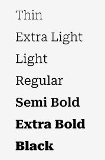

 <h1>Universidad Peruana de Ciencias Aplicadas</h1>
 
  <h2>Carrera: Ingeniería de Software</h2>
  <h2>Ciclo: 2025-20</h2>
 
  <h2>Curso: 1ASI0730 Aplicaciones Web</h2>
  <h2>Sección: 7452</h2>
  <h2>Profesor: Hugo Allan Mori Paiva</h2>
 
 <h1>Informe TB1</h1>
  <h2>Startup: </h2>
  <h2>Producto: </h2>
 
  <h2>Integrantes</h2>
 

 
| 
Alumno
 | 
Código
 |
|:-------------------------------------:|:-------------------------------------:|
|   Galindo Montero, Alejandro Manuel   |              u202321264               |
|     Guillen Galindo, Julio Adolfo     |              u20241a352               |
|   La Madrid Lozano, Ivan Jeanpierre   |              u202113432               |
|       Nanfuñay Liza, Pedro Jesus      |              u202215462               |
|     Ramirez Cabrera, Kenyi Efrain     |              u202220138               |

 
   <h3>Setiembre 2025</h3>

## Registro de Versiones del Informe

 
| Versión | Fecha      | Autor               | Descripción de modificación                                      |
|---------|------------|----------------------|-----------------------------------------------------------------|
| 0.1     | 13/09/2025 | Kenyi Ramírez        | Elaboración de la estructura inicial del reporte                |
| 0.2     | 13/09/2025 | Alejandro Galindo    | Desarrollo del Capitulo 1                                       |

## Project Report Collaboration Insights *(POR MODIFICAR POR CADA ENTREGA)
- **URL de la organización del proyecto:**  

- **URL del repositorio del informe del proyecto:**  

- **URL del repositorio del landing page del proyecto:**  

## Contenido

- [Student Outcome](#student-outcome)

- [Capítulo I: Introducción](#c1)
    - [1.1. Startup Profile](#11-startup-profile)
        - [1.1.1. Descripción de la Startup](#111-descripción-de-la-startup)
        - [1.1.2. Perfiles de integrantes del equipo](#112-perfiles-de-integrantes-del-equipo)
    - [1.2. Solution Profile](#12-solution-profile)
        - [1.2.1 Antecedentes y problemática](#121-antecedentes-y-problematica)
        - [1.2.2 Lean UX Process](#122-lean-ux-process)
            - [1.2.2.1. Lean UX Problem Statements](#1221-lean-ux-problem-statements)
            - [1.2.2.2. Lean UX Assumptions](#1222-lean-ux-assumption)
            - [1.2.2.3. Lean UX Hypothesis Statements](#1223-lean-ux-hypothesis-statements)
            - [1.2.2.4. Lean UX Canvas](#1224-lean-ux-canvas)
    - [1.3. Segmentos objetivo](#13-segmentos-objetivos)

- [Capítulo II: Requirements Elicitation & Analysis](#c2)
    - [2.1. Competidores](#21-competidores)
        - [2.1.1. Análisis competitivo](#211-análisis-competitivo)
        - [2.1.2. Estrategias y tácticas frente a competidores](#212-estrategias-y-tácticas-frente-a-competidores)
    - [2.2. Entrevistas](#22-entrevistas)
        - [2.2.1. Diseño de entrevistas](#221-diseño-de-entrevistas)
        - [2.2.2. Registro de entrevistas](#222-registro-de-entrevistas)
        - [2.2.3. Análisis de entrevistas](#223-análisis-de-entrevistas)
    - [2.3. Needfinding](#23-needfinding)
        - [2.3.1. User Personas](#231-user-personas)
        - [2.3.2. User Task Matrix](#232-user-task-matrix)
        - [2.3.3. User Journey Mapping](#233-user-journey-mapping)
        - [2.3.4. Empathy Mapping](#234-empathy-mapping)
    - [2.4. Big Picture EventStorming](#24-big-picture-eventstorming)
    - [2.5. Ubiquitous Language](#25-ubiquitous-language)

- [Capítulo III: Requirements Specification](#c3)
    - [3.1. To-Be Scenario Mapping](#31-to-be-scenario-mapping)
    - [3.2. User Stories](#32-user-stories)
    - [3.3. Impact Mapping](#33-impact-mapping)
    - [3.4. Product Backlog](#34-product-backlog)

- [Capítulo IV: Product Design](#c4)
    - [4.1. Style Guidelines](#41-style-guidelines)
        - [4.1.1. General Style Guidelines](#411-general-style-guidelines)
        - [4.1.2. Web Style Guidelines](#412-web-style-guidelines)
    - [4.2. Information Architecture](#42-information-architecture)
        - [4.2.1. Organization Systems](#421-organization-systems)
        - [4.2.2. Labeling Systems](#422-labeling-systems)
        - [4.2.3. SEO Tags and Meta Tags](#423-seo-tags-and-meta-tags)
        - [4.2.4. Searching Systems](#424-searching-systems)
        - [4.2.5. Navigation Systems](#425-navigation-systems)
    - [4.3. Landing Page UI Design](#43-landing-page-ui-design)
        - [4.3.1. Landing Page Wireframe](#431-landing-page-wireframe)
        - [4.3.2. Landing Page Mock-up](#432-landing-page-mock-up)
    - [4.4. Web Applications UX/UI Design](#44-web-applications-uxui-design)
        - [4.4.1. Web Applications Wireframes](#441-web-applications-wireframes)
        - [4.4.2. Web Applications Wireflow Diagrams](#442-web-applications-wireflow-diagrams)
        - [4.4.3. Web Applications Mock-ups](#443-web-applications-mock-ups)
        - [4.4.4. Web Applications User Flow Diagrams](#444-web-applications-user-flow-diagrams)
    - [4.5. Web Applications Prototyping](#45-web-applications-prototyping)
    - [4.6. Domain-Driven Software Architecture](#46-domain-driven-software-architecture)
        - [4.6.1. Design-Level EventStorming](#461-design-level-eventstorming)
        - [4.6.2. Software Architecture Context Diagram](#462-software-architecture-context-diagram)
        - [4.6.3. Software Architecture Container Diagrams](#463-software-architecture-container-diagrams)
        - [4.6.4. Software Architecture Components Diagrams](#464-software-architecture-components-diagrams)
    - [4.7. Software Object-Oriented Design](#47-software-object-oriented-design)
        - [4.7.1. Class Diagrams](#471-class-diagrams)
    - [4.8. Database Design](#48-database-design)
        - [4.8.1. Database Diagrams](#481-database-diagrams)

- [Capítulo V: Product Implementation, Validation & Deployment](#c5)
    - [5.1. Software Configuration Management](#51-software-configuration-management)
        - [5.1.1. Software Development Environment Configuration](#511-software-development-environment-configuration)
        - [5.1.2. Source Code Management](#512-source-code-management)
        - [5.1.3. Source Code Style Guide & Conventions](#513-source-code-style-guide--conventions)
        - [5.1.4. Software Deployment Configuration](#514-software-deployment-configuration)
    - [5.2. Landing Page, Services & Applications Implementation](#52-landing-page-services--applications-implementation)
        - [5.2.1. Sprint 1](#521-sprint-1)
            - [5.2.1.1. Sprint Planning 1](#5211-sprint-planning-1)
            - [5.2.1.2. Aspect Leaders and Collaborators](#5212-aspect-leaders-and-collaborators)
            - [5.2.1.3. Sprint Backlog 1](#5213-sprint-backlog-1)
            - [5.2.1.4. Development Evidence for Sprint Review](#5214-development-evidence-for-sprint-review)
            - [5.2.1.5. Execution Evidence for Sprint Review](#5215-execution-evidence-for-sprint-review)
            - [5.2.1.6. Services Documentation Evidence for Sprint Review](#5216-services-documentation-evidence-for-sprint-review)
            - [5.2.1.7. Software Deployment Evidence for Sprint Review](#5217-software-deployment-evidence-for-sprint-review)
            - [5.2.1.8. Team Collaboration Insights during Sprint](#5218-team-collaboration-insights-during-sprint)

- [Conclusiones](#conclusiones)
- [Bibliografía](#bibliografía)
- [Anexos](#anexos)

## Student Outcome
El curso contribuye al cumplimiento del Student Outcome ABET:

**ABET – EAC - Student Outcome 5**

**Criterio**: *La capacidad de funcionar efectivamente en un equipo cuyos miembros
juntos proporcionan liderazgo, crean un entorno de colaboración e inclusivo,
establecen objetivos, planifican tareas y cumplen objetivos.*

En el siguiente cuadro se describe las acciones realizadas y enunciados de
conclusiones por parte del grupo, que permiten sustentar el haber alcanzado el logro
del ABET – EAC - Student Outcome 5.

| Criterio específico                                                                             | Acciones realizadas                                                      | Conclusiones                   |
|-------------------------------------------------------------------------------------------------|--------------------------------------------------------------------------|--------------------------------|
| Trabaja en equipo para proporcionar liderazgo en forma conjunta                                 | <ul><li><b>Galindo Montero, Alejandro Manuel</b> <b>TB1</b>:</li> <li><b>Guillen Galindo, Julio Adolfo</b> <b>TB1</b>:</li> <li><b>La Madrid Lozano, Ivan Jeanpierre</b> <b>TB1</b>:</li> <li><b>Nanfuñay Liza, Pedro Jesus</b> <b>TB1</b>:</li> <li><b>Ramirez Cabrera, Kenyi Efrain</b> <b>TB1</b>: <b></li></ul>        | <ul><li><b>TB1</b>: </li></ul> |
| Crea un entorno colaborativo e inclusivo, establece metas, planifica tareas y cumple objetivos. | <ul><li><b>Galindo Montero, Alejandro Manuel</b> <b>TB1</b>:</li> <li><b>Guillen Galindo, Julio Adolfo</b> <b>TB1</b>:</li> <li><b>La Madrid Lozano, Ivan Jeanpierre</b> <b>TB1</b>:</li> <li><b>Nanfuñay Liza, Pedro Jesus</b> <b>TB1</b>:</li> <li><b>Ramirez Cabrera, Kenyi Efrain</b> <b>TB1</b>: <b></li></ul>        | <ul><li><b>TB1</b>: </li></ul> |                                          | <ul><li><b>TB1</b>: </li></ul> |

# Capitulo 1: Introducción

## 1.1 Startup Profile

### 1.1.1 Descripción de la Startup

es una aplicación web diseñada para optimizar la gestión y el mantenimiento de equipos de refrigeración en negocios que dependen de la cadena de frío. Nuestro alcance es atender a una amplia gama de clientes, incluyendo supermercados, minimarkets, laboratorios, restaurantes y empresas de los sectores alimentario y farmacéutico. Nuestra plataforma conecta de manera fluida a estos negocios con técnicos especializados y proveedores de equipos, facilitando un enfoque integral, proactivo y automatizado para la gestión de sus sistemas de refrigeración.
Las funcionalidades clave de la plataforma incluyen el monitoreo en tiempo real de temperatura, consumo energético y tiempo de uso. Además, ofrece alertas automáticas ante fallos, informes técnicos detallados, historiales de rendimiento y programación inteligente de mantenimientos. Estas herramientas permiten a empresas, técnicos y proveedores mejorar la eficiencia operativa, prevenir costosas pérdidas por fallos inesperados y mantener un registro completo del estado y uso de sus equipos.

Misión: Queremos ofrecer una solución tecnológica inteligente que ayude a las empresas a proteger su inventario y a optimizar la gestión de sus equipos de refrigeración. Al mismo tiempo, proporcionamos herramientas especializadas para mejorar la eficiencia operativa de los técnicos y proveedores del sector.
Visión: Ser la empresa líder en la gestión y el mantenimiento de equipos de refrigeración en el mercado peruano, comenzando por consolidar nuestra posición en Lima.

### 1.1.2 Perfiles de integrantes del equipo

| **Integrante**            | **Galindo Montero Alejandro Manuel**          |
|---------------------------|-----------------------------------------------|
| **Código del Estudiante** |  u202321264                                   |
| **Carrera**               |  Ingeniería de Software                       |
| **Descripción**           |   Mi nombre es Alejandro Manuel Galindo Montero, tengo 20 años y curso la carrera de Ingeniería de Software. Me considero una persona creativa y responsable. En mis tiempos libres me gusta aprender cosas nuevas. En este proyecto apoyaré con todos los conocimientos que he adquirido en los últimos años.   |
| **Foto**                  |   |

---

| **Integrante**            | **Guillen Galindo Julio Adolfo**                                                    |
|---------------------------|-------------------------------------------------------------------------------------|
| **Código del Estudiante** | u20241a352                                                                          |
| **Carrera**               | Ingeniería de Software                                                              |
| **Descripción**           | Actualmente curso la carrera de Ingeniería de Software en la UPC. Me considero una persona discreta, pero responsable y enfocada en cumplir los proyectos dentro de los plazos establecidos. Poseo conocimientos en C++ y Python; disfruto trabajar en equipo cuando existe colaboración y apoyo mutuo. Además, me motiva aplicar lo aprendido para afrontar los desafíos que puedan surgir en los próximos ciclos. |
| **Foto**                  |  |

---

| **Integrante**            | **La Madrid Lozano, Ivan Jeanpierre**                                               |
|---------------------------|-------------------------------------------------------------------------------------|
| **Código del Estudiante** |                                                                                     |
| **Carrera**               |                                                                                     |
| **Descripción**           |                                                                                     |
| **Foto**                  |                                         |

---

| **Integrante**            | **Nanfuñay Liza, Pedro Jesus**                                                      |
|---------------------------|-------------------------------------------------------------------------------------|
| **Código del Estudiante** |                                                                                     |
| **Carrera**               |                                                                                     |
| **Descripción**           |                                                                                     |
| **Foto**                  |                                         |

---

| **Integrante**            | **Kenyi Efrain Ramirez Cabrera**                                                    |
|---------------------------|-------------------------------------------------------------------------------------|
| **Código del Estudiante** | u202220138                                                                          |
| **Carrera**               | Ingeniería de Software                                                              |
| **Descripción**           | Soy Kenyi Ramirez, estudio la carrera de Ingeniería de Software en la Universidad Peruana de Ciencias Aplicadas. Soy una persona comprometida y trabajadora. Poseo un nivel intermedio en los lenguajes C++, Python, Java y HTML, los cuales aplico para garantizar resultados efectivos en mis tareas. |
| **Foto**                  |  |

## 1.2 Solution Profile

### 1.2.1 Antecedentes y Problematica

| **5W & 2H**                                     | **Descripcion**                                                                                                                                            |
|-------------------------------------------------|------------------------------------------------------------------------------------------------------------------------------------------------------------|
| **What: ¿Cuál es el problema?**                 | Los negocios que dependen de la refrigeración se enfrentan a una vulnerabilidad operativa significativa. La falta de control en sus equipos de congelación lleva a fallas inesperadas, alto consumo energético y falta de un mantenimiento proactivo. Como resultado, sufren grandes pérdidas económicas, tanto por productos dañados como por la interrupción de su servicio. |
| **When: ¿Cuándo sucede este problema?**         | Este problema es una amenaza constante, especialmente durante la operación continua de los negocios. Se vuelve más crítico cuando no hay técnicos disponibles para una revisión inmediata o cuando se ha descuidado el seguimiento regular del estado de los equipos. |
| **Where: ¿Dónde se produce este suceso?**       | El problema está presente en todo el país, afectando a negocios en diversas ciudades. Sin embargo, su impacto es particularmente notable en Lima, donde la cadena de frío es vital para sectores como la alimentación y la medicina. Las empresas de servicios que atienden a estos clientes también se ven afectadas al no tener una forma centralizada de gestionar sus operaciones. |
| **Who: ¿Quiénes están involucrados?**           | Este problema afecta a una amplia gama de actores. Por un lado, están los dueños y administradores de negocios que sufren las consecuencias directas de las fallas. Por otro, los técnicos y empresas de servicio que se ven obligados a responder a emergencias sin las herramientas adecuadas. |
| **Why: ¿Cuál es la causa del problema?**        | La causa principal es la falta de herramientas tecnológicas accesibles que permitan integrar el monitoreo en tiempo real, las alertas y la programación de servicios. En la mayoría de los casos, la gestión del mantenimiento aún es manual, lo que impide una respuesta preventiva y eficiente ante cualquier anomalía. |
| **How: ¿Qué llevó a la persona a llegar a esta situación?** | La situación actual es el resultado de la gestión reactiva y la falta de digitalización. Los negocios han dependido de una estrategia de "apagar incendios", esperando a que ocurra un problema crítico para actuar. Esta mentalidad ha generado un ciclo de costos elevados, tiempos de respuesta lentos y un desgaste operativo que se podría haber evitado con una planificación adecuada. |
| **How Much: ¿Cuánto es el impacto financiero?** | El impacto económico de una falla es considerable y varía. Las pérdidas por el deterioro de productos pueden ser de cientos a miles de soles. A esto se suman los costos de las reparaciones de emergencia y el daño a largo plazo en la reputación y la confianza del cliente, lo que hace que el costo total sea mucho mayor. |

### 1.2.2 Lean UX Process

#### 1.2.2.1 Lean UX Problem Statements

En el sector de la refrigeración, las empresas se enfrentan a un desafío recurrente: la falta de una gestión inteligente para sus equipos. Los negocios que dependen de la cadena de frío, desde supermercados hasta laboratorios farmacéuticos, operan con un alto riesgo de pérdidas económicas y desperdicio de energía, ya que su mantenimiento es reactivo, no proactivo.
Existe un vacío en el mercado que las soluciones actuales no han logrado llenar. No hay una plataforma que unifique la gestión y ofrezca una visibilidad completa del estado de los equipos. Esta ausencia de alertas preventivas y datos históricos dificulta la respuesta ante fallas y degrada la calidad del servicio técnico.
FrostGuard ha sido creada para superar estos obstáculos. Nuestra plataforma establece una conexión digital entre los negocios y sus equipos, permitiendo un monitoreo constante de la temperatura y el consumo energético. Esto no solo previene fallas, sino que también optimiza el rendimiento y prolonga la vida útil de los equipos. Además, proporcionamos a los técnicos una herramienta centralizada para organizar sus tareas, acceder al historial de cada equipo y responder de manera más eficiente.
Inicialmente, nos enfocamos en los negocios de Lima que buscan una solución confiable para sus sistemas de refrigeración, así como en los proveedores de servicio que desean modernizar sus operaciones. 
Sabremos que hemos tenido éxito cuando se reduzcan las fallas críticas, mejore la eficiencia energética y aumente en la satisfacción y lealtad de nuestros clientes, demostrando así el valor de la tecnología en el sector.

#### 1.2.2.2 Lean UX Assumption

# Business Outcomes

-	**Reducir las pérdidas de inventario:** La plataforma de FrostGuard previene fallas térmicas, minimizando el descarte de productos y aumentando la rentabilidad de los negocios.
- **Aumentar la eficiencia operativa:** Los técnicos pueden gestionar sus tareas de forma más inteligente y atender a más clientes en menos tiempo, lo que se traduce en una mayor productividad.
- **Mejorar la fidelización de clientes:** Un servicio proactivo y transparente fortalece la confianza con los clientes, lo que lleva a una mayor retención y a relaciones comerciales a largo plazo.
- **Optimizar los costos de mantenimiento:** La plataforma permite pasar de un modelo de mantenimiento reactivo, costoso e impredecible, a uno predictivo, que reduce los gastos en reparaciones de emergencia.
- **Posicionar el liderazgo en el mercado:** Al ofrecer una solución tecnológica innovadora, el proyecto permite a los proveedores de servicio diferenciarse de su competencia y captar nuevos clientes de manera más efectiva.
- **Generar ingresos recurrentes:** El modelo de negocio, basado en suscripciones y servicios de valor añadido, asegura un flujo de ingresos constante y escalable para la empresa.
- **Disminuir el consumo energético:** El monitoreo en tiempo real del consumo de energía permite identificar y corregir ineficiencias, lo que se traduce en ahorros significativos para los negocios.
- **Facilitar la toma de decisiones:** Los dueños de negocios tienen acceso a datos precisos y en tiempo real sobre el rendimiento de sus equipos, lo que les permite tomar decisiones más informadas para optimizar su operación.

# User Outcomes

## ¿Quién será nuestro usuario?

Nuestros usuarios clave son de tres tipos:
- Negocios que dependen de la cadena de frío, como restaurantes, supermercados y laboratorios, para quienes una falla es una amenaza directa a su rentabilidad.
- Técnicos especializados en refrigeración que necesitan herramientas para gestionar su trabajo de manera más eficiente.
- Proveedores de equipos que buscan diferenciarse ofreciendo un servicio postventa de vanguardia.

## ¿Dónde encaja nuestro producto en su vida?

La plataforma se integra como una herramienta esencial para la gestión diaria de nuestros usuarios. 
- Para los negocios, es una capa de seguridad que les garantiza la continuidad operativa y previene pérdidas. 
- Para los técnicos, se convierte en su asistente personal para organizar clientes y visitas. 
- Sirve como un registro centralizado y accesible que facilita auditorías y la toma de decisiones.

## ¿Qué problemas tiene nuestro producto y cómo se pueden resolver?

- Un desafío crítico es la precisión de los datos. Si las lecturas no son confiables, la plataforma pierde su valor. 
- Para resolverlo, implementaremos sensores certificados y algoritmos de validación de datos que corrijan lecturas erróneas. 
- Otro problema es la resistencia inicial de usuarios no tecnológicos. 
- Esto se abordará con una interfaz simple y un proceso de “onboarding” intuitivo, además de tutoriales en video para facilitar la adopción.

## ¿Cómo y Cuándo es usado nuestro producto?

- La plataforma es multiplataforma (web y móvil), lo que la hace accesible tanto desde una oficina como en el campo. 
- Negocios la consultan para monitorear el estado de sus equipos
- Los técnicos la utilizan para gestionar sus tareas.
- También funciona de manera automática en segundo plano, enviando alertas inmediatas al detectar una anomalía, lo que permite una respuesta rápida incluso fuera del horario laboral.

## ¿Qué características son importantes para la app?

Las características clave incluyen: 
- Monitoreo en tiempo real, alertas automatizadas y un historial técnico detallado. 
- La plataforma también integra un calendario de mantenimiento y un módulo exclusivo para técnicos. 
- Integración de IA para recomendaciones predictivas. 
- Sistema de gestión de roles para múltiples usuarios y ubicaciones son esenciales.

## ¿Cómo debe verse nuestro producto y cómo comportarse?

- El diseño de la plataforma debe transmitir confianza y claridad. 
- La interfaz será minimalista y centrada en la acción, mostrando la información más relevante de un vistazo. 
- La experiencia de usuario debe ser fluida, con una navegación intuitiva y notificaciones inmediatas que no saturen al usuario, sino que lo mantengan siempre informado y en control.

## ¿Qué valor busca el cliente?

- El cliente busca simplificar la gestión de sus equipos y pasar de ser un gestor reactivo a uno proactivo. 
- Los negocios desean seguridad operativa, saber que sus equipos están protegidos de fallas inesperadas y pérdidas. 
- También buscan optimizar sus costos a través de la eficiencia energética y una mejor trazabilidad del rendimiento de sus sistemas.

## ¿Qué beneficios adicionales obtendrá el cliente?

- Obtendrán visibilidad total y remota de sus activos.
- Soporte técnico más ágil gracias a la información centralizada
- Reducción significativa de los costos operativos.
- La plataforma proporcionará reportes personalizados que no podrían generar de forma manual.

## ¿Cómo atraeremos usuarios?

- Se implementará una estrategia de marketing de nicho que se dirija a la audiencia correcta a través de LinkedIn y correos.
- Exploraremos alianzas estratégicas con proveedores de equipos para ofrecer la plataforma como un valor añadido en sus ventas. 
- Prueba gratuita de 14 días para que los usuarios experimenten el valor del producto de primera mano, sin compromiso.

## ¿Cómo generaremos ingresos?

- Suscripción mensual, escalonada según el número de equipos y el nivel de funcionalidad. 
- Modelo freemium para captar a usuarios más pequeños
- Publicidad dirigida para marcas que deseen llegar a nuestra base de usuarios.

## ¿Cuál es nuestra competencia y cómo la superamos?

- Nuestra competencia son soluciones genéricas de gestión de mantenimiento y nuestra ventaja es la especialización. 
- La plataforma está diseñada exclusivamente para la refrigeración, lo que nos permite ofrecer funciones avanzadas como la detección de anomalías en tiempo real y la automatización de acciones, que ninguna otra herramienta genérica puede igualar.

## ¿Cuál es nuestro mayor riesgo?

- Resistencia al cambio del personal tradicional.
- Lentitud en la adopción inicial.
- Desconfianza en la precisión de los datos.

## ¿Cómo lo resolveremos?

- Implementaremos algoritmos de validación robustos para asegurar la precisión de los datos.
- Ofreceremos capacitación continua y soporte dedicado para facilitar la adopción.
- comenzaremos con una estrategia de integración progresiva, enfocándonos en los equipos más comunes y trabajando con sensores certificados para generar una base de confianza sólida.

#### 1.2.2.3 Lean UX Hypothesis Statements

**Hipótesis 1: Adopción del Producto**

Creemos que los negocios de alimentos y bebidas adoptarán nuestra plataforma para gestionar sus equipos de refrigeración, utilizándola regularmente para el monitoreo y la gestión de tareas.
Sabremos que hemos tenido éxito cuando la mayoría de nuestros usuarios activos semanales utilicen tanto la función de monitoreo en tiempo real como la de gestión de servicios durante los primeros meses de suscripción.

---

**Hipótesis 2: Mitigación de Pérdidas**

Creemos que, al proporcionar monitoreo en tiempo real y alertas tempranas, reduciremos significativamente las pérdidas de inventario de nuestros clientes relacionadas con fallos en la refrigeración.
Sabremos que hemos tenido éxito cuando una gran parte de nuestros clientes que reporten pérdidas de inventario confirmen que la alerta de nuestra plataforma les permitió actuar a tiempo para mitigar el daño, reflejándose en una notable reducción de pérdidas en sus registros.

---

**Hipótesis 3: Eficiencia del Servicio**

Creemos que nuestra plataforma optimizará la cadena de servicio, reduciendo sustancialmente el tiempo promedio de respuesta y resolución de un problema de refrigeración.
Sabremos que hemos tenido éxito cuando los técnicos de servicio registren que el tiempo desde la solicitud hasta la finalización de un servicio se ha acortado notablemente en comparación con sus procesos manuales, y esta mejora se refleje en los informes generados por nuestra plataforma.

---

**Hipótesis 4: Satisfacción del Cliente**

Creemos que la centralización de la gestión y la transparencia del proceso de servicio mejorarán la satisfacción de los clientes con el mantenimiento de sus equipos.
Sabremos que hemos tenido éxito cuando obtengamos una alta puntuación promedio en las encuestas de satisfacción del cliente relacionadas con la coordinación de servicios, y recibamos testimonios que resalten la facilidad y la claridad del proceso.

---

**Hipótesis 5: Retención y Valor a Largo Plazo**

Creemos que la propuesta de valor de nuestra plataforma, centrada en la automatización y el ahorro, incentivará la retención a largo plazo de los clientes.
Sabremos que hemos tenido éxito cuando la gran mayoría de nuestros clientes continúen utilizando la plataforma después de los primeros meses, y veamos que renuevan sus suscripciones de forma recurrente.

#### 1.2.2.4 Lean UX Canvas

<figure style="page-break-inside: avoid; text-align: center;">
  
  <figcaption style="font-size: 0.9em; color: #555;">
    <strong>Figura 1:</strong> Lean UX Canvas.
  </figcaption>
</figure>

## 1.3 Segmentos objetivos

**Segmento Objetivo 1: Negocios con equipos de refrigeración**

**Aspectos demográficos:**
- **Tipo de negocio:** Pequeñas, medianas y grandes empresas.
- **Rubro:** Alimentario, farmacéutico, restauración y comercio minorista.
- **Nivel de necesidad:** Alta dependencia de sistemas de refrigeración.

**Aspectos geográficos:**
- **Nacionalidad:** Peruana.
- **Zona geográfica:** Urbana.
- **Departamento:** Lima.

**Aspectos psicográficos:**
- **Motivación:** Evitar pérdidas económicas por fallas en la refrigeración y reducir costos operativos.
- **Valores:** La eficiencia, la calidad del inventario y el control de las operaciones.
- **Intereses:** La adopción de tecnología para optimizar la gestión y asegurar la tranquilidad en la operación diaria.

---

**Segmento Objetivo 2: Técnicos y empresas de mantenimiento**

**Aspectos demográficos:**
- **Tipo de negocio:** Profesionales independientes y compañías de servicio técnico.
- **Rubro:** Mantenimiento y reparación de equipos de refrigeración.
- **Nivel de necesidad:** Alta demanda de organización y eficiencia en sus procesos.

**Aspectos geográficos:**
- **Nacionalidad:** Peruana.
- **Zona geográfica:** Urbana.
- **Departamento:** Lima.

**Aspectos psicográficos:**
- **Motivación:** Incrementar la productividad, reducir el tiempo en tareas administrativas y mejorar la calidad de su servicio.
- **Valores:** La profesionalidad, la eficiencia y la tecnología como herramienta para facilitar su trabajo.
- **Intereses:** Contar con una plataforma que centralice la información, automatice la generación de reportes y mejore la comunicación con sus clientes.

# Capítulo II: Requirements Elicitation & Analysis

## 2.1. Competidores

### 2.1.1. Análisis competitivo

### 2.1.2. Estrategias y tácticas frente a competidores

## 2.2. Entrevistas

### 2.2.1. Diseño de entrevistas

### 2.2.2. Registro de entrevistas

### 2.2.3. Análisis de entrevistas

## 2.3. Needfinding

### 2.3.1. User Personas

### 2.3.2. User Task Matrix

### 2.3.3. User Journey Mapping

### 2.3.4. Empathy Mapping

## 2.4. Big Picture EventStorming

## 2.5. Ubiquitous Language

# Capítulo III: Requirements Specification

## 3.1. To-Be Scenario Mapping

## 3.2. User Stories.

Las historias de usuario para este proyecto se crearon en colaboración con el equipo de desarrollo, enfocándose en las necesidades principales de dos tipos de usuarios: los clientes, que son dueños de equipos de refrigeración, y los proveedores de servicios y equipos.

Para mantener la organización, las historias se agruparon en épicas según sus funcionalidades. Los criterios de aceptación de cada historia se definieron utilizando la sintaxis Gherkin, asegurando que el equipo comprendiera el problema desde la perspectiva del usuario final.

Para facilitar la planificación, el seguimiento y la priorización de las tareas, el equipo utilizó la plataforma Trello.

| **Epic / Story ID** | **Título**                                                    | **Descripción**                                                                                                                                                                                                                    | **Criterios de Aceptación**                                                                                                                                                                                                                                                                                                                                                                                                                                                                                                                                                                                   | **Relacionado con (Epic ID)** |
|---------------------|---------------------------------------------------------------|------------------------------------------------------------------------------------------------------------------------------------------------------------------------------------------------------------------------------------|----------------------------------------------------------------------------------------------------------------------------------------------------------------------------------------------------------------------------------------------------------------------------------------------------------------------------------------------------------------------------------------------------------------------------------------------------------------------------------------------------------------------------------------------------------------------------------------------------------------|------------|
| US-01               | Registro de usuario                                           | Como nuevo usuario, quiero registrarme para acceder a la plataforma y empezar a gestionar mis equipos                                                                                                                              | **Escenario 1: Crear cuenta exitosamente**   Dado que el nuevo usuario tiene todos los datos correctos,  Cuando completa el registro,  Entonces su cuenta es creada correctamente.  **Escenario 2: Intento de crear cuenta con email ya registrado**  Dado que el nuevo usuario intenta registrarse con un correo ya registrado,  Cuando envía el formulario,  Entonces el sistema muestra un mensaje indicando que el correo ya existe.                                                                                                                                          | EP-01      |
| US-02               | Inicio de sesión                                              | Como usuario, quiero acceder a mi cuenta en la plataforma para utilizar sus funcionalidades.                                                                                                                                       | **Escenario 1: Iniciar sesión correctamente**   Dado que el usuario tiene una cuenta activa,  Cuando ingresa sus datos correctamente,  Entonces accede a su panel de control.  **Escenario 2: Intento de iniciar sesión con datos incorrectos**  Dado que el usuario ingresa datos incorrectos,  Cuando intenta iniciar sesión,  Entonces el sistema muestra un mensaje de error.                                                                                                                                                                                            | EP-01      |
| US-03               | Gestionar equipos de refrigeración                            | Como cliente, quiero gestionar mis equipos de refrigeración en la plataforma para mantener un registro y control detallado de cada uno.                                                                                            | **Escenario 1: Registro de un nuevo equipo**  Dado que el cliente tiene los detalles de un nuevo equipo,  Cuando los ingresa,  Entonces el equipo se registra correctamente.  **Escenario 2: Actualización de la información de un equipo**  Dado que el cliente desea modificar los datos de un equipo ya registrado,  Cuando realiza los cambios,  Entonces la información del equipo se actualiza.                                                                                                                                                                         | EP-02       |
| US-04               | Recibir notificaciones de estado del equipo                   | Como cliente, quiero recibir notificaciones automáticas sobre el estado de mis equipos para tomar acciones rápidas ante cualquier incidencia o necesidad de mantenimiento.                                                         | **Escenario 1: Alerta de falla detectada**  Dado que un equipo presenta una falla,  Cuando la falla es detectada,  Entonces el cliente recibe una alerta.  **Escenario 2: Alerta de mantenimiento preventivo**  Dado que se acerca una necesidad de mantenimiento preventivo,  Cuando se identifica esa necesidad,  Entonces el cliente es notificado con antelación.                                                                                                                                                                                                | EP-05       |
| US-05               | Analizar el consumo energético de equipos                     | Como cliente, quiero ver y comparar el consumo energético de mis equipos para evaluar su eficiencia y tomar decisiones informadas.                                                                                                 | **Escenario 1: Visualización del consumo energético individual**  Dado que el cliente tiene equipos registrados,  Cuando solicita ver los datos de consumo de un equipo,  Entonces se muestra un informe de consumo energético de dicho equipo.  **Escenario 2: Comparación del consumo energético**  Dado que el cliente selecciona múltiples equipos para comparar,  Cuando solicita la comparación,  Entonces se genera una vista comparativa de su consumo energético.                                                                                      | EP-04       |
| US-06               | Control remoto de encendido y apagado                         | Como cliente, quiero poder encender y apagar mis equipos de refrigeración de forma remota para tener un control operativo total.                                                                                                   | **Escenario 1: Encender un equipo a distancia**  Dado que el cliente tiene un equipo conectado,  Cuando solicita el encendido del equipo,  Entonces el equipo cambia su estado a encendido.  **Escenario 2: Apagar un equipo a distancia**  Dado que el cliente tiene un equipo encendido,  Cuando solicita el apagado del equipo,  Entonces el equipo cambia su estado a apagado.                                                                                                                                                                                          | EP-02       |
| US-07               | Ajuste remoto de la temperatura                               | Como cliente, quiero ajustar la temperatura de mis equipos de refrigeración desde la plataforma para mantener las condiciones operativas ideales.                                                                                  | **Escenario 1: Aumentar la temperatura**  Dado que el cliente tiene un equipo conectado,  Cuando ajusta la temperatura deseada para que sea más alta,  Entonces la configuración de temperatura del equipo se actualiza al nuevo valor.  **Escenario 2: Disminuir la temperatura**  Dado que el cliente tiene un equipo conectado,  Cuando ajusta la temperatura deseada para que sea más baja,  Entonces la configuración de temperatura del equipo se actualiza al nuevo valor.                                                                                      | EP-02       |
| US-08               | Solicitar y gestionar servicios de mantenimiento y reparación | Como cliente, quiero solicitar servicios de mantenimiento (preventivo) y reparación (correctivo) para mis equipos, para asegurar su óptimo funcionamiento y recibir confirmación de mi solicitud.                                  | **Escenario 1: Solicitud de servicio exitosa**  Dado que el cliente requiere un servicio para uno de sus equipos,  Cuando el sistema le permite seleccionar el tipo de servicio y detallar la solicitud,  Entonces la solicitud se registra en el sistema y se le notifica al cliente.   **Escenario 2: Recepción de confirmación** Dado que la solicitud del cliente ha sido enviada,  Cuando el sistema procesa la solicitud,  Entonces el cliente recibe una confirmación de la recepción de su solicitud con un resumen de los detalles.                  | EP-03       |
| US-09               | Dar seguimiento al progreso del servicio                      | Como cliente, quiero seguir el avance de mi servicio solicitado para saber en qué etapa se encuentra y cuándo estará completado.                                                                                                   | **Escenario 1: Visualización del estado del servicio**   Dado que el cliente tiene una solicitud de servicio activa,  Cuando accede a su información de servicios,  Entonces se le presenta el estado actualizado de su solicitud.   **Escenario 2: Actualización de estado del servicio**  Dado que una solicitud de servicio está en curso, cuando su estado cambia (por ejemplo, de "En espera" a "En progreso"), entonces el sistema refleja el nuevo estado para el cliente.                                                                                                     | EP-03       |
| US-10               | Ver reporte de servicio realizado                             | Como cliente, quiero ver el reporte de servicio detallado para saber qué reparaciones se hicieron en mi equipo.                                                                                                                    | **Escenario 1: Generación del reporte de servicio**  Dado que el servicio ha sido completado,  Cuando el técnico termina,  Entonces el sistema genera un reporte detallado.  **Escenario 2: Enviar reporte al cliente por correo** Dado que el reporte ha sido generado,  Cuando se ha finalizado el servicio,  Entonces el sistema envía el reporte al cliente por correo electrónico.                                                                                                                                                                                               | EP-04       |
| US-11               | Recepción de alertas sobre solicitudes de servicio            | Como empresario, quiero recibir alertas automáticas cuando un cliente solicite un servicio de reparación o mantenimiento para poder gestionar la atención de forma inmediata.                                                      | **Escenario 1: Recepción de solicitud de servicio**  Dado que un cliente ha enviado una solicitud de servicio,  Cuando se recibe la solicitud,  Entonces el empresario recibe una alerta.   **Escenario 2: Alerta de mantenimiento preventivo**  Dado que se ha solicitado un mantenimiento preventivo,  Cuando la solicitud se registra,  Entonces el empresario recibe una alerta automática.                                                                                                                                                                                | EP-05       |
| US-12               | Ver historial de servicios                                    | Como empresario, quiero ver el historial de servicios realizados para cada cliente y equipo, para llevar un control detallado y eficiente.                                                                                         | **Escenario 1: Visualización del historial de servicios**  Dado que el empresario requiere consultar los servicios,  Cuando accede a la sección de historial,  Entonces puede ver el historial completo de los servicios realizados.  **Escenario 2: Filtrado del historial**  Dado que el empresario desea filtrar los servicios,  Cuando aplica un filtro por cliente o equipo,  Entonces el historial de servicios se actualiza mostrando solo los resultados correspondientes.                                                                                 | EP-04       |
| US-13               | Realizar seguimiento a solicitudes de servicio                | Como empresario, quiero realizar un seguimiento detallado a las solicitudes de servicio de mis técnicos, para saber cómo van.                                                                                                      | **Escenario 1: Ver estado de la solicitud de servicio**  Dado que el empresario tiene acceso a solicitudes  Cuando ingresa al sistema,  Entonces puede ver el estado actualizado de cada solicitud de servicio.  **Escenario 2: Actualización del estado de la solicitud** Dado que el empresario quiere seguir el progreso,  Cuando un técnico actualiza el estado de la solicitud,  Entonces el sistema muestra el estado en tiempo real.                                                                                                                                     | EP-03       |
| US-14               | Registrar y gestionar técnicos                                | Como empresario, quiero registrar técnicos en la plataforma para incluirlos en mi equipo de trabajo y gestionar sus perfiles.                                                                                                      | **Escenario 1: Registro exitoso de un técnico**  Dado que el empresario completa todos los datos requeridos de un técnico,  Cuando guarda la información,  Entonces el técnico queda registrado exitosamente.  **Escenario 2: Intento de registro con datos faltantes**  Dado que el empresario intenta registrar un técnico sin completar todos los campos obligatorios,  Cuando intenta guardar el registro,  Entonces no se permite la operación hasta que se completen los campos requeridos.                                                                            | EP-01       |
| US-15               | Consultar el perfil de un técnico                             | Como empresario, quiero ver el perfil de cada técnico, incluyendo sus datos y métricas de rendimiento, para poder evaluar su desempeño.                                                                                            | **Escenario 1: Acceso a la información completa de un técnico**  Dado que el empresario selecciona un técnico,  Cuando accede a su perfil,  Entonces puede visualizar sus datos personales, historial de servicios y calificaciones.  **Escenario 2: Visualización de perfil sin evaluaciones**  Dado que un técnico no ha recibido evaluaciones,  Cuando se consulta su perfil,  Entonces las métricas de desempeño no son visibles.                                                                                                                                          | EP-01       |
| US-16               | Asignar técnicos a servicios                                  | Como empresario, quiero asignar un técnico a una solicitud de servicio para asegurar que se realice el trabajo adecuadamente.                                                                                                      | **Escenario 1: Asignación de técnico**  Dado que el empresario ha recibido una solicitud de servicio,  Cuando selecciona un técnico,  Entonces el técnico es asignado a la solicitud.  **Escenario 2: Notificación de asignación**  Dado que un técnico ha sido asignado a un servicio,  Cuando el empresario confirma la asignación,  Entonces el técnico recibe una notificación con los detalles.                                                                                                                                                                      | EP-03       |
| US-17               | Generar reporte de desempeño de técnicos                      | Como empresario, quiero generar reportes sobre el desempeño de mis técnicos para evaluar su eficiencia y productividad.                                                                                                            | **Escenario 1: Generar reporte de desempeño**  Dado que el empresario quiere evaluar el desempeño de sus técnicos,  Cuando selecciona la opción de generar reporte,  Entonces el sistema crea un informe con los datos.  **Escenario 2: Descargar reporte de desempeño** Dado que el reporte ha sido generado,  Cuando el empresario quiere descargarlo,  Entonces el sistema permite descargar el archivo en formato PDF.                                                                                                                                                       | EP-04       |
| US-18               | Configurar alertas de mantenimiento                           | Como empresario, quiero configurar alertas automáticas para el mantenimiento preventivo de los equipos para gestionar su seguimiento de forma eficiente.                                                                           | **Escenario 1: Configuración de una nueva alerta**  Dado que el empresario desea configurar una alerta de mantenimiento,  Cuando ingresa los parámetros necesarios (ej. frecuencia, tipo de equipo),  Entonces la alerta se configura correctamente.  **Escenario 2: Actualización de una alerta existente**  Dado que el empresario quiere modificar una alerta ya configurada,  Cuando ajusta los parámetros,  Entonces la alerta es actualizada.                                                                                                                           | EP-05       |
| US-19               | Visualizar clientes y servicios asociados                     | Como empresario, quiero ver un listado de clientes y los servicios que han solicitado para organizar de manera eficaz el trabajo de los técnicos.                                                                                  | **Escenario 1: Acceso a la información de clientes**  Dado que el empresario necesita ver los clientes con servicios pendientes,  Cuando accede a la funcionalidad de clientes,  Entonces puede visualizar a los clientes y sus servicios relacionados.  **Escenario 2: Filtrado de servicios por estado**  Dado que el empresario quiere enfocarse en servicios específicos,  Cuando aplica un filtro por el estado del servicio,  Entonces la lista se actualiza mostrando solo los servicios que coinciden con el filtro.                                         | EP-04       |
| US-20               | Visualizar equipos asignados a clientes                       | Como empresario, quiero ver un listado de los equipos que han sido entregados a los clientes para darles un seguimiento adecuado.                                                                                                  | **Escenario 1: Acceso a la lista de equipos por cliente**  Dado que el empresario quiere consultar los equipos de sus clientes,  Cuando accede al listado de equipos,  Entonces puede visualizar los equipos asignados a cada cliente.  **Escenario 2: Filtrado de equipos**  Dado que el empresario necesita encontrar equipos específicos,  Cuando aplica filtros por estado o tipo de equipo,  Entonces la lista de equipos se actualiza mostrando los resultados correspondientes a los filtros aplicados.                                                         | EP-02       |
| US-21               | Recibir notificaciones de eventos importantes                 | Como cliente, quiero recibir notificaciones sobre eventos importantes como el progreso del servicio para mantenerme informado.                                                                                                     | **Escenario 1: Problema reportado durante el servicio** Dado que el técnico detecta una complicación o requiere aprobación,  Cuando se genera un evento interno,  Entonces el sistema envía una notificación que requiere acción del cliente. **Escenario 2: Notificación sobre progreso del servicio** Dado que el servicio está en ejecución,  Cuando el estado cambia,  Entonces se envía una notificación al cliente.                                                                                                                                                        | EP-05       |
| US-22               | Evaluar un servicio completado                                | Como cliente, quiero evaluar un servicio una vez que ha finalizado para expresar mi satisfacción con el trabajo realizado.                                                                                                         | **Escenario 1: Envío de la evaluación**  Dado que el cliente ha recibido un servicio,  Cuando envía una calificación,  Entonces la evaluación es registrada.  **Escenario 2: Modificación de la evaluación**  Dado que el cliente desea cambiar una evaluación ya enviada,  Cuando actualiza la calificación dentro del plazo establecido,  Entonces la nueva calificación reemplaza a la anterior.                                                                                                                                                                 | EP-06       |
| US-23               | Visualizar la propuesta de valor principal                    | Como visitante, quiero conocer la propuesta de valor de la plataforma para entender si se ajusta a mis necesidades.                                                                                                                | **Escenario 1: Propuesta visible al ingresar**  Dado que un visitante llega a la página principal,  Cuando la página carga,  Entonces se le presenta una frase que explica claramente la propuesta de valor.  **Escenario 2: Contenido orientado a la gestión de refrigeración**  Dado que el visitante pertenece al segmento de gestión de equipos,  Cuando revisa la propuesta de valor,  Entonces encuentra conceptos relacionados con gestión inteligente y monitoreo de equipos.                                                                                       | EP-07       |
| US-24               | Explorar soluciones específicas para mi rubro                 | Como visitante, quiero conocer las soluciones que ofrece la plataforma para mi tipo de negocio para saber si se ajusta a mis necesidades.                                                                                          | **Escenario 1: Información para negocios de refrigeración**  Dado que un visitante explora las soluciones ofrecidas,  Cuando revisa el contenido disponible,  Entonces encuentra descripciones dirigidas a negocios que utilizan o gestionan equipos de refrigeración.  **Escenario 2: Información para empresas proveedoras de servicios**  Dado que un visitante explora las soluciones ofrecidas,  Cuando revisa el contenido disponible,  Entonces encuentra información dirigida a empresas proveedoras de equipos o servicios de mantenimiento.              | EP-07       |
| US-25               | Comprender las funcionalidades clave                          | Como visitante, quiero entender las funcionalidades principales de la plataforma para evaluar si se adaptan a mi operación.                                                                                                        | **Escenario 1: Acceso a funcionalidades principales**  Dado que un visitante consulta las características de la plataforma,  Cuando revisa la lista de funcionalidades,  Entonces puede identificar opciones clave como monitoreo en tiempo real, automatización de alertas y gestión remota.  **Escenario 2: Descripciones orientadas al valor**  Dado que un visitante lee las descripciones de las funcionalidades,  Cuando evalúa cada una,  Entonces comprende el beneficio que aporta para su operación de refrigeración o mantenimiento.                          | EP-07       |
| US-26               | Conocer la misión y visión                                    | Como visitante, quiero conocer la misión y visión de la empresa para entender su enfoque y propuesta de valor.                                                                                                                     | **Escenario 1: Acceso a la misión de la empresa**  Dado que un visitante accede a la información institucional,  Cuando revisa el contenido corporativo,  Entonces encuentra una descripción clara de la misión.  **Escenario 2: Acceso a la visión de la empresa**  Dado que un visitante accede a la información institucional,  Cuando revisa el contenido estratégico,  Entonces encuentra una descripción clara de la visión a futuro.                                                                                                                                 | EP-07       |
| US-27               | Contactar con el equipo de ventas                             | Como visitante empresario, quiero contactar fácilmente con el equipo de ventas para iniciar una posible relación comercial.                                                                                                        | **Escenario 1: Disponibilidad de un canal de contacto**  Dado que un visitante está interesado en contactar al equipo de ventas,  Cuando busca información de contacto,  Entonces encuentra una opción clara para iniciar la comunicación.  **Escenario 2: Redirección al canal adecuado**  Dado que un visitante selecciona la opción de contacto,  Cuando es redirigido,  Entonces llega a un canal funcional (ej. un formulario, dirección de correo o número de contacto).                                                                                        | EP-07       |
| US-28               | Acceder a la plataforma web (Call to Action)                  | Como usuario registrado, quiero acceder fácilmente a la plataforma web desde la página de inicio para gestionar mis operaciones y equipos.                                                                                         | **Escenario 1: Visibilidad del acceso a la plataforma**  Dado que un usuario registrado visita la página principal,  Cuando busca cómo ingresar a su cuenta,  Entonces encuentra una opción clara para acceder a la plataforma.  **Escenario 2: Redirección a la plataforma web**  Dado que el usuario selecciona la opción para acceder a la plataforma,  Cuando es redirigido,  Entonces llega a la página de inicio de sesión de la plataforma web.                                                                                                                       | EP-07       |
| US-29               | Descargar la app móvil desde la web                           | Como visitante interesado en usar la plataforma desde el celular, quiero descargar fácilmente la app móvil para instalarla y comenzar a usarla.                                                                                    | **Escenario 1: Acceso a las opciones de descarga móvil**  Dado que un visitante desea usar la aplicación en su celular,  Cuando explora la página web,  Entonces encuentra un enlace o referencia para la descarga de la app móvil.  **Escenario 2: Redirección a la tienda correcta**  Dado que un visitante selecciona el enlace de descarga,  Cuando es redirigido,  Entonces accede a la tienda de aplicaciones correspondiente según su sistema operativo (ej. Google Play, App Store).                                                                                 | EP-07       |
| TS-01               | Gestión de alertas críticas vía API                           | Como desarrollador, busco implementar un mecanismo que exponga las alertas críticas detectadas en los equipos a través de una API RESTful, para activar notificaciones automáticas al usuario.                                     | **Escenario 1: Envío de notificación al detectar falla**  Dado que se procesa una alerta crítica desde un equipo,   Cuando se genera una notificación al usuario,   Entonces se envía la alerta.   **Escenario 2: Falla detectada sin notificación activa**  Dado que el servicio de notificaciones está deshabilitado,  Cuando se genera la alerta crítica,  Entonces no se envía la notificación, y se registra en el historial.                                                                                                                                | EP-05       |
| TS-02               | Creación de solicitudes de mantenimiento (API)                | Como desarrollador, quiero implementar una API que me permita crear solicitudes de mantenimiento para que los negocios reporten necesidades de soporte técnico.                                                                    | **Escenario 1: Creación exitosa de solicitud**  Dado que se envía una solicitud POST a `/api/v1/service-requests` con los datos del equipo y la descripción del problema,   Cuando la solicitud es procesada,   Entonces se recibe una respuesta 201 y se guarda la solicitud en el sistema.  **Escenario 2: Datos incompletos en la solicitud**  Dado que se envía una solicitud a `/api/v1/service-requests` sin un campo obligatorio,   Cuando la solicitud es procesada,   Entonces se recibe una respuesta 400 con el mensaje "Invalid data".                         | EP-03       |
| TS-03               | Registro de intervenciones técnicas por API RESTful           | Como desarrollador, quiero registrar las intervenciones técnicas realizadas a través de la API para llevar un seguimiento detallado del mantenimiento.                                                                             | **Escenario 1: Registro exitoso**   Dado que se envía una solicitud POST a `/api/v1/interventions` con los datos del técnico y equipo,   Cuando la solicitud es procesada,   Entonces se recibe una respuesta 201 y el registro se almacena.  Escenario 2: Registro con técnico no existente  Dado que el ID del técnico no existe,   Cuando se realiza la solicitud POST a `/api/v1/interventions`,   Entonces se recibe una respuesta 404 con el mensaje "Technician not found".                                                                                           | EP-03       |
| TS-04               | Gestión de evaluaciones de servicio vía API                   | Como desarrollador, mi objetivo es implementar un endpoint que permita a los clientes registrar y actualizar una evaluación de servicio para reflejar su experiencia.                                                              | **Escenario 1: Evaluación inicial del servicio**  Dado que el cliente ha recibido un servicio,   Cuando se envía una solicitud POST a `/api/v1/reviews` con la puntuación (1-5),   Entonces se recibe una respuesta 201 y se almacena la evaluación asociada al servicio.  **Escenario 2: Edición dentro del plazo permitido**  Dado que el cliente ya evaluó un servicio y han pasado menos de 48 horas,   Cuando realiza una solicitud PUT a `/api/v1/reviews/{id}` con una nueva puntuación,   Entonces se recibe una respuesta 200 y la evaluación anterior se actualiza. | EP-06       |
| TS-05               | Registrar nuevo usuario a través de API RESTful               | Como desarrollador, quiero exponer un endpoint para registrar nuevos usuarios en la plataforma, validando datos como correo único y formato de contraseña, para permitir el acceso seguro de nuevos usuarios.                      | **Escenario 1: Registro exitoso** Dado que el endpoint `/api/v1/users` está disponible, cuando se envía una solicitud POST con datos válidos (nombre, email único, contraseña válida), entonces el sistema responde con 201 y devuelve el usuario registrado. **Escenario 2: Registro con email existente** Dado un correo ya registrado,   Cuando se intenta registrar nuevamente,   Entonces se devuelve un 400 con mensaje "Email already registered".                                                                                                                               | EP-01       |
| TS-06               | Consulta de estado de servicios por API                       | Como desarrollador, mi objetivo es crear un endpoint para que clientes y empresarios puedan consultar el estado de una solicitud de servicio en tiempo real.                                                                       | **Escenario 1: Consulta exitosa del estado**  Dado que se envía una solicitud GET a `/api/v1/requests/{id}` con un ID válido,   Cuando la solicitud es procesada,   Entonces se recibe una respuesta 200 y se devuelve el estado actual de la solicitud.  **Escenario 2: Consulta con ID existente**  Dado que el ID de la solicitud no existe,  Cuando se realiza la consulta,   Entonces se recibe una respuesta 404 con el mensaje "Request not found".                                                                                                                | EP-03       |
| TS-07               | Sistema de notificaciones para eventos relevantes             | Como desarrollador, quiero que el sistema pueda enviar notificaciones automáticas o manuales ante eventos clave (problemas, cambios de estado) para mantener informados a clientes y técnicos.                                     | **Escenario 1: Envío automático por cambio de estado**  Dado que una solicitud de servicio cambia a un estado relevante,   Cuando la plataforma procesa el cambio,   Entonces se envía una notificación al cliente.  **Escenario 2: Notificación por registro manual de evento**  Dado que un técnico registra un evento crítico,   Cuando se procesa el evento,   Entonces se envía una notificación automática al cliente y a los involucrados.                                                                                                                      | EP-05       |
| EP-01               | Gestión de Cuentas de Usuario                                 | Esta epic se centra en todo lo necesario para que los usuarios puedan crear, acceder y administrar sus perfiles de forma segura en la plataforma. | | |
| EP-02               | Gestión y Monitoreo de Equipos                                | Esta epic abarca la funcionalidad para que los clientes agreguen, editen y monitoreen sus equipos de refrigeración, facilitando su control. | | |
| EP-03               | Proceso de Solicitudes de Servicio                            | Esta epic cubre el ciclo completo de las solicitudes de servicio, desde que un cliente pide una reparación o mantenimiento hasta que el trabajo se completa y se le da seguimiento. | | |
| EP-04               | Análisis e Informes de Datos                                  | Esta epic se encarga de la generación de reportes clave sobre el rendimiento de los equipos, el consumo energético y la eficiencia de los servicios, permitiendo un análisis detallado. | | |
| EP-05               | Sistema de Alertas y Notificaciones                           | Esta epic está dedicada a la creación de un sistema robusto que envía alertas automáticas a clientes y empresarios sobre fallas, necesidades de mantenimiento y el progreso de los servicios. | | |
| EP-06               | Mecanismo de Evaluación del Servicio                          | Esta epic se enfoca en la funcionalidad que permite a los clientes calificar los servicios recibidos, proporcionando retroalimentación valiosa para el equipo. | | |
| EP-07               | Página de Aterrizaje y Experiencia Inicial                    | Esta epic cubre el desarrollo de la página de aterrizaje (landing page), asegurando que los visitantes entiendan rápidamente la propuesta de valor y puedan contactar al equipo comercial con facilidad. | | |

## 3.3. Impact Mapping.
El equipo desarrolló un Impact Mapping en colaboración utilizando la herramienta UXPressia. Este mapa se creó para conectar los objetivos de negocio directamente con los requisitos funcionales de la plataforma.

<figure style="page-break-inside: avoid; text-align: center;">
  
  <figcaption style="font-size: 0.9em; color: #555;">
    <strong>Figura 1:</strong> Impact Mapping.
  </figcaption>
</figure>

## 3.4. Product Backlog.
Para el desarrollo de nuestra plataforma, hemos creado un Product Backlog que funciona como una lista completa de todas las funcionalidades, características e incluso tareas técnicas necesarias para avanzar en el proyecto.

Para mantener el proyecto organizado, usamos la escala de Fibonacci (1, 2, 3, 5, 8, 13, 21) para estimar el esfuerzo de cada tarea. Esta escala de Story Points nos ayuda a priorizar y planificar de la siguiente manera:

1: Tareas sencillas y rápidas.
2: Tareas de complejidad moderada.
3: Tareas que requieren más tiempo y esfuerzo.
5: Tareas complejas.
8: Tareas de alta complejidad que impactan varias áreas del proyecto.

<figure style="page-break-inside: avoid; text-align: center;">
  
  <figcaption style="font-size: 0.9em; color: #555;">
    <strong>Figura 1:</strong> Product Backlog.
  </figcaption>
</figure>

| Orden | User Story ID | Titulo                                                        | Descripcion                                                                                                                                                                                                   | Story Points |
|-------|---------------|---------------------------------------------------------------|---------------------------------------------------------------------------------------------------------------------------------------------------------------------------------------------------------------|--------------|
| 01    | US-23         | Visualizar la propuesta de valor principal                    | Como visitante, quiero conocer la propuesta de valor de la plataforma para entender si se ajusta a mis necesidades.                                                                                           | 2            |
| 02    | US-24         | Explorar soluciones específicas para mi rubro                 | Como visitante, quiero conocer las soluciones que ofrece la plataforma para mi tipo de negocio para saber si se ajusta a mis necesidades.                                                                     | 2            |
| 03    | US-25         | Comprender las funcionalidades clave                          | Como visitante, quiero entender las funcionalidades principales de la plataforma para evaluar si se adaptan a mi operación.                                                                                   | 2            |
| 04    | US-26         | Conocer la misión y visión                                    | Como visitante, quiero conocer la misión y visión de la empresa para entender su enfoque y propuesta de valor.                                                                                                | 2            |
| 05    | US-27         | Contactar con el equipo de ventas                             | Como visitante empresario, quiero contactar fácilmente con el equipo de ventas para iniciar una posible relación comercial.                                                                                   | 2            |
| 06    | US-28         | Acceder a la plataforma web (Call to Action)                  | Como usuario registrado, quiero acceder fácilmente a la plataforma web desde la página de inicio para gestionar mis operaciones y equipos.                                                                    | 2            |
| 07    | US-29         | Descargar la app móvil desde la web                           | Como visitante interesado en usar la plataforma desde el celular, quiero descargar fácilmente la app móvil para instalarla y comenzar a usarla.                                                               | 3            |
| 08    | US-08         | Solicitar y gestionar servicios de mantenimiento y reparación | Como cliente, quiero solicitar servicios de mantenimiento (preventivo) y reparación (correctivo) para mis equipos, para asegurar su óptimo funcionamiento y recibir confirmación de mi solicitud.             | 5            |
| 09    | US-09         | Dar seguimiento al progreso del servicio                      | Como cliente, quiero seguir el avance de mi servicio solicitado para saber en qué etapa se encuentra y cuándo estará completado.                                                                              | 3            |
| 10    | US-10         | Ver reporte de servicio realizado                             | Como cliente, quiero ver el reporte de servicio detallado para saber qué reparaciones se hicieron en mi equipo.                                                                                               | 3            |
| 11    | US-03         | Gestionar equipos de refrigeración                            | Como cliente, quiero gestionar mis equipos de refrigeración en la plataforma para mantener un registro y control detallado de cada uno.                                                                       | 5            |
| 12    | US-04         | Recibir notificaciones de estado del equipo                   | Como cliente, quiero recibir notificaciones automáticas sobre el estado de mis equipos para tomar acciones rápidas ante cualquier incidencia o necesidad de mantenimiento.                                    | 3            |
| 13    | US-05         | Analizar el consumo energético de equipos                     | Como cliente, quiero ver y comparar el consumo energético de mis equipos para evaluar su eficiencia y tomar decisiones informadas.                                                                            | 5            |
| 14    | US-06         | Control remoto de encendido y apagado                         | Como cliente, quiero poder encender y apagar mis equipos de refrigeración de forma remota para tener un control operativo total.                                                                              | 8            |
| 15    | US-07         | Ajuste remoto de la temperatura                               | Como cliente, quiero ajustar la temperatura de mis equipos de refrigeración desde la plataforma para mantener las condiciones operativas ideales.                                                             | 8            |
| 10    | US-09         | Recepción de alertas automáticas para servicio                | Como empresario, quiero recibir alertas automáticas cuando un cliente solicite un servicio de reparación o mantenimiento.                                                                                     | 8            |
| 16    | US-11         | Recepción de alertas sobre solicitudes de servicio            | Como empresario, quiero recibir alertas automáticas cuando un cliente solicite un servicio de reparación o mantenimiento para poder gestionar la atención de forma inmediata.                                 | 3            |
| 17    | US-12         | Ver historial de servicios                                    | Como empresario, quiero ver el historial de servicios realizados para cada cliente y equipo, para llevar un control detallado y eficiente.                                                                    | 5            |
| 18    | US-13         | Realizar seguimiento a solicitudes de servicio                | Como empresario, quiero realizar un seguimiento detallado a las solicitudes de servicio de mis técnicos, para saber cómo van.                                                                                 | 8            |
| 19    | US-14         | Registrar y gestionar técnicos                                | Como empresario, quiero registrar técnicos en la plataforma para incluirlos en mi equipo de trabajo y gestionar sus perfiles.                                                                                 | 5            |
| 20    | US-15         | Consultar el perfil de un técnico                             | Como empresario, quiero ver el perfil de cada técnico, incluyendo sus datos y métricas de rendimiento, para poder evaluar su desempeño.                                                                       | 5            |
| 21    | US-16         | Asignar técnicos a servicios                                  | Como empresario, quiero asignar un técnico a una solicitud de servicio para asegurar que se realice el trabajo adecuadamente.                                                                                 | 8            |
| 22    | US-17         | Generar reporte de desempeño de técnicos                      | Como empresario, quiero generar reportes sobre el desempeño de mis técnicos para evaluar su eficiencia y productividad.                                                                                       | 5            |
| 23    | US-18         | Configurar alertas de mantenimiento                           | Como empresario, quiero configurar alertas automáticas para el mantenimiento preventivo de los equipos para gestionar su seguimiento de forma eficiente.                                                      | 3            |
| 24    | US-19         | Visualizar clientes y servicios asociados                     | Como empresario, quiero ver un listado de clientes y los servicios que han solicitado para organizar de manera eficaz el trabajo de los técnicos.                                                             | 3            |
| 25    | US-20         | Visualizar equipos asignados a clientes                       | Como empresario, quiero ver un listado de los equipos que han sido entregados a los clientes para darles un seguimiento adecuado.                                                                             | 3            |
| 26    | US-21         | Recibir notificaciones de eventos importantes                 | Como cliente, quiero recibir notificaciones sobre eventos importantes como el progreso del servicio para mantenerme informado.                                                                                | 3            |
| 27    | US-22         | Evaluar un servicio completado                                | Como cliente, quiero evaluar un servicio una vez que ha finalizado para expresar mi satisfacción con el trabajo realizado.                                                                                    | 3            |
| 28    | US-01         | Registro de usuario                                           | Como nuevo usuario, quiero registrarme para acceder a la plataforma y empezar a gestionar mis equipos de refrigeración.                                                                                       | 5            |
| 29    | US-02         | Inicio de sesión                                              | Como usuario, quiero iniciar sesión con mi cuenta para acceder a la plataforma.                                                                                                                               | 3            |
| 28    | TS-01         | Gestión de alertas críticas vía API                           | Como desarrollador, busco implementar un mecanismo que exponga las alertas críticas detectadas en los equipos a través de una API RESTful, para activar notificaciones automáticas al usuario.                | 8           |
| 29    | TS-02         | Creación de solicitudes de mantenimiento (API)                | Como desarrollador, quiero implementar una API que me permita crear solicitudes de mantenimiento para que los negocios reporten necesidades de soporte técnico.                                               | 8            |
| 30    | TS-03         | Registro de intervenciones técnicas por API RESTful           | Como desarrollador, quiero registrar las intervenciones técnicas realizadas a través de la API para llevar un seguimiento detallado del mantenimiento.                                                        | 5            |
| 31    | TS-04         | Gestión de evaluaciones de servicio vía API                   | Como desarrollador, mi objetivo es implementar un endpoint que permita a los clientes registrar y actualizar una evaluación de servicio para reflejar su experiencia.                                         | 5            |
| 32    | TS-05         | Registrar nuevo usuario a través de API RESTful               | Como desarrollador, quiero exponer un endpoint para registrar nuevos usuarios en la plataforma, validando datos como correo único y formato de contraseña, para permitir el acceso seguro de nuevos usuarios. | 5           |
| 33    | TS-06         | Consulta de estado de servicios por API                       | Como desarrollador, mi objetivo es crear un endpoint para que clientes y empresarios puedan consultar el estado de una solicitud de servicio en tiempo real.                                                  | 8            |
| 34    | TS-07         | Sistema de notificaciones para eventos relevantes             | Como desarrollador, quiero que el sistema pueda enviar notificaciones automáticas o manuales ante eventos clave (problemas, cambios de estado) para mantener informados a clientes y técnicos.                | 8           |

# Capítulo IV: Product Design

## 4.1. Style Guidelines
El diseño del logo de IceTrack busca transmitir los conceptos de protección, tecnología y monitoreo constante. Se eligió como elemento central un escudo estilizado con un copo de nieve integrado, simbolizando la protección de la cadena de frío. El escudo representa confianza y seguridad, mientras que el copo de nieve refleja el enfoque en la refrigeración. De manera complementaria, las líneas suaves y geométricas refuerzan la idea de precisión, estabilidad y eficiencia tecnológica.

### 4.1.1. General Style Guidelines
- Branding:
(En proceso...)

- Typography:
La tipografía seleccionada es Roboto Serif, por su claridad, legibilidad y llamativa, ideal para interfaces digitales enfocadas en datos técnicos. Para el cuerpo de texto, se utiliza Inter 14px con un interlineado de 1.5, garantizando una lectura fluida. Los tamaños se adaptan en contexto web según la jerarquía: títulos, subtítulos y párrafos.
   - Escala:
    

      
    

    
   - Weights:
    

      
    

    
   - Nomenclatura:
    

      
    

    
   - Example:
    

      
    

  
- Colors:
La paleta de colores de IceTrack prioriza la tecnología, frescura y acción. El celeste transmite frescura, usado para botones y acentos principales. El rojo, asociado con la energía y acción. Este color incrementa la sensación de emergencia, siendo ideal para captar la atención de manera inmediata. Gris oscuro/azulado (Deep Navy): aporta seriedad y profesionalismo, usado en textos y fondos secundarios. El gris claro aporta seriedad, usado en fondos. Por ultimo, el azul oscuro transmite estabilidad y tecnología. Es el color base de botones o avisoos.

- Spacing:
El espaciado está diseñado para ofrecer una experiencia clara y ordenada, facilitando la lectura de datos técnicos y alertas:
  - Entre secciones principales: mínimo 20px para marcar el cambio de contexto.
  - Entre encabezados y párrafos: 16px para reforzar jerarquía visual.
  - Entre párrafos consecutivos: 14px para mantener continuidad y evitar bloques densos.
  - Espaciado de botones e inputs: mínimo 10px entre elementos para garantizar usabilidad.

- Tono de comunicación:
IceTrack transmite profesionalismo, confianza y proactividad, claves para un sistema que protege inventarios y garantiza la continuidad operativa:
  - Profesional y técnico, de modo que sea comprensible para empresas, técnicos y proveedores.
  - Preventivo y confiable, orientado a la acción rápida sin generar alarma innecesaria.
  - Empático y cercano, resaltando que IceTrack está diseñado para apoyar y facilitar el trabajo, no para complicarlo.

- Lenguaje aplicado:
  - Claro y directo, evitando tecnicismos complejos cuando no son necesarios.
  - Orientado a la acción, con instrucciones breves y fáciles de seguir.
  - Consistente en terminología técnica, garantizando coherencia en alertas, reportes y documentación.

### 4.1.2. Web Style Guidelines
Elegimos la paleta basada en azules, rojo blanco y negro, porque queremos representar los valores de tecnología, confianza y alerta crítica. El azul oscuro transmite estabilidad y profesionalismo, siendo el color principal de fondos y tipografías. El azul claro simboliza frescura, innovación y eficiencia, usado en botones y elementos interactivos. El rojo se reserva para alertas y notificaciones, comunicando de manera inmediata fallas o eventos críticos en los equipos de refrigeración.

El uso balanceado de estos tonos asegura que la información clave sea rápidamente perceptible sin perder sobriedad visual. Los contrastes se aplican estratégicamente para mantener un diseño ordenado, moderno y fácil de interpretar en cualquier dispositivo.

En cuanto a la tipografía, dado que IceTrack se orienta a la gestión técnica y empresarial, optamos por una fuente clara y contemporánea, como el Inter, que refuerza la legibilidad de dashboards y reportes. Los tamaños son medianos a grandes para asegurar claridad en datos críticos, mientras que los títulos y botones aplican variaciones de peso y tamaño para resaltar lo más importante en cada sección.

  

    
  

- Tipografía:
Se respetará la relación tipográfica establecida en los General Style Guidelines.

- Responsive Design Standards:
IceTrack está diseñado como una aplicación mobile-first, adaptándose fluidamente a distintos dispositivos:

  - Mobile (360px – 768px)
    - Navegación tipo hamburguesa.
    - Cards apiladas en columna.
    - Botones grandes y legibles.

  - Tablet (769px – 1024px)
    - Layout en 2 columnas.
    - Menú lateral colapsable.

  - Desktop (1025px en adelante)
    - Menú principal siempre visible.
    - Layout de 3 columnas en dashboards y secciones de métricas.

- Interactivity
  - Botones:
    - Bordes redondeados en 12px.
    - Hover: cambio de fondo a azul claro o sombra suave.
    - Feedback claro al una animación sutil.

  - Transiciones y animaciones:
    - Duración: 200–300ms.
    - Curva: ease-in-out.

- Accessibility
  - Todo ícono debe tener alternativa textual (aria-label o alt).
  - Navegación totalmente compatible con teclado (Tab, Enter, Esc).
  - Fuente mínima: 16px para garantizar legibilidad.
  - Colores con contraste suficiente para cumplir con WCAG AA.

- UI Consistency
  - Iconografía uniforme, estilo outline con grosor consistente.
  - Botones y formularios con la misma geometría y espaciado.
  - Uso consistente de colores: azul para acciones, rojo solo para alertas.
  - Estándar de espaciado basado en múltiplos de 8px para mantener ritmo visual.

## 4.2. Information Architecture

### 4.2.1. Organization Systems
Se utilizaran diversos métodos para organizar la información según su relevancia, y su presentación visual se ha realizado de las siguientes maneras:

- Organización Jerárquica: Se usara en el dashboard principal, donde se prioriza mostrar primero las alertas críticas, luego los indicadores de consumo energético, y en reportes históricos.

- Organización Secuencial: En los flujos de interacción, como el registro de equipos, creación de solicitudes de servicio o configuración de alertas de mantenimiento.

- Organización Matricial: Para la comparación de datos energéticos y desempeño de equipos en los sistemas.

### 4.2.2. Labeling Systems
En IceTrack, el sistema de etiquetado ha sido diseñado para maximizar la claridad y reducir la carga cognitiva de los usuarios. Todas las etiquetas en la navegación, en los reportes o en la gestión de equipos, priorizan la simplicidad, la consistencia semántica y un lenguaje directo, profesional y fácil de comprender, sin sacrificar precisión técnica.

- Principios clave del sistema de etiquetado:
  - Las etiquetas evitarán tecnicismos innecesarios y ambigüedades. Se emplearán términos comunes que puedan ser entendidos tanto por empresarios como por técnicos.
  - Un mismo concepto siempre se representará con la misma palabra en todos los entornos (web, app móvil, correos de notificación).
  - Las etiquetas se limitarán a 1–3 palabras, descriptivas y directas.
  - Las etiquetas más críticas tendrán un mayor peso visual en la jerarquía tipográfica definida en la guía de estilo.

- Etiquetas principales por área
  - Navegación global: Inicio, Equipos, Servicios, Reportes, Alertas, Administración, Ayuda
  - Landing Page: Bienvenido a IceTrack, Soluciones, Funcionalidades, Casos de uso, Contáctanos
  - Gestión de equipos: Añadir equipo, Control remoto, Ajustar temperatura, Historial
  - Servicios de mantenimiento:, Solicitudes, Progreso, Confirmación, Historial
  - Reportes y métricas:, Consumo, Comparar, Descargar, Desempeño técnico

- Acciones del usuario Crear cuenta, Iniciar sesión, Solicitar servicio, Ver reporte, Configurar alerta, Descargar PDF, Cerrar sesión

- Asociaciones entre etiquetas: “Equipo crítico”, “Alerta preventiva”, “Reporte generado”

### 4.2.3. SEO Tags and Meta Tags
- Landing Page
  - Title: Gestión inteligente de equipos de refrigeración.
  - Meta Description: Optimiza la gestión de tu cadena de frío con monitoreo en tiempo real, alertas automáticas y mantenimiento predictivo, protegiendo tu inventario y reduciendo pérdidas.
  - Meta Keywords: gestión de refrigeración, mantenimiento predictivo, monitoreo en tiempo real, cadena de frío, eficiencia energética, equipos de refrigeración
  - Meta Author: Frostshield 

- Web Application:
  - Title: Monitoreo y gestión de tus equipos de refrigeración
  - Meta Description: Supervisa el estado de tus equipos, recibe alertas inmediatas y gestiona servicios de mantenimiento desde una sola plataforma.
  - Meta Keywords: monitoreo de refrigeración, gestión de equipos, alertas preventivas, mantenimiento en línea, reportes energéticos, técnicos de refrigeración
  - Meta Author: Frostshield 

### 4.2.4. Searching Systems
Las decisiones de búsqueda en IceTrack están orientadas a garantizar que los usuarios —empresarios, técnicos y proveedores— encuentren rápidamente la información crítica de sus equipos y servicios, sin sentirse abrumados por grandes volúmenes de datos.

- Opciones de Búsqueda
  - Barra de búsqueda
    - Permite ingresar términos específicos como nombre del equipo, tipo de servicio o estado del equipo.
    - Los resultados se muestran de forma instantánea conforme el usuario escribe.
  
  - Categorías
    - Congeladoras
    - Refrigeradores
    - Equipos de frío industrial
    - Mantenimiento preventivo
    - Alertas de fallas
    - Historial de consumo
  
  - Etiquetas populares
    - Mantenimiento programado
    - Alerta crítica
    - Servicio completado

- Filtros disponibles
  - Por tipo de equipo: Congeladoras o refrigeradores.
  - Por estado del equipo: Activo, en reparación, necesita mantenimiento.
  - Por fecha de última revisión: Últimos 7 días, últimos 30 días.
  - Por consumo energético: Rango mínimo–máximo según eficiencia.

- Apariencia de los datos después de la búsqueda
  - Listados de resultados: Incluyen nombre del equipo, estado, próxima fecha de mantenimiento y consumo energético.
  - Resumen y descripción: Cada resultado presenta un historial de mantenimiento o alertas recientes.
  - Ordenación y filtros aplicados: El usuario puede ordenar por relevancia, estado del equipo, consumo energético. Los filtros activos se muestran claramente en la parte superior.
  - Revisiones y comentarios: Cada resultado puede incluir reseñas o comentarios de técnicos/clientes sobre el desempeño y la calidad del servicio.

### 4.2.5. Navigation Systems
La estructura de navegación en IceTrack está diseñada para ofrecer una experiencia de usuario fluida, asegurando acceso rápido a funcionalidades críticas y manteniendo coherencia visual con la identidad de la marca.

- Páginas principales
  - Inicio: Dashboard con estado general de equipos y alertas críticas.
  - Funcionalidades: Descripción de herramientas clave como monitoreo en tiempo real, alertas automáticas y reportes.
  - Beneficios: Explicación de ventajas competitivas (ahorro energético, reducción de pérdidas, eficiencia operativa).
  - Nosotros: Información sobre la misión, visión y el equipo de IceTrack.
  - Contacto: Formulario de contacto y datos de soporte.

- Opciones de usuario
  - Inicias Sesion: Acceso para usuarios registrados.
  - Registrarme: Registro de nuevos clientes, técnicos y proveedores.
  - Perfil: Configuración y gestión de información personal o empresarial.
  - Cerrar sesión: Salida segura de la cuenta.

- Búsqueda y navegación
  - Barra de búsqueda: Disponible en todas las páginas para localizar equipos, servicios o reportes.
  - Categorías: Filtrado por tipo de equipo o tipo de servicio.
  - Explorar: Navegación rápida hacia módulos principales (Equipos, Servicios, Reportes, Administración).

- Branding e identidad
 - El logo y nombre IceTrack estarán visibles en la esquina superior izquierda de todas las vistas, asegurando coherencia de marca.
 - Los colores y tipografía seguirán los lineamientos definidos en la guía de estilo, reforzando la identidad visual y la confianza del usuario.

## 4.3. Landing Page UI Design

### 4.3.1. Landing Page Wireframe

### 4.3.2. Landing Page Mock-up

--- Julio ---

## 4.4. Web Applications UX/UI Design

### 4.4.1. Web Applications Wireframes

### 4.4.2. Web Applications Wireflow Diagrams

### 4.4.3. Web Applications Mock-ups

### 4.4.4. Web Applications User Flow Diagrams

## 4.5. Web Applications Prototyping

## 4.6. Domain-Driven Software Architecture

### 4.6.1. Design-Level EventStorming

### 4.6.2. Software Architecture Context Diagram

### 4.6.3. Software Architecture Container Diagrams

### 4.6.4. Software Architecture Components Diagrams

## 4.7. Software Object-Oriented Design

### 4.7.1. Class Diagrams

## 4.8. Database Design

### 4.8.1. Database Diagrams

# Capítulo V: Product Implementation, Validation & Deployment

## 5.1. Software Configuration Management

### 5.1.1. Software Development Environment Configuration

### 5.1.2. Source Code Management

### 5.1.3. Source Code Style Guide & Conventions

### 5.1.4. Software Deployment Configuration

## 5.2. Landing Page, Services & Applications Implementation

### 5.2.1. Sprint 1

#### 5.2.1.1. Sprint Planning 1

#### 5.2.1.2. Aspect Leaders and Collaborators

#### 5.2.1.3. Sprint Backlog 1

#### 5.2.1.4. Development Evidence for Sprint Review

#### 5.2.1.5. Execution Evidence for Sprint Review

#### 5.2.1.6. Services Documentation Evidence for Sprint Review

#### 5.2.1.7. Software Deployment Evidence for Sprint Review

#### 5.2.1.8. Team Collaboration Insights during Sprint

